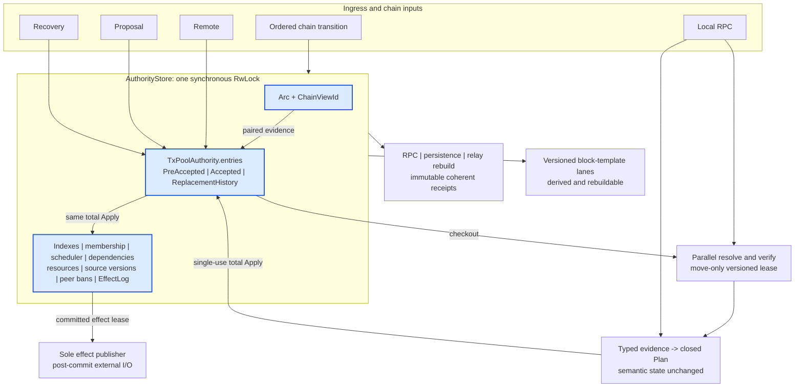
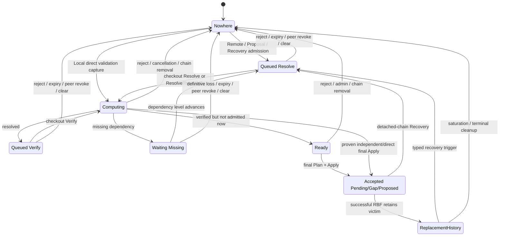

# Tx-Pool Architecture: Unified Authority Kernel

This document is the normative design of the current tx-pool. It describes
the surviving production model, not the migration history. Executable behavior
and attack regressions are indexed by [REVIEW_GUIDE.md](REVIEW_GUIDE.md);
machine-contract maintenance is documented by [VALIDATION.md](VALIDATION.md);
performance evidence and measurement rules live in
[PERFORMANCE.md](PERFORMANCE.md) and [BENCHMARK.md](BENCHMARK.md).

## 1. Decision

`TxPoolAuthority` is the only transaction-lifecycle authority. It lives with
the exact chain snapshot it validates against inside one `AuthorityStore`
protected by a synchronous `RwLock`. Its `entries` map owns every retained or
accepted transaction by raw transaction hash:

```text
Owner(h) = Nowhere
         | PreAccepted(phase, source, evidence, charge)
         | Accepted(status, proof, charge)
         | ReplacementHistory(observation, charge)
```

Indexes, membership relations, scheduling, dependency observations, resource
accounting, source versions, peer-ban state and committed effects are fields or
projections of that same authority. They change in the same total Apply as the
owner. None is a second decision authority.

Resolve, script verification and immutable planning are parallel work outside
the authority guard. A typed version or lease binds each result to the exact
owner and chain view it can settle. External I/O runs only after Apply and
consumes effects committed by that Apply.



The word pipeline refers to parallel computation around this kernel. It does
not mean a chain of owning queues. The pipeline may reorder expensive work;
only Apply decides ownership and membership.

## 2. Compatibility boundary

The refactor preserves these externally observable contracts:

- Local RPC submission performs validation directly and returns its committed
  result synchronously. It does not wait behind retained remote work.
- Remote, Proposal and Recovery inputs use retained asynchronous validation.
- RPC continues to expose only `Pending` and `Proposed`. Internal `Gap` maps to
  public `Pending` for compatibility, but internal proposal/template selection
  always consumes the exact `AcceptedStatus` and never the RPC projection.
- Replacement history is private recovery state. It is absent from live-pool
  RPC status, block templates and persistence.
- Verification-cache identity is the inline 32-byte witness hash together with
  the exact `ScriptVerificationRules` generation.
- Persistence remains best effort. Accepted transactions and Recovery-source
  entries are captured from one read cut; all replayed transactions re-enter
  ordinary validation.
- Full/reset block-template replacement remains serialized. Proposal,
  transaction and uncle component work remains optimistic and concurrent.
- Consensus validation is not replaced or weakened. Tx-pool-only evidence
  reuse is explicitly scoped in section 8.4.

Any change to wire, RPC, persistence, cache or template behavior requires a
separate compatibility decision; an internal simplification is not permission
to change it.

## 3. Why structural change from `develop` is necessary

The justification is concrete failure closure, not preference for new types.
The table also records the cost paid by the UAK and whether risk is eliminated,
bounded or merely transferred.

| Family | Verified `develop` structure and failure | Why a local patch is not a complete proof | UAK mechanism and cost | Disposition |
|---|---|---|---|---|
| F1 ownership and ABA | `VerifyQueue`, `OrphanPool`, active verifier work, conflict storage and accepted `PoolMap` independently retain or infer a transaction's location. Clear, peer removal and re-admission cross those structures. | Locking one handoff still leaves every other producer, cancellation and administrative path to coordinate the same partition. A complete local fix would have to introduce a common owner/version protocol, which is the structural change. | One `entries` map; three owner variants; one non-reused entry version and typed compute lease. One authority write guard sequences short transitions. | Ownership ambiguity is eliminated. Lock contention is a measurable cost, not hidden. |
| F2 RBF and capacity atomicity | `process_rbf` removes victims and publishes rejection/conflict state before `_submit_entry` and `limit_size` have proved the replacement can remain accepted. | Moving one fee check earlier cannot make victim closure, descendant removal, accepted capacity, resource accounting, callbacks and failure recovery one transaction. Undo would add another fallible state machine. | Immutable membership/RBF compilation followed by one total Apply; optional victim history is installed by that Apply. Planning and closure work are bounded. | Partial replacement is eliminated. Bounded plan cost replaces rollback risk. |
| F3 observable effects | Accepted mutation, callbacks, relay-known state, recent rejection, cache work and block-template notification occur in separate calls/tasks and can be separated by failure or saturation. | Adding retries to every endpoint cannot prove which state was committed and can duplicate or omit publication. | `EffectLog` is part of the authority; a bounded effect delta commits with ownership. One move-only publisher consumes it after the guard opens. | State/effect gaps are eliminated in-process. Crash durability and exactly-once external delivery remain explicit residual risks. |
| F4 hostile resources | Accepted capacity, orphan count, verification cycles, conflict retention and auxiliary graph/index memory use different limits or omit metadata/active-work cost. | Independent ceilings do not prove the sum and allow transitions between structures to escape or double charge. | One `ResourceLedger` charges entries, bytes, edges, active work, compute envelopes, accepted cost, remote/per-peer state and replacement history; effect memory is separately bounded by the same construction inputs. | Uncharged residency is eliminated; conservative overcharging is an accepted bounded availability trade-off. |
| F5 dependency progress | Missing work, orphan work, accepted causal edges and conflict recovery use separate wake mechanisms. Definitive parent loss and source promotion can miss the mechanism that parked a child. | Adding a wake at one removal site leaves reorg, RBF, expiry, clear and peer revocation as independent publication tables. | One canonical dependency set, `DependencyFrontier`, observation cut, reverse keys and bounded level-triggered maintenance. | Lost-wake timing dependence is eliminated; bounded maintenance latency remains. |
| F6 conflict recovery | RBF victims are removed, conflict history is recorded separately and recovery is spawned later into another queue. Ordering decides whether a loser is restored, replaced again or stranded. | Restore/abort ordering patches move the race and fee/accounting proof between structures. | Only an actually Accepted victim can become charged inert `ReplacementHistory` in the same successful replacement Apply. Recovery always re-enters validation. | Speculative victim ownership and nested undo are eliminated. Optional history may be dropped as a complete set under its hard sub-budget. |
| F7 chain and template convergence | Reorg processing updates blank template/candidate uncles, then pool status/recovery, then full template. `Gap` and RPC `Pending` are conflated externally, and detached-uncle proposals can suppress re-proposal. | Fixing one `Gap` demotion or uncle filter leaves three independently published generations and startup/readiness loss. | One reliable capacity-one tip transition pairs snapshot and authority Apply; exact source versions drive versioned template receipts. Full/reset and optimistic component lanes retain their distinct concurrency. | Chain/owner generation splits are eliminated. A derived template can retain its last valid value and temporarily underfill after a rebuild failure. |
| F8 identity and evidence | Raw hash, witness hash and proposal short ID are passed through APIs with overlapping primitive types; detached recovery historically queried a witness-keyed cache with the raw hash. | Call-site review cannot prove every future caller selects the same identity and rule context. | Newtypes for owner/proposal/version/view identities and a concrete cache key containing witness hash plus script rules. Short IDs are collision-aware indexes only. | Identity substitution is made unrepresentable at typed boundaries. |

The UAK is justified only while each retained mechanism maps to one of these
families or another named compatibility/attack requirement. An implementation
artifact with no such owner is design debt and must be removed.

## 4. Authority algebra and invariants

### 4.1 Owner variants

`OwnedTx` is a closed enum:

- `PreAccepted`: retained admission with source, original basis, current phase
  and exact charge;
- `Accepted`: consensus-facing pool member with status, proof, provenance and
  accepted accounting;
- `ReplacementHistory`: an inert, charged former Accepted victim retained only
  for bounded recovery.

`Nowhere` is absence from `entries`; it is not a stored tombstone. Every owner
stores a `TxRecord` whose raw identity equals its map key.

### 4.2 PreAccepted phases

`PreAcceptedPhase` has five semantic locations:

```text
Queued(Resolve)
Queued(Verify(ResolvedFacts))
Computing(ActiveWork)
Waiting(ObservedDependencies)
Ready(VerifiedFacts)
```

Resolve and Verify queue states share a typed `QueuedWork` enum. Computing
contains the only active lease, exact chain view, work permit, resource grant,
attribution, payload policy and dependency cut. Waiting can represent only a
non-empty missing-dependency observation. Replacement conflict history cannot
be encoded as executable waiting work.

### 4.3 Accepted status

`AcceptedStatus` is `Pending`, `Gap` or `Proposed`. Status is authoritative
internal state. Public RPC compatibility mapping is a derived read operation
and cannot feed proposal or commit selection.

### 4.4 Stable proof obligations

| ID | Invariant |
|---|---|
| T1 OwnerPartition | For every raw hash, `entries` contains zero or one `OwnedTx`; no worker, queue, effect, cache or template owns lifecycle state. |
| T2 CapabilityAndABA | A completion mutates only the exact entry version, phase, lease, generation and chain view it checked out. Stale work is mutation-free. |
| T3 ContinuousResources | An owner is charged if and only if it exists; ownership and every charge coordinate change in the same Apply. |
| T4 DependencyExactness | Canonical input/cell-dep/header/dep-group facts and reverse observations describe the same owner generation. Definitive loss cannot leave a surviving accepted consumer. |
| T5 SchedulerExactness | Every executable PreAccepted owner has exactly the scheduler membership implied by its phase; no inert/history owner is executable. |
| T6 TotalApply | A prepared transition contains all owner, projection, resource, clock and effect deltas. Consuming Apply has no ordinary failure result. |
| T7 CommittedEffects | Every required external outcome is in the same committed Apply; the publisher never reconstructs it by rereading authority state. |
| T8 BoundedHostility | Peer-controlled count, bytes, edges, fanout, closure, retries, active work and effect memory have explicit checked bounds. |
| T9 ChainSnapshotPairing | `Arc<Snapshot>` and `ChainViewId` move as one store fact; a T -> T' -> T sequence remains distinguishable by revision. |
| T10 LevelTriggeredProgress | Notifications are hints only. A consumer subscribes before checking its authoritative level and sleeps only when a named independent action can change that level. |
| T11 IdentityAndEvidence | Every proof is bound to the exact raw/witness identity, script rules, chain view and policy context it proves. |
| T12 CoherentPublicProjection | RPC, compact-block, persistence, relay rebuild and fee/template reads are captured from one authority read cut and finished outside the guard. |
| T13 TemplateConvergence | Template lanes publish only receipts whose chain/source cut remains current; full/reset priority and optimistic partial concurrency are preserved. |

These invariants are checked by construction first and by bounded validation as
defense in depth. A runtime check is not a substitute for a type that can
remove the invalid state.

## 5. Identity and evidence

| Type | Role |
|---|---|
| `RawTxHash(Byte32)` | primary ownership and accepted membership |
| `WitnessTxHash(Byte32)` | transaction witness identity inside authority evidence |
| `TxVerificationCacheKey { [u8; 32], ScriptVerificationRules }` | copy-cheap, context-complete script cache identity |
| `ProposalId(ProposalShortId)` | collision-aware consensus proposal index only |
| `EntryVersion(u128)` | non-reused exact owner incarnation/phase |
| `ComputeLeaseId(u128)` | move-only active computation capability |
| `ApplySequence(u128)` | total committed authority/source/effect order |
| `PoolGeneration(u64)` | clear/generation boundary |
| `ChainViewId { ChainRevision, ChainTipHash }` | exact chain event and same-tip evidence scope |

Positive chain-cell evidence may be reused only when the current and resolved
tip hashes match and the individual `CellMeta.transaction_info` proves the cell
came from the chain. Pool-produced cells are always checked against the mutable
membership overlay. This is a tx-pool final-admission optimization only; it is
not available to block or consensus verification, removal-history reasoning or
another transaction's dependency proof.

The `pre_resolve_tip`, cell metadata and script-rule generation must originate
from the same captured `Arc<Snapshot>`. No caller may infer provenance from an
ingress source or a nearby hash.

## 6. Lifecycle and sources



Sources are policy, not locations:

- Remote carries immutable ingress peer/residency and the declared-cycle
  policy for its exact witness payload. It is charged globally and per peer.
- Proposal is trusted. Same-witness promotion may preserve immutable ingress
  attribution while replacing peer-supplied verification policy.
- Recovery is trusted detached-chain/persistence input and must re-run normal
  resolve and verification.
- Local owns no retained phase. It performs computation directly and uses the
  same final membership compiler and effect rules.
- TestAccept evaluates validation policy but performs no authoritative Apply.

A peer ban removes only not-yet-Accepted owners attributed to that peer. The
same committed effect releases the relay's pending/known projection, so another
peer can supply the transaction. Accepted owners remain accepted.

## 7. Validate, Plan, Apply and effects

### 7.1 Validation

Resolution and script verification consume immutable snapshot/overlay inputs
and produce concrete receipts. Workers carry no owner map and never decide
membership. Resource envelopes are reserved before attacker-shaped resolved
data can become retained state.

### 7.2 Plan

Plan runs under a coherent authority cut and changes no authoritative semantic
fact. It may reserve collection capacity so Apply cannot fail allocation, then
builds a private closed delta containing:

- exact before/after owners;
- index and source-version replacements;
- accepted membership/causal projection changes;
- scheduler and dependency-frontier changes;
- resource charge changes;
- clock values;
- the exact bounded effect mutation;
- retirement and move-only handoff carriers.

Ordinary outcomes such as rejection, backpressure, duplicate, stale evidence
and cancellation are decided before Apply and represented by closed enums. A
prepared plan borrows the authority mutably and is `must_use`; it cannot be
applied twice or against another authority.

### 7.3 Apply

`PreparedApply::apply(self) -> CommittedDelta` is total. It swaps all fields in
one short authority critical section, advances the clocks and returns the only
post-commit handoff. Large retired payloads and generations are carried out of
the guard before destruction. Apply performs no external I/O and has no
rollback path.

Specialized `PreparedCheckout` and `PreparedEffectCheckout` types contain their
move-only compute/effect capability by construction; a successful Apply cannot
discover a missing handoff afterward.

```mermaid
sequenceDiagram
    participant D as Dispatcher or worker
    participant S as AuthorityStore
    participant C as Parallel computation
    participant P as Effect publisher
    participant E as External endpoint

    D->>S: capture typed work + exact version/view
    S-->>D: move-only lease and immutable evidence
    D->>C: resolve or verify without authority guard
    C-->>D: typed result
    D->>S: Plan under coherent cut
    Note over S: validate stale/budget/policy<br/>reserve capacity; build complete delta
    D->>S: consume total Apply
    S-->>D: CommittedDelta + retirement/handoff
    Note over D,S: authority guard opens before destruction or await
    P->>S: checkout committed effect lease
    P->>E: perform external I/O
    P->>S: settle exact effect progress
```

## 8. Membership, RBF and dependencies

### 8.1 Accepted membership

`MembershipProjection` is derived from Accepted owners and stores the causal
input/cell-dependency graph, spender relation, ancestor/descendant aggregates,
status counts and deterministic ordering required by admission and templates.
It is not a second payload owner. Membership preparation validates the complete
virtual final set before the authority owner map changes.

### 8.2 Independent and coupled work

Transactions whose inputs/dependencies are chain-backed and whose membership
plans commute may be validated concurrently and accepted through one bounded
`IndependentDelta`. Coupled transactions use the same authority and proof
rules but compile an exact cohort. This extracts CKB cell-model parallelism
without adding a sharded owner map or a second DAG authority.

### 8.3 RBF

RBF planning computes the complete conflict/victim/descendant closure, new
unconfirmed-input rule, ancestor/descendant overlap, dependency-on-victim rule,
candidate bound, absolute replacement fee and size-based fee-rate gate against
one coherent virtual membership. A rejected plan is mutation-free.

A successful plan applies candidate insertion, all victim removals, descendant
updates, charge changes, dependency levels, source versions and effects once.
Only actually Accepted victims can become `ReplacementHistory`. If the history
partition cannot retain the complete optional set, the set is terminalized and
the winner is retried without history; partial history and winner failure are
not legal saturation outcomes.

### 8.4 Dependency progress

Every owner carries one canonical `KnownDependencies` basis. Missing work owns
a non-empty `ObservedDependencies` with an exact `DependencyCut`. Reverse keys
are derived in `DependencyFrontier`. Availability and definitive loss advance
authority levels in the same Apply that changes the producer or spender.

Workers subscribe to the mutation hint before checking the authoritative
level. The hint may be coalesced or lost because the level is the truth.
Maintenance operates in bounded slices and re-arms only when a relevant source
cut advances. A timeout may diagnose failure but is never the progress proof.

The production resolver must not expose a PreAccepted output as chain-backed
dependency evidence for an unrelated transaction. Accepted pool-produced
evidence is represented through the membership overlay and causal compiler.

## 9. Chain and administrative transitions

The chain layer owns one tip-installation boundary: install the new snapshot,
then send the exact fork delta on a reliable capacity-one ordered channel. RPC
readiness cannot suppress this transition. The ordered reorg driver packages
detached/attached inputs outside the authority guard, then one chain Plan/Apply
pairs the new `Arc<Snapshot>` and `ChainViewId` with all owner, membership,
status, recovery, dependency, resource and effect changes.

Normal best-block and truncate paths use this same boundary. IBD and
candidate-uncle notifications remain readiness-gated derived signals and must
not be placed on the authoritative ordered channel.

Clear, peer revocation, local removal, remote expiry and accepted expiry use a
cause-complete owner-removal compiler. It updates every projection and required
effect once. `ClearPipeline` preserves Accepted owners; `ClearPool` creates a
fresh empty generation. Reorg and clear do not use a recovery lock, nested undo
or detached-block payload owner.

## 10. Committed effects and external failure

`EffectLog` is a bounded field of `TxPoolAuthority`. It owns immutable committed
outcomes, not transaction lifecycle. Capacity is partitioned into Remote,
Trusted and Critical classes, each with an indivisible batch bound validated at
construction. Chain detail that every consumer can rebuild may collapse to one
constant-size `GenerationReset`; non-rebuildable security effects may not.

The effect enum includes accepted/rejected outcomes, chain-committed remote
settlement, peer-cohort revocation, remote expiry/release, parent requests and
generation reset. A pending-recent-reject index is a charged lookup into the
same resident batches.

One synchronously claimed publisher task is the sole consumer. It checks out a
move-only lease, executes endpoints after the store guard opens and settles the
exact progress token. Endpoint failure cannot roll back or reinterpret the
committed owner transition. Relay publication uses a bounded nonblocking
mailbox; overflow converges through `GenerationReset` and bounded level rebuild.

Effect delivery is not crash durable or universally exactly-once. This is an
explicit operational boundary, not hidden transaction state.

## 11. Reads, RPC, persistence and cache

All public/query projections borrow one `AuthorityReadView` from one store read
cut. Allocation-heavy sorting, parent expansion and serialization occur after
the guard opens. Cursors carry exact source cuts and restart if relevant state
changes.

- RPC may show PreAccepted work as Pending and maps Accepted Gap to Pending for
  compatibility; internal detail and template code consume exact phases/status.
- ReplacementHistory returns no live RPC status and falls through to the
  existing recent-reject/RBF-compatible surface.
- Compact-block lookup is collision-aware and may read every live owner that
  intentionally participates in that compatibility surface.
- Persistence captures Accepted owners and Recovery-source PreAccepted owners,
  orders them parent-first outside the guard and writes through one serialized
  atomic-file writer. It excludes Remote, Proposal and ReplacementHistory.
- Cache reads and writes use `TxVerificationCacheKey`; cache update is derived
  work and never gates committed ownership.

## 12. Concurrency, tasks and progress

### 12.1 Lock domains

The transaction authority has one synchronous `RwLock`. Production code may
not hold it across `.await`, blocking I/O, VM execution or external endpoint
work. `AuthorityRuntime` exposes concrete operations rather than a generic
mutation closure.

Other locks protect derived outputs only: verification cache, relay mailbox,
candidate uncles, current block template and template convergence. They cannot
decide transaction ownership. Template publication acquires the current-
template guard, then performs a bounded synchronous authority source check;
production never waits on the template guard while holding the authority guard.

The count-only compute semaphore reserves transient capacity but contains no
transaction identity and has no independent lifecycle state.

### 12.2 Task ownership

`AuthorityTaskTopology` constructs every capability before spawning the first
task and owns:

- resolve/verify workers;
- Ready and bounded maintenance drivers;
- the sole effect publisher;
- the derived verification-cache updater;
- optional block-template lanes.

The service generation separately owns the ordered reorg driver. Cancellation
closes producers first, joins authority workers, closes and drains effects,
then joins derived tasks. Every task exit is classified by what it owns;
template/cache degradation retains authoritative state, while loss of the sole
authority capability forbids persistence until the final static fault audit
proves the boundary cannot be reached by valid or hostile input.

### 12.3 Wait-for proof

Every wait must name an independently running releaser:

| Wait | Held authority capability | Releaser |
|---|---|---|
| compute semaphore | none | completion/cancellation of another compute lease |
| mutation `Notify` | none | any committed Apply; waiter rechecks level first |
| effect capacity | the exact failed settlement capability, no store guard | sole effect publisher settlement or cancellation |
| verification cache channel | no owner or store guard | cache updater; cache failure is derived degradation |
| ordered chain channel | chain request at producer boundary, no store guard | ordered reorg driver |
| template source change | no authority guard | authority Apply or candidate-uncle source mutation |
| shutdown joins | topology owner only | cancellation-aware owned task or bounded operational timeout |

The complete deadlock/livelock/lost-wake/starvation audit and constructive
saturation tests are release gates, not assumptions inferred from timeouts.

## 13. Block-template convergence

The block assembler is a rebuildable derived projection. It owns no tx-pool
membership. `AuthorityTemplateReadReceipt` captures accepted payloads,
relations, exact proposal/transaction/chain source versions and the paired
snapshot under one read cut; construction happens after the guard opens.

Five tasks preserve the established performance model:

1. one ordered replacement lane serializes reset and full rebuild;
2. one optimistic proposal lane;
3. one optimistic transaction lane;
4. one optimistic uncle lane;
5. one coalesced external notification lane.

Each build publishes only if its chain/source receipt and expected template
revision/reset epoch still match. Full/reset has priority over partial work,
but partial and uncle construction is not serialized behind it. Optional
proposals and uncles share one byte budget; only proposal IDs actually
published in the candidate uncles are excluded. A rebuildable failure retains
the last valid template and waits for a source-level change rather than
spinning or mutating tx-pool state.

## 14. Resource and complexity contract

`ResourceLedger` continuously charges each owner by raw hash. Coordinates are
entries, resident bytes, dependency edges, active work, reserved compute bytes
and edges, accepted count/size/cycles, global Remote usage, per-peer usage and
ReplacementHistory usage. Effect batches/bytes have a separate bounded ledger
inside the same authority.

Checked construction proves limit hierarchy and a complete per-lease compute
envelope. Transitions use checked arithmetic. Peer-controlled parent count,
dependency expansion, RBF candidates, causal closure, eviction cohort,
maintenance slice, relay mailbox and effect batch all have explicit bounds.

Population-sized work is forbidden in ordinary lock-held ingress/settlement.
Whole-generation scans are limited to named chain/admin/query/template paths,
captured in bounded pages or performed outside the guard where possible. The
static complexity audit must identify each exception and its hostile bound
before benchmark acceptance.

## 15. Rust-native failure model

Valid transactions, hostile peers, stale work, duplicates, capacity pressure,
allocation pressure, cancellation and external failure are typed ordinary
outcomes. They must not panic, deadlock, livelock, leak charge or invalidate the
service generation.

Production authority code does not use `panic!`, `assert!`, `unwrap()`,
`expect()` or `catch_unwind` as validation or control flow. A structural
`AuthorityFault` denotes contradiction between the one owner and its derived
projections, not policy rejection. Rust is not treated as an Erlang-style
restart runtime: panic-and-catch and broad fail-stop are not repair mechanisms.

No release claim may assume structural faults are unreachable. The final
pre-benchmark static audit must trace every fault constructor backward through
legal/hostile inputs and concurrency. Any reachable case is a model bug to
remove or a typed local outcome to redesign, not a reason to stop the service.

## 16. Performance model

The architecture preserves parallelism where CKB permits it:

- independent resolve and script verification run concurrently outside the
  authority lock;
- a worker may retain its transient permit across the exact computation it
  owns, but not across unrelated waiting;
- independent membership transitions may compile into bounded commuting
  batches;
- Local direct validation bypasses retained scheduling;
- authority read queries are shared;
- block-template component construction stays optimistic and parallel;
- external effects, cache writes and persistence I/O stay outside the guard.

The cost of safety is short authoritative checkout/settlement/Apply work,
version/evidence objects, exact derived projections and a bounded effect log.
These costs must be measured, but no optimization may create another owner,
weaken final validation, move expensive work under the guard or serialize the
template lanes.

Static review precedes profiling. Profiling attributes cost and selects
optimization candidates; fixed-binary A/B decides measured value. Neither is a
correctness-discovery substitute.

## 17. Minimality and rejected alternatives

### Harden the `develop` queues

Rejected. Closing all owner handoffs, RBF rollback, resource transfer and
publication gaps would require a shared authority/version/effect protocol
across the queues. Retaining the queues after adding that protocol would keep
duplicate state without preserving useful concurrency.

### Separate pre-pool and accepted authorities

Rejected by the current implementation review. The cross-owner handoff and
coherent read problem were accidental complexity. Accepted and preaccepted
payloads now occupy variants in one map and one Apply; read concurrency comes
from the store `RwLock`, not a second owner.

### Universal async actor

Rejected. Serializing validation, read capture, template work and Local direct
submission through one mailbox would weaken independent-transaction and
read/template concurrency. The kernel serializes only ownership transitions.

### Nested undo or rollback

Rejected. All fallible policy, capacity, closure and effect checks finish
before total Apply. Undo would add persistent intermediate states and another
failure path without a business requirement.

### Separate DAG or sharded lifecycle owners

Rejected as a default. CKB dependency information is valuable for bounded
frontier scheduling and commuting batches, but a second DAG/shard authority
would duplicate membership, RBF and resource facts. The current dependency and
membership projections extract graph parallelism under one owner. A future
shard design must prove conflict/RBF/chain atomicity and lower measured cost
before adding state.

### No pipeline

Rejected. Removing retained parallel computation would simplify scheduling but
discard the main scalable property: chain-backed independent transactions can
resolve and verify concurrently. The correct simplification is one owning
kernel with typed borrowed work, not serialized computation.

This is the smallest constructively safe model currently selected. It remains
subject to the pre-benchmark minimality audit: every state, lock, task, clock,
receipt and effect class must retain a business, compatibility, concurrency or
attack owner.

## 18. Implementation map

| Concern | Primary implementation owner |
|---|---|
| owner algebra and typed evidence | `authority/state.rs`, `authority/chain.rs` |
| total Plan/Apply and clocks | `authority/plan.rs`, `authority/plan/` |
| accepted membership and RBF | `authority/plan/membership.rs`, `authority/plan/membership/` |
| resources | `authority/resources.rs` |
| scheduling | `authority/scheduler.rs` |
| dependency observations and wake | `authority/dependency.rs` |
| source-version compiler | `authority/source.rs` |
| committed effects | `authority/effect.rs`, `authority/publisher.rs` |
| runtime lock and capabilities | `authority/runtime.rs` |
| workers and task ownership | `authority/worker.rs`, `authority/topology.rs` |
| service compatibility boundary | `authority/service.rs` |
| chain packaging and ordered boundary | `authority/chain_boundary.rs`, `chain/src/verify.rs` |
| coherent reads and persistence receipts | `authority/read.rs`, `authority/query.rs` |
| template receipts and publication lanes | `authority/template.rs`, `authority/template_driver.rs` |
| bounded relay projection | `authority/relay.rs` |

Production tests belong under dedicated `tests/` modules. Any irreducible
`cfg(test)` field or observation hook must be a named seam in
`test-layout-manifest.json`; an entire production directory may never be
excluded from static safety review.

## 19. Change rules

Before adding a state, lock, task, queue, cache, version, effect or fallback:

1. name the business/compatibility/attack case;
2. identify the one authoritative owner and legal transitions;
3. prove why an existing type or derived projection cannot represent it;
4. define identity, validity, rebuild and resource bounds;
5. derive the wait-for and shutdown edges;
6. account for lock work, allocations, clones and concurrency;
7. add exact unit, integration, hostile and complexity evidence;
8. update the architecture contract, behavior registry and review guide in the
   same change.

Manual producer-to-consumer maps are suspect. Prefer one exhaustive compiler
from before/after owner state to source versions, effects and wake levels. A
variant with consumers but no producer, or a publication point with no
consumer/rebuild rule, fails review.

## 20. Residual risks and release conditions

The following are explicit boundaries, not claims of completion:

| ID | Residual risk or release condition |
|---|---|
| R1 | Reachability of every typed authority/generation fault still requires the final static adjudication. |
| R2 | External effects are not crash durable or universally exactly-once. |
| R3 | Persistence is best effort and every replayed transaction re-enters validation. |
| R4 | Process OOM abort, FFI failure and memory corruption are outside the tx-pool model. |
| R5 | Derived template failure can retain the last valid template and underfill until a source change. |
| R6 | Optional replacement history can be discarded as a complete set under its bounded sub-budget. |
| R7 | Legacy v1 persistence remains an accepted compatibility input. |
| R8 | The complete tx-pool-related integration universe remains the P9.8 gate. |
| R9 | Reproducible fixed-binary performance acceptance remains the P10 gate. |

Before P10, one code-verified matrix must:

1. prove the exact `develop` race/non-atomic call graphs that require each UAK
   mechanism;
2. account for every new state, lock, log, task, bound and failure domain and
   distinguish risk elimination from bounding or transfer;
3. prove this is the smallest constructively safe model and that valid or
   hostile inputs cannot reach an invariant fault;
4. close every statically derivable correctness, security, liveness,
   publication, identity and complexity issue;
5. re-adjudicate every historical report against current code as
   `confirmed-closed`, `superseded-by-proven-model`,
   `suppressed-with-current-counterevidence` or `open-blocker`;
6. make documentation, machine contracts, isolated tests, full related
   integration coverage and CI selectors agree exactly.

Only after these gates close may profiling and benchmark evidence be used to
make the final production acceptance claim.
