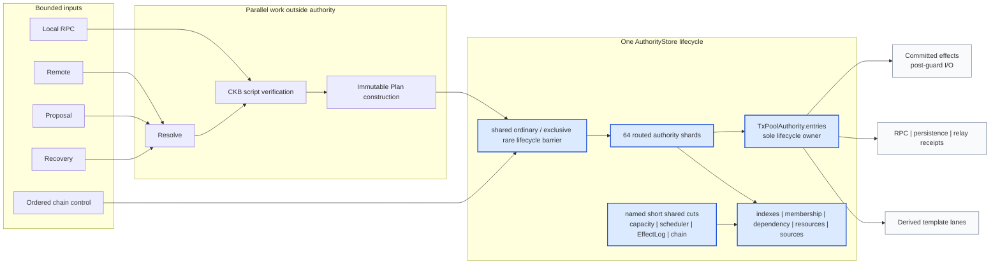
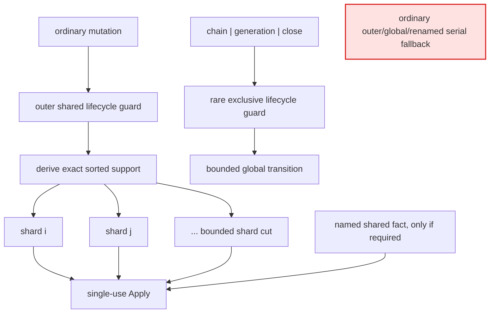
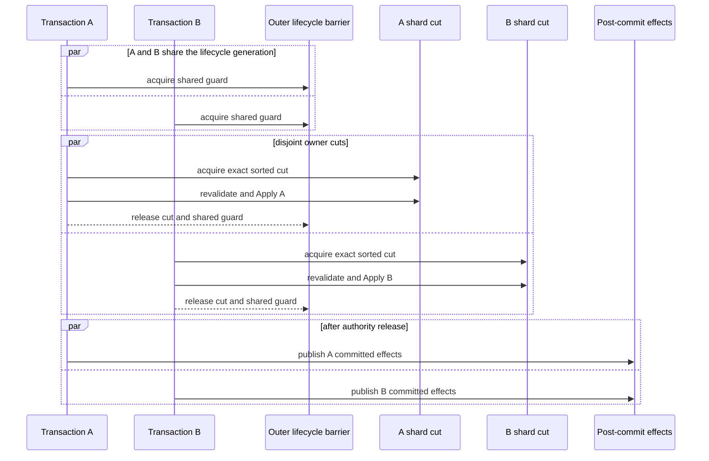
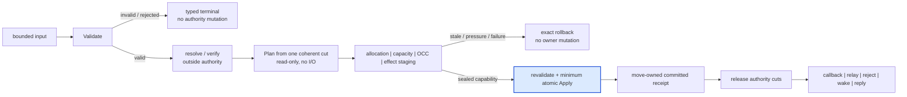
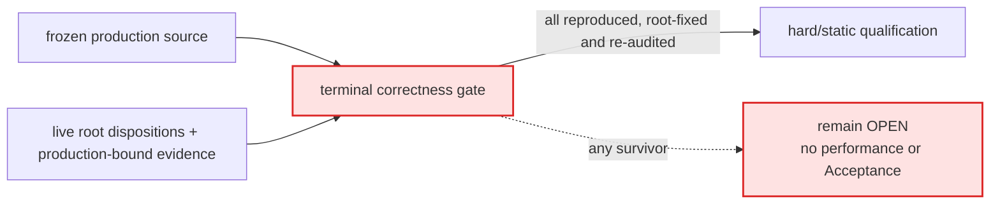

# Tx-Pool Architecture: Current True-Shard Authority Kernel

## Document authority and exact status

This document describes the architecture implemented by the synchronized
true-shard source base:

- commit `51d282345d1d83119c46cdde8f1115f14561b4ac`;
- tree `1e19719c764c7349a178d7ac0b7bf4999542966f`.

It is an architecture reference, not live execution state or proof. The
repository-owned [`control/txpool-v8/`](../control/txpool-v8/) directory owns the
current phase, blockers, evidence boundary and next action. In particular,
[`FINDINGS_LEDGER.json`](../control/txpool-v8/FINDINGS_LEDGER.json) records open
terminal-audit candidates that override any required invariant below until the
candidate has been reproduced, repaired and re-audited.

The stable objective, hard constraints, phase order and Acceptance vocabulary
are in [`architecture-contract.json`](../architecture-contract.json). The
canonical delivery goal is the next result-before-frozen finite candidate
generation. The original open architecture-class optimum remains honest
research `OPEN_FROZEN`; a finite winner cannot close it.

Historical I2/I3/M3.6 design narratives, model-base work and earlier topology
experiments are retained in Git and `optimization-evidence/`. They are not
mixed into this current architecture description.

## 1. External semantic boundary

The refactor must preserve CKB consensus, script results, hardfork selection,
wire formats and the declared RPC, storage, configuration, recovery and
operational contracts unless a separately owned compatibility decision says
otherwise. In particular:

- Local submission returns its committed terminal result synchronously.
- Remote, Proposal and Recovery sources use retained asynchronous validation.
- Public status remains `Pending | Proposed`; internal phases and replacement
  history are not new public ownership states.
- Proposal/template behavior continues to agree with the implemented two-step
  confirmation rules for main-chain, uncle, genesis and reorg histories.
- Verification-cache identity includes the exact transaction/witness and
  script-rule environment it proves.
- CKB-VM instruction, cycle and script semantics are consensus facts and may
  not vary by node. Tx-pool may bound local verification time/resource use, but
  a local timeout is not consensus evidence and is not a peer-ban premise.
- Persistence remains best effort. Every replayed transaction re-enters the
  normal validation and ownership path.

## 2. One lifecycle authority

`TxPoolAuthority.entries` is the only transaction-lifecycle owner, keyed by
raw transaction hash. A transaction is in exactly one of these logical states:

```text
Nowhere
PreAccepted(phase, source, evidence, charge)
Accepted(status, proof, charge)
ReplacementHistory(observation, charge)
```

Indexes, membership, scheduler rows, dependency relations, resource totals,
source versions, peer-fence state and committed effects are projections or
accounting owned by the same Apply lifecycle. They may accelerate a query or
carry an external effect; they may not decide transaction policy independently
or become a second owner.

Checked-out resolve/verify work is a move-only capability bound to the exact
owner version and chain view it observed. It is not another resident owner.
Stale, cancelled and failed work must return or terminalize every capability,
charge, wake and response it owns.



The diagram shows ownership, not call frequency. `Effects`, public reads and
template lanes consume committed or coherent receipts; none can become a
second transaction authority.

## 3. Physical true-shard layout

`AuthorityStore` pairs the chain snapshot/view with the authority generation.
Its outer `parking_lot::RwLock` is a lifecycle barrier, not the ordinary owner
commit lock:

- every ordinary production mutation takes the shared outer arm and an exact,
  canonically ordered cut over the 64 physical authority shards;
- disjoint ordinary owner cuts can overlap;
- no ordinary production route falls back to the outer write arm;
- the outer write arm is reserved for rare generation/chain/lifecycle
  replacement, effect close, internal test plumbing or non-authority wrapper
  recycling. The verifier binds the current source census; the exact call-site
  count is evidence, not a permanent architectural constant.

Owner-lifetime facts are co-located with the owner shard where their identity
and lifetime match: owner payload, causal parents/children, aggregate metadata,
deadlines, order keys and owner-scoped resource/source data. Shared facts are
routed by the fact they answer, for example conflict keys, proposal keys,
peer-fence rows and dependency control. Multi-shard cuts acquire shards in one
canonical order.

The following domains may retain their own short, named linearization cut
because their fact is genuinely shared:

- total resource-capacity reservation;
- scheduler frontier/fairness state;
- the sole committed `EffectLog` and publication cursor;
- chain/generation lifecycle state;
- monotonic identities whose exact ordering is externally observed.

These domains may not be combined into a renamed global owner mutex. A shared
cut must state the exact fact, work bound and release point that justify it.



The red node is deliberately disconnected: it is not an allowed route. A
multi-shard operation takes one sorted cut; it does not acquire arbitrary
shards incrementally.

### 3.1 Disjoint ordinary commit timing



If A and B require the same conflict, capacity, scheduler or effect fact, that
named fact creates the necessary local ordering edge. Physical shard separation
alone never proves semantic independence.

## 4. Validate, Plan, Apply, effects

Every state-changing route follows one lifecycle:

1. **Validate** checks trust-boundary syntax, counts, bytes, cycles, policy and
   immutable inputs without mutation.
2. **Plan** reads one coherent bounded cut, performs no I/O and constructs a
   closed transition with exact freshness evidence.
3. **Apply** revalidates that evidence and consumes a sealed single-use plan to
   commit the smallest atomic owner/projection/resource/effect change.
4. **Effects** run only after authority release and cannot veto or reinterpret
   the committed transition.

All operations that can allocate, backpressure or return an ordinary failure
must occur before owner mutation. A post-mutation activation step must be
infallible under its pre-reserved linear capability. Rollback consumes the same
capability and restores the exact unused reservation.

No authority lock may span `.await`, external I/O or attacker-sized work.
Expensive resolve, script verification, immutable classification, encoding and
endpoint delivery remain outside authority cuts.



Only the blue node mutates lifecycle authority. This is the test for whether a
future optimization preserves the architecture rather than transferring a
failure after commit.

## 5. Required invariants and their current boundary

The `T1`-`T16` identifiers are stable review vocabulary. They are obligations,
not a claim that the current implementation already satisfies every row.

| ID | Required property | Current boundary |
|---|---|---|
| T1 OwnerPartition | A raw hash has zero or one lifecycle owner. | Production properties uphold the scoped owner algebra. |
| T2 CapabilityAndABA | Work mutates only the exact version/view it checked out; stale work is mutation-free. | Scoped production properties exist; composition remains part of terminal audit. |
| T3 ContinuousResources | Every resident owner and staged operation has exactly conserved bounded charges. | Resource/effect staging is implemented; Ready peer-revocation reservation is an open blocker. |
| T4 DependencyExactness | Dependency availability/loss and every surviving consumer agree at the actual commit cut. | OPEN: scalar reserved `ApplySequence` is not a committed prefix under reverse completion. |
| T5 SchedulerExactness | Executable owners and scheduler membership agree; hidden staging is not visible early. | Scoped scheduler properties exist; Ready-head final reservation is open. |
| T6 TotalApply | A sealed transition owns all deltas; no ordinary failure occurs after mutation begins. | Required for every root repair; green tests alone are insufficient. |
| T7 CommittedEffects | Required external outcomes commit with the transition and publish afterward from one log. | Sole journal is implemented; Drop/error visibility remains assurance debt. |
| T8 BoundedHostility | Hostile bytes, rows, fanout, closure, retries, work and effects have checked bounds. | Population work under full-query/persistence guards is OPEN. |
| T9 ChainSnapshotPairing | Snapshot and `ChainViewId` move coherently and ABA remains distinguishable. | OPEN for chain receipt stability, template publication and stale clear intent. |
| T10 LevelTriggeredProgress | A waiter subscribes before checking a level and names an independent releaser. | Ordered shutdown/reconcile drain is OPEN. |
| T11 IdentityAndEvidence | Every proof binds raw/witness identity, rules, chain view and policy context. | Scoped properties uphold known paths. |
| T12 CoherentPublicProjection | RPC, template, relay and persistence observations come from one source cut and finish costly work outside it. | OPEN for full-query/persistence guard work and template publication. |
| T13 TemplateConvergence | A published template is coherent with one current chain/proposal/transaction/uncle source. | Publication source fencing is OPEN. |
| T14 StageCommutativity | A multi-owner batch equals a named canonical fold or has an exact pairwise commuting proof. | Required per batch family; no generic batching assumption. |
| T15 BoundedComputeExchange | Only bounded move-owned compute capabilities cross worker/coordinator boundaries. | Scoped topology and cancellation properties exist. |
| T16 SemanticBatchProgress | Compatible retained work uses available worker/commit capacity without timers or per-owner global serialization. | Scoped properties exist; no performance winner follows. |

## 6. Ingress, compute and Ready

Retained ingress accepts only bounded messages. A homogeneous admissible prefix
may be planned together, but batching never changes the canonical sequential
meaning of the items. Malformed Remote input uses a hidden routed peer fence
and exact cohort removal; it must not remove another peer's owner or turn an
operational rejection into generation invalidity.

Resolve and verification execute outside authority. Checkout moves one exact
capability; completion carries the owner version, chain/policy evidence and
resource settlement needed by final Apply. The scheduler is level-triggered:
notifications are hints, not work authority.

Ready uses strict source/economic ordering and bounded compatible waves.
Reservations, hidden scheduler stages and final shard cuts must conserve one
captured head through commit or rollback. The current malformed Remote
peer-revocation path is under terminal audit because it can drop the captured
Ready reservation before generic cohort commit.

## 7. Membership, conflicts and RBF

One canonical membership evaluator owns duplicate, conflict, RBF, capacity and
accepted-graph decisions. It reads through sealed capabilities and produces a
single membership result; a test relation or optimization classifier may not
become a second policy engine.

RBF removes the complete required victim/descendant closure atomically, updates
resource/index/dependency/scheduler projections in the same Apply and records
only successfully displaced accepted victims in bounded replacement history.
Failed candidates use the existing rejection surface. Optional replacement
history may be discarded only as a complete charged set under its declared
sub-budget.

## 8. Dependency authority

Dependency keys cover inputs, cell deps, headers and expanded dep groups.
Consumers/waiters and their level/dirty state are key-routed derived authority
inside the same Apply lifecycle as owners. Staged relations remain invisible
until activation; rollback removes the exact staged relation.

The current source reserves `ApplySequence` before Apply. That value is a
unique ordering identity, not proof that every smaller sequence committed.
Disjoint reverse completion can therefore make a scalar dependency cut stale
without detecting it. The terminal audit must select an actual-commit receipt
or a proved committed-prefix mechanism; it may not add a waiter scan, repair
task or global ticket held through Apply.

## 9. Effects and endpoint failure

`EffectLog` is the sole committed-effect journal. A bounded staged record is
invisible before activation. The move-only activation/rollback capability owns
its reservation, so owner mutation and effect commitment remain one logical
transition. The publisher borrows one immutable committed record, performs
callback/network/reject/relay work after authority release and settles progress
through the same log.

Endpoint failure cannot roll back ownership or create authority invalidity.
Circuit disposal must settle the receipt, release its charge and wake capacity.
Effects are not crash durable or universally exactly-once; that is an explicit
operational boundary.

## 10. Chain, generation, clear and shutdown

Chain reconciliation is a rare semantically global transition and may use an
exclusive lifecycle fence without weakening ordinary true-shard concurrency.
It must bind the exact chain source, detached recovery input, owner/projection
changes and installed snapshot/view through one coherent cut.

The implementation base has open terminal candidates here:

- a validated chain receipt can be invalidated by an ordinary shared commit
  before final Apply;
- template publication can release its source guard before swap/notification;
- public clear can carry a caller snapshot that is stale when its ordered
  command executes;
- shutdown can acknowledge cancellation while an admitted Reconcile remains
  queued or in flight, then incorrectly permit persistence.

These are not permissions to restore an ordinary outer writer. The candidate
roots are rare lifecycle fencing, execution-time clear intent and one ordered
seal/close/drain receipt.

## 11. Reads, RPC, persistence and template projection

Point reads use exact routed cuts. Full-pool queries, fee estimation,
persistence and some template operations require a coherent multi-shard source
receipt. The output work may be `O(pool)` because the response itself is
`O(pool)`; that does not justify one `O(pool)` all-shard guard hold.

At the synchronized implementation base, full-query and persistence capture
still traverse and, for persistence, allocate/clone variable rows while the
fixed all-shard read cut is held. This violates the intended authority critical
section boundary and is an open blocker. A repair must preserve one coherent
generation without unbounded retry or a second query authority, while moving
clone/sort/serialization/parent expansion outside the minimum source cut.

Template building is derived and rebuildable. Proposal, transaction and uncle
receipts must refer to one chain source at publication. A stale build may be
discarded; it may not publish and notify after a newer chain source commits.

## 12. Tasks, channels and resource bounds

Every task has one owner, bounded input, cancellation, join/shutdown and
capability-return path. Channels and relay mailboxes bound both item count and
retained bytes. A closed transport terminalizes the exact admitted capability;
it does not silently retry through another route.

The resource model separately accounts for resident owners, retained pipeline
work, active compute, dependency edges, replacement history, staged effects,
peer fences and bounded handoffs. Allocation failure is typed and fail-safe;
repeated whole-pool replacement under allocation pressure remains an assurance
candidate until a production liveness counterexample or stronger
counterexplanation decides it.

## 13. Rust and proof boundary

Rust can prove visibility, ownership, move-only capability use, exhaustive
state handling and who may enter Apply. It cannot by itself prove that a
trusted Apply body consumed every semantic component or that the architecture
is globally minimal. Those claims require production-bound properties,
mutation counterexamples, claim-specific formal relations or explicit OPEN
boundaries.

Small relations under `authority/tests/claim_relations/` may normalize only a
named production observation. The TLA files under `formal/` are historical
proposition-specific falsifiers. Neither is a second executable tx-pool or a
general semantic authority.

Evidence strength increases only as needed:

1. source producer/consumer/observation chain;
2. type or lock-graph impossibility;
3. deterministic no-sleep production interleaving canary;
4. quiescent rebuild oracle or targeted mutant;
5. replayable randomized sequence;
6. bounded Loom/Shuttle model for a named concurrency claim;
7. source-isomorphic formal proof for one explicit quantifier.

Partner, sub-agent, external report, generated package and green test are
neutral inputs. Primary independently reproduces and adjudicates them.

## 14. Terminal-audit boundary

This architecture reference does not copy the live root, blocker census or
next action. Those facts change during root repair and are owned only by
`control/txpool-v8/STATE.json` and `AUDIT_PLAN.json`; exact candidate source
slices are loaded on demand from `FINDINGS_LEDGER.json`.



Primary collects and clusters before editing, then flows one root at a time:
reproduce or refute, use the weakest sufficient production-bound proof, compare
the smallest Rust-native root against a strong alternative, implement one
self-consistent root slice and run its focused gate. Each slice retires its
superseded code, tests, comments, checker row and document claim.

## 15. Implementation map

| Responsibility | Production owner |
|---|---|
| owner states, identities and typed phases | `authority/state.rs` |
| outer lifecycle barrier and route orchestration | `authority/runtime.rs` |
| physical 64-shard layout and exact cuts | `authority/shard.rs` |
| sealed Plan/Apply lifecycle | `authority/plan.rs`, `authority/plan/*` |
| membership, conflict, RBF and eviction | `authority/plan/membership.rs`, `authority/plan/membership/*` |
| dependency relations and maintenance | `authority/dependency.rs` |
| scheduler and Ready frontier | `authority/scheduler.rs` |
| resource capacity and accounting | `authority/resources.rs` |
| committed effects and publication | `authority/effect.rs`, `authority/publisher.rs` |
| resolve and validation evidence | `authority/resolver.rs`, `authority/validation.rs` |
| compute exchange and worker capabilities | `authority/compute_coordinator.rs`, `authority/worker.rs`, `authority/work.rs` |
| chain planning and ordered boundary | `authority/plan/chain_transition.rs`, `authority/chain_boundary.rs` |
| coherent reads, queries and persistence receipts | `authority/read.rs`, `authority/query.rs` |
| template receipts and publication | `authority/template.rs`, `authority/template_driver.rs` |
| relay projection and peer fences | `authority/relay.rs`, `authority/ban.rs` |
| service/controller handoff | `authority/service.rs`, `service/*` |

## 16. Change and Acceptance rules

Before adding a state, lock, task, queue, cache, version, effect or fallback:

1. name the protocol/compatibility/hostile case and authoritative fact;
2. identify its legal transitions and exact linearization point;
3. show why an existing type or projection cannot represent it;
4. define identity, freshness, rebuild and resource bounds;
5. derive wait-for, cancellation, rollback, shutdown and recovery edges;
6. account for lock work, allocation, clone, destruction, task/wake and TCB;
7. compare a smaller deletion/fusion/type root;
8. add source-bound focused evidence and update code, tests, contract, review,
   validation and project state together.

Terminal correctness precedes static finite-candidate qualification,
profiling/performance, complexity/minimality, final security and reviewer
Acceptance. A future performance campaign freezes the repaired candidate,
`develop` baseline, binaries, workloads, environment, metrics and noise rules
before observing results. Historical measurements cannot select the repaired
identity.

Completion requires one final source identity in `STATE.json`, source-bound
architecture documentation and generated projections; all blocking terminal
findings resolved; focused and aggregate gates run at their owning boundary;
and no ordinary global/renamed serial fallback, second engine, population
repair scan or unpaid transitional mechanism remains.
