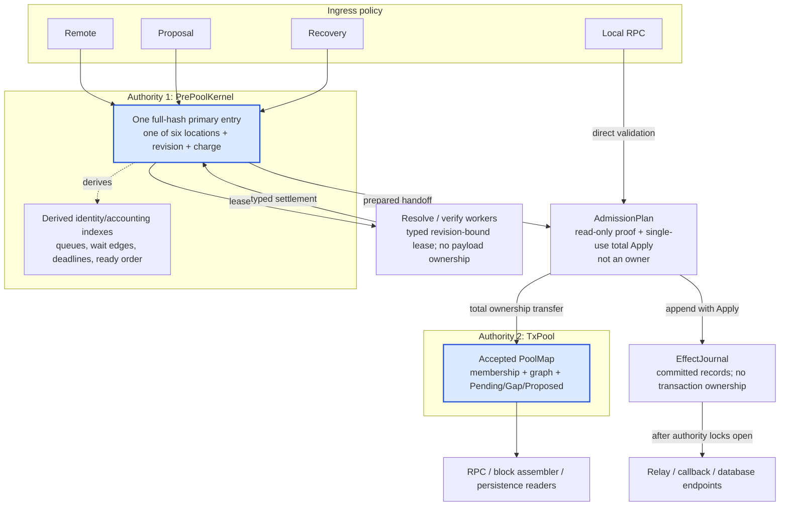
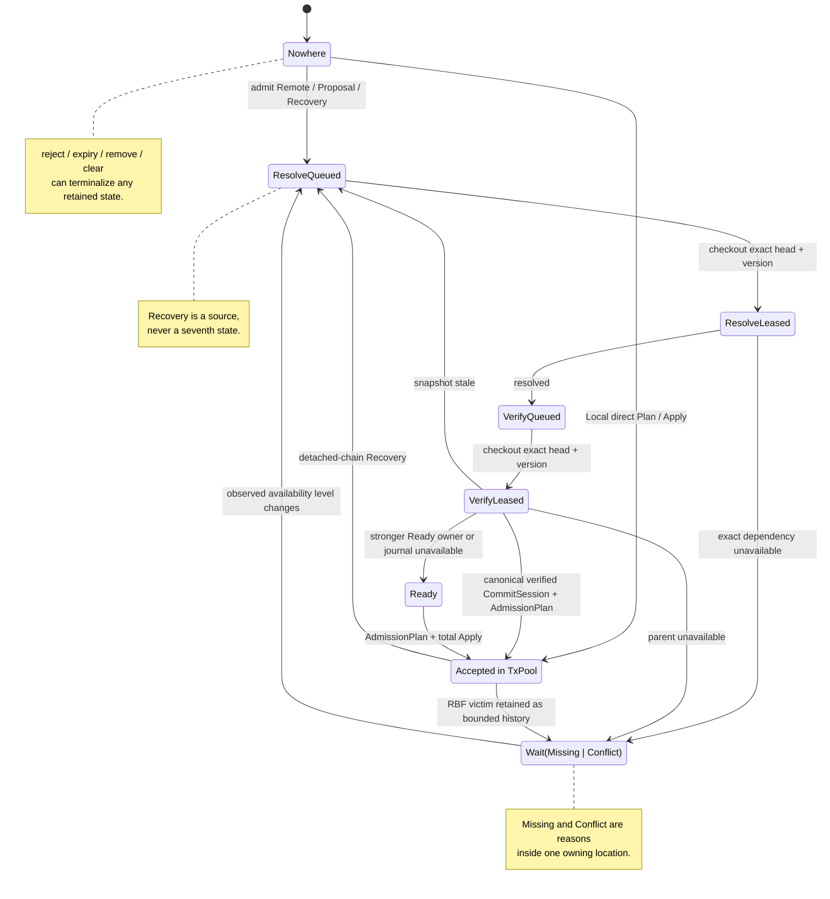
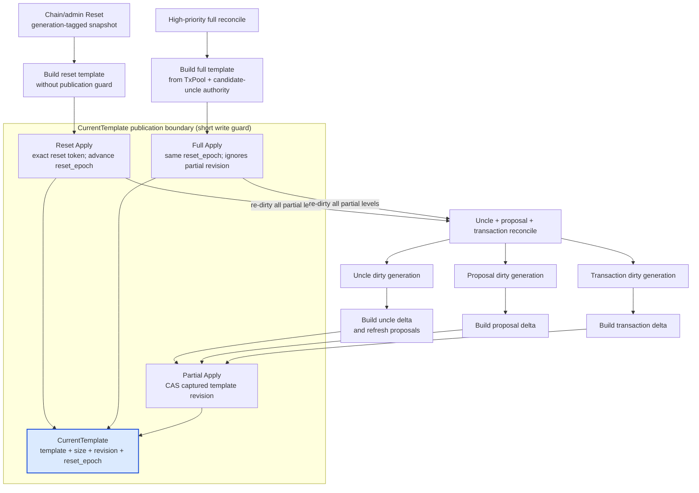

# Tx-Pool Architecture: Two-Authority Plan/Apply Kernel

This is the normative design for the current implementation. Executable
behavior and hostile-case evidence live in
[`REVIEW_GUIDE.md`](REVIEW_GUIDE.md); contract maintenance and CI commands live
in [`VALIDATION.md`](VALIDATION.md). Migration notes and checkpoint history are
intentionally not part of the public architecture.

## 1. Decision

The final architecture has two, and only two, executable transaction owners:

1. `TxPool` owns accepted transactions and consensus-facing pool status.
2. `PrePoolKernel` owns retained transactions that have not been accepted.

Every pre-pool transaction is one primary entry in exactly one of six
locations. Queues, wait edges, deadlines, conflict indexes and counters are
derived projections containing identity or accounting only. Accepted mutation
is a read-only `PoolMutationPlan` followed by total `apply_mutation`. Stable
observable effects are appended in the same innermost critical section as
state Apply.

This is deliberately not a universal actor, an undo/rollback engine, a
restart-on-panic system, or a generic workflow framework. It is the smallest
model found that closes the concrete `develop` ownership, RBF atomicity,
liveness and resource-bound failures without serializing read-heavy accepted-
pool or optimistic block-template work.



Only the two blue nodes own transaction payloads. Workers borrow one exact
version, `AdmissionPlan` proves a transfer, and the journal owns immutable
effects—not a third copy of transaction lifecycle state.

## 2. Goals and non-goals

The architecture must:

- make retained payload ownership explicit and queryable;
- make stale asynchronous completions harmless through one non-reused version;
- reject all ordinary policy/capacity failures before accepted Apply;
- preserve exact RBF, dependency, reorg, proposal and template liveness;
- bound bytes, entries, active work and graph fan-out before retention/work;
- publish callbacks, relay decisions and diagnostics without state/effect gaps;
- isolate untrusted computation and endpoints using Rust-native boundaries;
- make transaction and authority code panic-free by construction: typed
  outcomes before mutation and a single-consumption total Apply;
- prefer static unrepresentability over runtime validation, and typed results
  over unwind isolation; never use `panic!` plus `catch_unwind` as transaction,
  worker, retry, rollback or authority-control flow;
- retain Local RPC's direct synchronous validation path by design;
- preserve or improve pipeline throughput, subject to controlled A/B.

It does not attempt to:

- make the process survive OOM, abort, FFI corruption or arbitrary memory
  corruption;
- treat an invariant panic as a legal transaction result;
- provide durable mempool persistence across crashes;
- make callbacks or network endpoints exactly-once;
- replace consensus verification, the accepted `PoolMap`, or block-template
  policy with a general scheduler.

## 3. Why `develop` requires structural change

The refactor is justified by failure families, not by a preference for new
types.

| Family | `develop` defect | Required structural boundary |
|---|---|---|
| F1 ownership/ABA | queue pop, active work, orphan retention, clear and re-admit infer location from several structures; stale work can erase or duplicate ownership | one full-hash primary entry and one non-reused version |
| F2 accepted atomicity | RBF/capacity paths can remove accepted transactions before every replacement condition is known | immutable accepted Plan and total Apply |
| F3 stable effects | mutation and relay/callback publication can be separated by saturation or endpoint failure | bounded journal append coupled to Apply |
| F4 resource hostility | queue, orphan, conflict and graph metadata have separate or incomplete accounting | one retained-entry charge plus explicit graph/active bounds |
| F5 dependency liveness | missing/conflicting work can be parked in disconnected mechanisms and miss a wake | one `Wait` owner with exact, level-triggered reverse keys |
| F6 conflict recovery | speculative victim ownership and failed-RBF restoration require ordering-sensitive undo | no speculative removal; conflict history is optional metadata in the same kernel |
| F7 chain/admin ordering | reorg, clear, save and template updates can observe different ownership generations | `TxPool -> PrePoolKernel -> EffectJournal` chain transition plus epoch/reset authority |
| F8 identity/status | raw hash, witness hash, proposal short ID and RPC status can be used as if interchangeable | explicit identity domains and collision-aware projections |

Local hardening of each legacy queue cannot prove the partition invariant: the
bug is the inferred handoff between structures. Conversely, moving accepted
`PoolMap` into one global actor would simplify proof but regress concurrent
read/template/RPC performance and create a single mailbox bottleneck. Two
authorities are the minimum separation that preserves both proof and useful
concurrency.

## 4. Ownership and state

### 4.1 Partition

The single logical ownership state for each full transaction hash `h` is the
closed sum:

```text
Owner(h) = Absent
         | PrePool(location, version, payload)
         | Accepted(status, entry)
```

It is represented by two physical partitions only to preserve useful
concurrency: the accepted `TxPool` remains read-optimized for RPC/template
consumers, while `PrePoolKernel` serializes short lifecycle transitions.  The
representation invariant is:

```text
owners(h) = accepted(h) + prepool(h)
owners(h) is 0 or 1
```

`accepted(h)` is membership in `TxPool`. `prepool(h)` is membership in the
kernel primary map. Physical separation is not permission for two independent
commit authorities. `AdmissionPlan` is the only ordinary cross-partition
transition: it is planned while both generations are stable and applies the
kernel handoff plus accepted insertion as one total operation under the fixed
lock order. Clear/reorg use the separately documented chain-authoritative
generation transition. No other caller may remove one owner and later repair
the other.

### 4.2 Six pre-pool locations

```text
ResolveQueued
ResolveLeased
Wait(Missing | Conflict)
VerifyQueued
VerifyLeased
Ready
```

`Missing` and `Conflict` are reasons inside the one unavailable-work location;
they do not own payloads independently. Recovery is a trusted source, not a
state. There is no persistent `Committing`, `Invalidated`, `RaceLost`,
`RecoveryRetained`, victim hold, undo state or conflict-owned payload.



Every worker completion must present the correct lease type, full hash and
exact entry revision. A stale arrow therefore becomes a typed no-op instead of
an implicit state transition; no caller can manufacture a raw location tag.

The entry owns:

- compact raw transaction payload;
- source attribution;
- exactly one typed state payload;
- full-hash version and arrival clocks;
- expiry and conservative retained-byte charge;
- canonical dependency keys.

Derived projections own no transaction payload:

- fair resolve/verify queues;
- proposal-short-ID index;
- peer, parent, waiter, deadline, ready and ready-by-input indexes;
- total/remote/per-peer/conflict residency;
- total/per-owner active work;
- bounded availability epochs and dirty wake keys.

### 4.3 Sources are policy, not location

`PrePoolSource` is `Remote(peer)`, `Proposal`, or `Recovery`.

- Remote retains immutable ingress attribution, current-payload blame,
  the declared-cycle policy for its exact witness payload, remote/per-peer
  charge and expiry. Trusted same-witness source promotion supersedes that
  peer-supplied policy while preserving the original ingress used for
  administrative revocation. A verify lease seals the policy it checked out;
  every negative script-verification result is bound to that policy as well as
  the chain view. If a trusted promotion races either the peer's lower cycle
  ceiling or a declared-cycle mismatch, Apply retains the exact resolved
  payload and requeues trusted verification instead of publishing a stale peer
  rejection.
- Proposal is trusted and may promote the same-witness Remote entry or replace
  its payload with a trusted witness variant.
- Verification workers never publish a separately sampled source. The
  `VerifyLeased -> Ready/Accepted` transition derives the payload source from
  the same stored entry and version it replaces, so promotion, optional direct
  handoff and Ready fallback have one linearization point.
- Recovery is trusted detached-chain input and enters the ordinary resolve
  lifecycle parent-first.
- Local never enters the pre-pool. It validates synchronously, commits under
  the same accepted Plan/Apply transaction, and settles any matching retained
  owner. This is an intentional API behavior, not an optimization accident.

## 5. Identity domains

| Identity | Only valid role |
|---|---|
| full transaction hash | primary ownership, accepted membership, lease owner |
| witness hash (`wtx_hash`) | `TxVerificationCacheKey`; verification results cannot alias witness variants |
| proposal short ID | collision-aware index and consensus proposal protocol only |
| entry revision (`u128`) | process-global, non-reused identity for one exact primary state and its derived indexes |
| pipeline epoch | administrative clear/reorg invalidation, not per-entry identity |

A short-ID collision is backpressure/rejection, never proof of duplicate
ownership. Cache accesses construct `TxVerificationCacheKey::from_transaction`.
A stale completion must present the correct typed lease, full hash and exact
revision before it can mutate the primary. Callers cannot supply a raw
revision/location pair.

## 6. State transitions

The public transition family is closed:

| From | Command/outcome | To |
|---|---|---|
| Nowhere | admit Remote/Proposal/Recovery | ResolveQueued |
| retained location | trusted same-hash promotion | same semantic phase or ResolveQueued for a new trusted witness |
| ResolveQueued | checkout exact queue head | ResolveLeased(new revision) |
| ResolveLeased | resolved | VerifyQueued(new revision) |
| ResolveLeased | exact dependency unavailable | Wait(Missing/Conflict) |
| Wait | all observed keys available | ResolveQueued |
| VerifyQueued | checkout exact queue head | VerifyLeased(new revision) |
| VerifyLeased | verified, fee-gated and stronger than every published Ready owner | Accepted through the ordinary AdmissionPlan |
| VerifyLeased | stronger Ready owner or unavailable effect journal | Ready(new revision) |
| VerifyLeased | snapshot/parent stale | ResolveQueued or Wait |
| Ready | selected commit handoff | accepted or bounded Conflict wait/history |
| any retained location | reject/remove/expiry/peer removal/clear | Nowhere |
| any retained generation | chain/admin generation reset | sealed retired generation, then Nowhere/new recovery entries |

Every single-entry transition validates its next entry, exact usage delta,
active-work delta and index constraints before detaching the old projections.
Bounded multi-entry transitions use a private `MutationSet` to derive one
exclusive `PreparedKernelMutation<'_>` containing final primaries, exact
projection changes and reserved monotonic counters. Consuming `commit(self)`
performs the total move. There is no public mutation between Plan and Apply and
no rollback path.

Legal outcomes are typed:

- transaction/policy rejection;
- bounded capacity/backpressure;
- stale lease or location race;
- duplicate/idempotent arrival;
- Apply.

Primary/index/accounting contradictions are not transaction outcomes. Private
state constructors and a prepared authority transaction prevent them on legal
paths; a pre-Apply consistency failure is a typed system fault, never an
assertion inside Apply and never a peer/RPC rejection.

`validate_entry_projection` is the production pre-Apply check for each changed
primary's existing derived memberships. It is bounded by that entry's own
edges, not a full-pool reconciliation, and is retained as defense in depth
until construction and types prove the same facts without it. Converting it to
a debug-only check or deleting it requires an explicit architecture decision,
replacement proof and performance evidence; it is not a mechanical cleanup.

## 7. Scheduling and progress

### 7.1 Fair work queues

Resolve and verify queues contain `WorkKey` identities only. Each source owner
has a queue with a fair turn; runnable heads are derived from global and
per-owner active limits. Verify work carries a typed `VerifyCycleClass` and is
stored in exactly one of the owner's disjoint small/large ordered sets. The
general head is the maximum of the two partition heads under the unchanged
total `WorkKey` order; a constrained worker reads only the small head. Thus a
large-cycle population cannot hide eligible small work or turn capability
filtering into an owner-population scan, and no key is duplicated to obtain
that bound.

After a successful Resolve or Verify completion, the worker may check out the
next lease from the same lane inside that completion's kernel mutation. This is
same-acquisition lease continuation, not a second scheduler: the existing fair queue and active
limits still select the lease, Verify preserves the worker's capability, and a
continuation never crosses Resolve to Verify. The capability is sealed into
`VerifyLease` at checkout rather than supplied again by completion. The result
type distinguishes
"completion applied, no next lease" from a post-Apply checkout fault, so a
caller cannot roll back or settle the completed lease after ownership already
moved.

Only completion and checkout share the short kernel critical section. The
worker releases it before Resolve/Verify computation and never holds it across
an `await`.

Pause, cancellation and command-channel loss are checked before accepting the
continuation for normal processing. If one lease was already checked out, the
worker completes exactly that lease in final mode without another checkout.
This bounds stop latency without dropping an owned lease or creating a
self-sustaining wake loop.

### 7.2 Ready order

Ready selection uses one total `ReadyKey`, strongest last:

1. source priority: Remote < Proposal < Recovery;
2. exact fee rate by `u128` cross multiplication;
3. absolute fee;
4. earlier arrival;
5. smaller full hash;
6. process-global entry revision.

The reverse comparisons for arrival/hash are intentional because the driver
selects the greatest key. Revision is globally unique, so a later transaction-
size comparison would be unreachable rather than an additional ordering rule.
There is deliberately no time-dependent aging: source and fee preference are
stable, Remote residency remains deadline/budget bounded, and only bounded
chain-derived Proposal/Recovery ingress can outrank Remote. Under sustained
overload a lower-fee Remote candidate can therefore wait until its residency
deadline, matching fee-market preference at the cost of strict per-candidate
fairness; controlled performance acceptance must measure saturation throughput
and tail latency. Dynamic aging
would require periodic reindexing of every Ready key and is not justified
without evidence that this explicit trade-off is unacceptable.

`CommitSession<'_, Origin>` is a non-copyable capability whose `Origin` is one
of two private sealed types: a published Ready owner or the exact active
`VerifyLease`. Both exclusively borrow the kernel from selection through the
same accepted or rejected Plan/Apply API. The private candidate records hash,
revision, rank, payload, inputs, location proof and immutable ingress peer.
Rust therefore prevents expiry, verification publication or another commit
selection from mutating that authority; while a returned Plan exists, it
reborrows the session until Apply or drop. Stale commit tickets and a third
caller-defined origin are unrepresentable.

The verified origin is an opportunistic fold, not a second fast-path policy.
It opens only when its prospective `ReadyKey` is strictly stronger than the
current published Ready head. Otherwise the existing `VerifyLeased -> Ready`
transition runs. It derives the exact transient charge from the verified
payload and proves the same total/remote/per-peer budget delta before planning
accepted admission. Final liveness, RBF closure, capacity, source promotion,
peer-ban fence, conflict retention, template receipt and effect batch all use
the same generic session and `AdmissionPlan`. Journal Full/Closed applies
nothing and publishes the owner as Ready for the level-triggered driver; no
verified worker waits on effect capacity while holding state.

Peer revocation is an administrative transition of the same authority, not a
second lock or a second lifecycle protocol. One ban Plan/Apply installs the
expiring, non-evicting peer marker and removes the complete indexed
`PreAccepted` ingress cohort attributed to that peer. This includes checked-out
work: its move-only lease remains memory-safe, but its later settlement observes
a missing/version-stale owner and cannot publish state. `Accepted` membership is
deliberately outside the cohort. Therefore the authority lock itself decides
the race: a commit that applies first remains Accepted; a ban that applies first
removes every not-yet-Accepted owner and makes later work stale.

The marker transition is valid even when that indexed cohort is empty. Cohort
presence is derived cleanup state, not evidence that the ban happened. This
linearizes the authority decision against a controller message that was queued
before the ban but reaches admission afterwards; making marker publication
conditional on a resident owner would reopen that race.

New Remote admission checks only its ingress peer in that same authority Plan;
there is no additional hot-path ban mutex, waiting state, cleanup task, or
population scan. Marker cardinality is coupled to the network's existing
unexpired ban set and a transaction-residency LRU is forbidden because newer
bans must not evict an older live revocation decision. First-ban deadlines use
the fixed network duration and therefore enter one monotonic expiration queue;
a repeated live decision reuses that lease without extending, shortening or
adding another expiration owner. New bans prune only the due prefix, making
cleanup amortized in expired markers rather than rescanning all live peers.
The ban Apply commits
one cardinality-independent `PeerCohortRevoked` effect, not one item per removed
transaction. Its optional culprit is a typed malformed-only value containing
the exact raw hash and bounded public reason. Publication records that exact
reject, performs the external network ban for only the time remaining on the
same committed marker lease, and sends a required relayer
`GenerationReset`; the reset clears stale known/pending projections without
creating transaction tombstones or retaining the removed cohort's hashes.
The same transaction may therefore immediately be admitted from a different,
non-banned peer. Effect backpressure applies nothing, including the marker, so
an external consumer never decides whether authority removal happened.

The peer-revocation surface has the following anti-drift proof rules. They are
architectural constraints, not replaceable implementation details:

| Failure family | Root cause | Permanent constraint |
|---|---|---|
| queued ingress crosses a ban | treating a non-empty resident cohort as evidence that revocation occurred | marker publication is valid even for an empty cohort and shares the cohort-removal Apply |
| partial cleanup or work resurrection | splitting peer attribution, owner removal and lease invalidation across actors | immutable ingress attribution and the complete `PreAccepted` peer index are consumed by one authority Plan/Apply |
| publisher-created policy | allowing an I/O adapter to infer a ban from a generic malformed rejection | only `PeerCohortRevoked` can construct a network-ban action; the publisher never rereads or re-decides policy |
| extended or inconsistent ban duration | starting a new duration when delayed I/O finally runs | marker and external call consume one deadline lease, evaluated at the foreign-call boundary |
| attack-amplified cleanup | emitting one effect per peer-owned transaction or scanning unrelated owners/markers | one cohort effect, one charged per-peer index traversal and due-prefix-only expiry pruning |

### 7.3 Wait is level-triggered

`Wait` records the exact dependency keys and their observed level epochs.
Availability and definitive loss both dirty a bounded key; maintenance drains
bounded slices. A missed notification is harmless because the level remains
visible. Parent terminalization and dependent invalidation share one cohort
Apply, so trusted Proposal/Recovery children re-evaluate terminal policy rather
than parking forever, while Remote children retain their request/expiry policy.
Parent loss demotes resolved/verified consumers using the same exact keys.
The immutable cohort Plan projects waiter-count deltas once over changed
primaries, inspecting the smaller of its requested and observed key frontiers;
it never multiplies every changed key by every cohort member or persists a
second dependency index. The resulting level plan is still applied only after
the primary cohort's total Apply.
Final accepted-pool validation remains authoritative even if background
demotion has not run yet.

### 7.4 UAK replacement-history boundary

The isolated Unified Authority Kernel does not encode RBF history as a source
flag or a `Waiting(Conflict)` phase. Only a successful replacement of a
genuinely Accepted victim can construct the private
`OwnedTx::ReplacementHistory` location. That location owns raw transaction and
exact dependency evidence, but has no ingress source, peer/deadline, scheduler
lane, active-work capability or executable phase. This type split prevents an
under-fee/failed candidate from becoming retained history and removes invalid
source × phase combinations instead of policing them with runtime assertions.

History is charged to total preacceptance and a dedicated zero-active-work
sublimit. One membership Plan either retains the complete replacement closure
or terminalizes the complete optional set while still accepting the winner.
Its post-Apply dependency cut prevents same-cohort self-wake. Only after every
dependency that is actually unavailable in the replacement's final overlay has
a newer final availability level—or through a typed trusted Proposal lease—can
history convert to ordinary executable preacceptance. A partial release only
prompts a bounded re-evaluation; it cannot consume history while another
winner still owns a blocker. The full dependency basis remains retained for
fresh resolution, but unrelated available inputs/deps are not wake triggers.
It remains absent from Pending,
template and persistence projections; G5 must map it to the existing
recent-reject/RBF-compatible query surface during the single production
cutover, not introduce a new public RPC state. The authority's live-RPC
projection therefore returns typed absence for this owner; that absence is
what requires the endpoint adapter to continue to recent-reject lookup.

## 8. Resource proof

Admission or transition planning accounts conservatively before retention:

- total pre-pool entries and bytes;
- Remote entries and bytes;
- per-peer entries and bytes;
- optional conflict-history entries and bytes;
- total active work and per-peer active work;
- dependencies per entry and dependents per parent;
- Ready inputs and candidates per input;
- accepted pool serialized bytes, retained bytes, cycles and mutation closure;
- effect batches/bytes by trust region;
- candidate uncle count and per-height count.

The charge is held continuously across queued, leased, waiting and Ready
locations. A worker borrows an `Arc`; it does not become a new owner or refund
residency. Before a verified lease can transfer directly, its payload-derived
post-verification growth is checked with the same exact usage-delta planner;
the Ready fallback consumes that identical charge. Optional conflict history
degrades to a terminal result when its partition is full. Graph operations stop
at explicit product/fan-out bounds before mutating.

The UAK production compiler treats the configured pipeline residency limit as
one physical envelope. It statically partitions retained ownership from exact
per-capability compute grants; checkout charges the grant's bytes and edges in
the same owner record, and settlement atomically exchanges or releases it.
Increasing worker count therefore cannot multiply the physical ceiling.
Configuration is rejected at assembly if one grant cannot hold the minimum
weighted entry. The partition ratio is policy that may be tuned by controlled
benchmarking; it does not introduce another lock, queue or resource authority.

`NotifyTxs(Vec<TransactionView>)` is a trusted controller boundary. Each item
still passes validation and admission accounting, but the vector itself is not
currently proven by this module to have an upstream length bound; this remains
a documented integration-boundary risk rather than a hidden invariant claim.

## 9. Accepted Plan/Apply

Ordinary admission, RBF and capacity eviction use one concrete
`AdmissionPlan` transaction:

1. Under the accepted pool write guard, calculate RBF conflict closure,
   ancestry, status, candidate parents, capacity evictions and post-state
   totals without mutation.
2. Return every ordinary `Reject` from Plan.
3. While accepted membership is unchanged, build the matching total kernel
   handoff, exact dependency/template receipt and immutable exact-sized effect
   batch. Planning may return a typed stale/capacity result but changes no
   owner, clock, index or budget.
4. The innermost effect-journal predicate first accepts that exact batch, then
   one total Apply installs accepted membership, consumes the kernel owner and
   records the level-triggered template delta before appending the effect. The
   physical order makes the only still-fallible pool insertion the first
   operation; the complete transition remains hidden under both authority
   guards.
5. Release locks, then run callbacks/network/database endpoints.

```mermaid
sequenceDiagram
    autonumber
    participant D as Verified completion or Ready commit driver
    participant P as TxPool
    participant K as PrePoolKernel
    participant J as EffectJournal
    participant E as External endpoints

    D->>P: acquire accepted write guard
    D->>P: build immutable PoolMutationPlan
    alt Reject / Stale / Backpressure
        P-->>D: typed outcome; release guard; original state unchanged
    else accepted plan is complete
        D->>K: acquire kernel and prepare exact revision-bound handoff
        D->>J: acquire innermost journal guard and test exact batch
        Note over P,J: Fixed nesting TxPool → PrePoolKernel → EffectJournal<br/>No await or foreign endpoint; bounded snapshot reads are Plan-only
        alt exact journal region is Full
            J-->>D: Full before Apply; release journal
            D-->>K: release kernel
            D-->>P: release TxPool
            D->>K: verified origin publishes Ready; otherwise no state change
            D->>J: Ready driver waits for capacity with no state guard
            D->>P: replan from current generations
        else capacity accepted
            D->>P: total accepted PoolMap Apply
            D->>K: consume the prepared pre-pool owner
            Note over P,K: Both authority guards remain held;<br/>no reader observes the physical overlap
            D->>J: append the matching committed effect sequence
            D-->>J: release journal
            D-->>K: release kernel
            D-->>P: release TxPool
            D->>E: publish effects after authority locks open
        end
    end
```

The failure half of the diagram is as important as the success half: no legal
failure occurs after accepted mutation begins, and capacity waiting owns no
reservation or transaction state across the await.

`PoolMutationPlan` contains the candidate, final status, exact removals and
post totals. The enclosing `AdmissionPlan` contains the only matching kernel
handoff and publication receipt. Exclusive prepared borrows prevent the
planned generations from changing; its Apply performs total prevalidated
moves and no assertion or fallible lookup. It cannot discover fee, RBF,
ancestry, identity, effect capacity or resource policy after removing a victim.
Pipeline rejection has its own read-only terminal plan; it likewise cannot
call a fallible park/remove transition after the journal predicate.

This removes the need for nested undo. Rollback is the wrong abstraction here:
it duplicates ownership, index and accounting semantics, and its own failure
becomes a second correctness problem. Read-only Plan plus total Apply proves
the original state is unchanged on every legal failure.

## 10. Cross-authority locking

The nesting order is:

```text
optional serial/work permit
  -> optional EffectJournal capacity wait (no state guard is held)
  -> TxPool read/write
    -> PrePoolKernel mutex
      -> EffectJournal mutex for capacity + total Apply + append
```

No await, callback, mutable database endpoint or retired-generation drop occurs
while the accepted pool/kernel/journal nesting is held. Immutable chain-
snapshot reads are currently allowed only while constructing a bounded Plan.
Verified workers may await the outer TxPool write guard before entering this
nesting, but retain only their existing typed lease: total waiters are bounded
by `max_active_work`, one peer by `max_active_work_per_peer`, and Tokio's FIFO
write queue prevents later verified arrivals from overtaking an already queued
Local/reorg writer. No timeout, try-lock, reservation or second semaphore
changes that ordering.
The normal same-tip final-liveness path consumes the resolved cell's existing
chain provenance as positive evidence after checking the mutable pool overlay,
so it does not repeat the RocksDB point lookup; stale-tip and unproven cells
must revalidate. Remaining RBF/removal snapshot reads are a measured critical-
section cost, not permission to add unbounded I/O. Kernel-only worker
transitions use only the shorter kernel→journal suffix. Code must not acquire
`TxPool` from an effect callback or while already holding the kernel.

### 10.1 Tx-pool-only same-tip cell evidence

`TxPoolResolvedCellChecker` is an admission optimization, not a consensus or
block-validation rule. It may avoid a repeated chain point lookup for one
resolved cell only when all of these conditions hold:

1. the resolved metadata and `pre_resolve_tip` were captured from the same
   `Arc<Snapshot>` used by resolution;
2. `pre_resolve_tip == current_tip_hash`;
3. that cell has `transaction_info`, which proves it came from the chain
   snapshot rather than an accepted-pool producer; and
4. the current accepted-pool overlay was checked first and did not report a
   spender or producer result.

The proof is per cell, never per transaction. A permissive RBF resolve ignores
accepted-pool consumers only; it does not turn a chain miss into metadata, and
pool-produced metadata has no `transaction_info`. A changed tip or absent
chain provenance therefore falls through to the snapshot checker. Removal-
history queries such as `planned_unavailable_parent_hashes` and
`planned_available_dependencies` reason about other transactions and never
consume this evidence. Block, consensus, store and snapshot checkers retain
`CellChecker::is_live_resolved_cell`'s default `is_live(out_point)` behavior.

The UAK cutover encodes the same premise in `FinalAdmissionValidation` rather
than exporting a reusable Boolean. `AuthorityStore` captures the exact Ready
version, its paired snapshot, dependency cut, and one cell-order-aligned bit
projection of Accepted producers under a single read guard. The guard then
opens before cell/header database reads and time/DAO verification. A changed
script-rules receipt becomes a typed Verify requeue; a transaction-level
location or context failure becomes a sealed terminal disposition containing
its committed rejection effect. Structural evidence mismatch remains a typed
authority fault. These constructors require validator-owned capabilities, so
a sibling module cannot stamp a successful final receipt manually. This path
is tx-pool-only and is not imported by block or consensus verification.

The first attempt plans optimistically without a worst-case capacity wait. If
the exact batch is `Full`, the caller releases every state lock, waits on that
exact charge as a level-triggered hint, then replans against the new
generations. No reservation crosses an await and no authoritative mutation is
replayed.

## 11. Stable effects

The effect journal has statically partitioned trust ceilings:

- Remote can consume only the Remote ceiling;
- Trusted may use ordinary capacity plus trusted headroom;
- Critical chain/admin work has independent headroom.

Ordinary admission always precomputes one exact immutable batch. `try_apply`
checks its actual charge, executes total state Apply and appends one sequence
while holding the journal mutex. Expensive RBF/capacity/kernel planning never
runs under the journal mutex, and ordinary admission never commits first and
falls back to `GenerationReset` because a post-Apply bound was wrong.

`GenerationReset` remains a deliberately narrow chain-convergence mechanism.
Authoritative reorg/clear cannot wait behind callback or relay detail; when its
bounded detail region is saturated, the state transition commits and the
constant-size latest-generation record subsumes that observational detail.
This exception must not be reused by ordinary transaction admission. More
generally, reset/coalescing is legal only for a projection that the reset can
rebuild completely. Chain-transition status is rebuildable; its per-item
recent-reject/callback detail is deliberately best-effort when that rare path
must collapse to a reset. This is an operational-observation trade-off, not a
second state authority. Network ban and exact malformed-culprit rejection are
not rebuildable and must never disappear through that fallback. Peer-cohort
revocation therefore uses one exact critical effect and treats journal Full as
zero-mutation backpressure, while only its relayer endpoint carries a required
generation reset. The publisher cannot infer a ban from a generic rejection:
only the authority-committed `PeerCohortRevoked` effect may create that external
action.

The effect surface has two matching anti-drift rules. A derived rejection read
is identified by `(ApplySequence, effect position, immutable batch identity)`,
not sequence alone, because one committed batch may contain the same raw hash
more than once. And allocation pressure in that derived index may collapse
only chain-rebuildable detail to reset; it cannot weaken exact peer-revocation
publication or make its state Apply partial.

The publisher drains FIFO order. Full relayer capacity retains the active head;
individual relay detail may coalesce to `GenerationReset`, which stays pending
until accepted. Callback execution is isolated on a bounded endpoint thread.
Callback, network-ban and recent-reject database calls share a production
timeout and stable per-kind circuit, so one stuck foreign call cannot retain
the sole journal head; endpoint panic cannot unwind state Apply. At most one
timed-out detached call exists per opened blocking endpoint circuit.

The production publisher cannot mutate the effect log directly. Its runtime
facade checks out one move-only lease, settles that exact lease as published,
circuit-disposed or retained, and closes production only after compute work has
drained. Every successful effect Apply opens the authority guard, destroys
retirement carriers, then publishes the shared level hint. An idle publisher
subscribes before checking the log, holds no lock across its wait and observes
`None` only after close plus complete queued/active/reset drainage. The service
supervisor remains responsible for stopping every non-compute producer before
calling close; the runtime intentionally does not infer task liveness from
transaction state.

An accepted-duplicate `Ok` is also authority-dependent output. Its publisher
holds an accepted-membership read capability through journal append, so clear
or reorg either observes the `Ok` before its reset/removal or wins first and
suppresses the stale acknowledgement. Fresh admission success remains part of
the immutable `AdmissionPlan` batch and has no manual publication gap.

Exactly-once delivery is not claimed. After state Apply, a bounded stable
record exists until detailed publication succeeds, a newer authoritative
generation reset subsumes rebuildable relay detail, or a bounded foreign
endpoint attempt fails and its stable circuit disposes only that endpoint.
The last case never reverses authority: in particular, a committed peer fence
continues rejecting that exact `PeerIndex` ingress session even if the
network-ban call fails. It does not authenticate a future reconnect as the
same remote identity; losing the external disconnect/ban may therefore admit a
new session. That availability/security boundary and lost observability are
the explicit R2 operational risk, not a successful-publication claim.

A Remote owner that resolves to a complete missing-cell frontier follows the
same rule. Resolution derives canonical, sorted and deduplicated parent
transaction hashes outside the authority guard. The current-source Plan then
commits `Waiting(Missing)` and the matching parent-request effect in one Apply;
Proposal and Recovery owners do not manufacture relay requests. The runtime's
Remote effect region is assembled to fit the largest legal request batch. If
capacity is transiently full, the move-only settlement retains that exact
bounded missing result and waits for a mutation signal instead of re-running
resolution. Production header resolution rejects an unavailable header
directly, so this transaction-parent projection never treats a header hash as
a relayable transaction.

## 12. Dependencies and conflicts

Three relations are intentionally distinct:

1. causal producers: inputs and expanded dep-group producers;
2. conditional readers: cell/header dep ordering constraints;
3. availability keys: exact causes that keep a pre-pool entry in `Wait`.

Accepted `PoolMap` normalizes out-point memberships into set semantics so the
same input/dep cannot publish or remove one logical edge twice. RBF conflict
closure is bounded by the complete input × candidates product before traversal.
The accepted Plan builds a virtual post-removal overlay for ancestry and
availability; total Apply then moves exactly that closure.

Failed RBF does not remove and restore victims. A verified losing transaction
may remain as bounded `Wait(Conflict)` history only after it has passed the
higher fee gates. When its keys become available it returns through ordinary
resolution and final RBF validation. Optional-history saturation terminalizes
the loser rather than blocking the winning commit. The cohort seal defines the
event cut centrally: unchanged history observes a dependency-level advance,
but a victim retained by that same Apply records the post-Apply level and
cannot treat its own replacement release as a later wake event. This rule adds
no lifecycle state or caller-maintained publication ordering.

## 13. Reorg, clear and persistence

### 13.1 Reorg

The chain-authoritative phase holds the accepted write guard and kernel mutex:

1. reconcile attached/detached blocks and accepted statuses once;
2. collect detached transactions plus the accepted descendant closure of
   detached producers;
3. order one combined recovery set parent-first;
4. compile/apply one bounded trusted kernel recovery plan;
5. if that complete set cannot be represented within the frozen bound, reset
   the ephemeral accepted/pre-pool generation rather than retain an invalid
   parentless suffix;
6. journal the immediate block-assembler reset and optimistic generations.

The recovery payload is an ordinary `PrePoolSource::Recovery` entry in one of
the six locations. No handler-local payload, cross-await `recovery_lock`,
`RecoveryRetained` location or replay retry owner exists. Duplicate attached
raw hashes suppress detached witness variants; cache lookup uses witness hash.
An attached-cell conflict carries its canonical `OutPoint` in the typed removal
cause and committed effect. Multiple conflict paths join by deterministic
outpoint order, preserving the existing `Resolve(Dead(outpoint))` public reason
without reconstructing it after Apply.

### 13.2 Gap and uncle liveness

Reorg status reconciliation reevaluates Gap entries against the new proposal
window, including Gap→Pending demotion. Block template proposal packaging also
filters candidate uncles whose proposal IDs conflict with proposals that must
be repackaged. A detached block cannot remain an eligible uncle and suppress
the only proposal path of its recovered transactions for an epoch.

Block assembler authority is intentionally asymmetric:

- Reset and `update_full` linearize at one complete-template publication
  boundary while their construction remains concurrent;
- `update_full` has highest priority;
- `update_full` derives uncle content from the bounded candidate authority
  rather than copying a reset template's transient blank projection;
- uncle/proposal/transaction updates remain concurrent, optimistic versioned
  OCC deltas and may be skipped transiently;
- every successful reset/full replacement re-dirties all three partial
  generations, so an acknowledgement racing the replacement cannot erase a
  newer or overwritten level;
- a failed reset remains pending and blocks ordinary deltas until a matching
  full rebuild succeeds;
- zero update interval applies deltas eagerly, retries resets periodically and
  suppresses external miner notification only as configured.

### 13.3 Clear and save

Clear advances the administrative epoch, takes the accepted guard, swaps the
entire pre-pool generation in O(1), installs a generation reset, releases the
guard and only then destroys retired payloads. Stale workers cannot mutate the
new generation because entry revisions never repeat.

Explicit save serializes accepted plus retained recovery-relevant transactions
in dependency order. Graceful shutdown persists only after supervised state
workers and the effect publisher finish normally. An invariant failure marks
persistence ineligible so a corrupt derived state is not written as truth.

Each service owns a child of the process-wide cancellation token. Global exit
therefore stops every service, while `TxPoolController::stop` closes only that
tx-pool generation and cannot poison a later restart or an unrelated sibling.

## 14. Rust-native failure model

The design does not emulate Erlang supervision or promise recovery from OOM,
abort, FFI faults or memory corruption. It does require panic-free transaction
and authority paths, using Rust ownership and private constructors to separate
expected results from programming contradictions:

```text
type/ownership proof  >  typed pre-mutation Result  >  foreign-code isolation
```

`catch_unwind` is not a correctness mechanism. Internal resolver, verifier,
scheduler, publisher and authority code propagates typed outcomes. Code
supplied by callers is kept outside authority locks and isolated behind a
thread/task/channel boundary; its failure cannot select a transaction state,
rollback, retry or generation transition.

| Class | Rust encoding | Boundary |
|---|---|---|
| malformed/policy | `Reject` / transaction `PrePoolError` | reject/ban according to policy |
| capacity/backpressure | typed error | no mutation; wait/retry or bounded degradation |
| stale/duplicate race | typed stale/duplicate | discard, preserve current owner or retry level |
| shutdown/config/resource | typed external result or startup failure | controlled stop/fail startup |
| resolver/verifier failure | typed job result before settlement | terminalize/quarantine that exact lease; worker continues where safe |
| foreign callback/endpoint failure or hang | thread/task/channel isolation plus timeout/circuit | state remains committed; publisher progresses/coalesces without unwind-driven control flow |
| primary/index/accounting contradiction | typed pre-Apply system fault | controlled stop, skip persistence; never blame input |

Legal hostile input must not reach the last row or unwind the service. The
prepared transaction owns an exclusive authority borrow until `commit(self)`,
and state-specific constructors carry the facts needed by total Apply. Adding
a recover-and-repair path after partial Apply would still expand the state
machine and risk persisting corruption, so contradictions are detected before
the first mutation rather than asserted or repaired afterward.

The remaining operational consequence is explicit: a pre-Apply system fault
stops the tx-pool without persisting the generation. The defense against a
repeatable peer DoS is structural—peer-selectable parsing, policy, capacity,
stale and endpoint outcomes are typed, while total Apply has no assertion
boundary—not a restart of unknown authority state.

## 15. Block-template authority

Accepted status is consensus-facing and remains `Pending`, `Gap` or `Proposed`.
RPC compatibility may project Gap as pending, so review/tests must inspect
internal detail when liveness depends on the distinction. Proposal selection
iterates true Pending; transaction selection commits true Proposed.

Template state has two forms:

- a full authoritative snapshot generation, updated by Reset/`update_full`;
- coalesced uncle/proposal/transaction dirty generations applied concurrently
  and optimistically through version checks.



Reset and full construction may overlap partial construction; only publication
is serialized. A reset invalidates an older full build through `reset_epoch`.
A full build wins over intervening partial revisions, while each partial update
must match its captured `TemplateRevision`. Re-dirtying all three partial
levels after reset/full closes the lost-acknowledgement race without routing
all work through one actor.

Candidate-uncle retention is the input authority for both full and uncle-only
plans. Preparation clones the bounded cache under a short synchronous lock;
chain lookups and template construction run after that lock opens, and stale
cleanup is committed only with the matching successful publication token.

Candidate uncles are bounded at production limits (128 total, 10 per height)
in both production and tests. An uncle is removed/rejected when it is on the
main chain, already embedded, epoch/target-invalid, structurally invalid, or
conflicts with proposal liveness. Test builds do not change these limits.

## 16. Performance model

Correctness structure is also the intended performance structure:

- one short synchronous kernel mutex section per retained transition;
- identity-only fair queues and reverse indexes;
- `Arc` borrowing for raw/resolved/verified payloads;
- stack-sized plans for single-entry transitions;
- heap-backed cohort planning only for bounded multi-entry changes;
- move-only Apply; no cloned old-entry snapshot/undo journal;
- one serialized commit driver instead of competing commit owners;
- worker checkout itself proves whether a level-triggered queue is empty;
  there is no separate check-then-pop lock pair;
- successful Resolve/Verify completion can carry one same-lane checkout from
  the same kernel acquisition, without a new queue, owner or cross-stage path;
- accepted reads remain behind the existing `RwLock`, not a global actor;
- no foreign/mutable I/O or payload destruction under authority locks;
- same-tip resolved chain provenance removes normal duplicate liveness reads;
  remaining bounded immutable-snapshot Plan reads require dedicated lock-hold
  measurements before any cache, prefetch or optimistic-retry protocol is added;
- block-template/effect notifications coalesce level-triggered work.

Performance acceptance is empirical, not inferred from line count. The final
gate compares clean revisions with controlled warmup/cache conditions and
measures throughput, tail latency, RSS/allocation, lock hold time, worker
utilization, commit, reorg and template latency. A material regression blocks
production even if correctness tests pass.

Profiling first considers mechanical work inside the existing authority
transaction: unchanged-index detach/attach, repeated fair-owner head
publication, unconditional lane-readiness recomputation and avoidable Plan
cloning. Such work may be removed only when the resulting delta Apply remains
total and `validate_entry_projection` retains equivalent coverage. Lock
amortization comes second; another cache, batch owner or resident DAG is not an
acceptable substitute for measured mechanical simplification.

## 17. Extensibility rules

A new stage or policy is acceptable only if it answers these questions:

1. Does it require retaining a payload, or can it be derived metadata/work?
2. Which of the two authorities owns it at every instant?
3. Can it be encoded inside an existing state payload/reason/source rather
   than a seventh location?
4. What exact byte, entry, active and graph bounds apply before retention?
5. What typed revision-bound command consumes it, and what are all legal outcomes?
6. Does it alter accepted membership? If so, where is immutable Plan and total
   Apply?
7. Which stable effects must be appended with Apply?
8. What level-triggered condition guarantees progress after a lost wake?
9. Which review behavior and unit/process regression prove the boundary?
10. What benchmark demonstrates no material hot-path regression?

A proposal that adds a payload-owning side cache, rollback journal, broad
retry, reverse lock order, unbounded vector/graph, or test-only production
behavior is rejected at design review.

## 18. Why this is the preferred architecture

### Versus hardening `develop`

Per-queue locks/checks cannot make a transaction's location single-valued
across pop, await, cancellation, conflict parking and clear. Fixes remain
ordering-dependent and every new queue adds another handoff proof. The kernel
removes the root inferred-location premise.

### Versus a universal tx-pool actor

One actor could serialize all ownership but would route accepted reads,
template queries, RPC inspection and graph computation through a mailbox. It
reduces concurrency, raises tail latency/backpressure coupling and makes large
messages part of the trusted scheduling surface. The two-authority design
serializes only mutation boundaries that require atomicity.

### Versus nested undo/transactions

Undo snapshots duplicate state and require a second correct implementation of
indexes, budgets, victims and wakeups. Apply failure then needs rollback failure
semantics. Plan/Apply preserves the original state until all ordinary failure
conditions are exhausted and has one mutation implementation.

### Versus persistent commit/conflict/recovery states

`Committing`, `RaceLost`, victim holds and `RecoveryRetained` encode protocol
execution as durable ownership. They enlarge the partition, persistence,
expiry, clear and ABA matrices. A single commit driver, bounded `Wait` reason
and ordinary Recovery source provide the required semantics without those
locations.

### Versus invariant-repair/restart

Repairing an authority after a contradiction requires trusting projections
already proven inconsistent and choosing which externally visible effects to
replay. Rust isolation remains appropriate at genuinely foreign computation
and endpoint boundaries. Authority transitions instead use proof-carrying
state and typed pre-Apply faults; no assertion or unwind is part of the
transaction protocol. This is simpler than repair because hostile legal
outcomes are fully classified before Apply and partial mutation is
unrepresentable.

## 19. Proof obligations

The machine contract is [`architecture-contract.json`](../architecture-contract.json).
The human proof obligations are the stable, independently reviewable leaves
below.  For reasoning they form eight broader theorem families: partition
(T1), lease causality (T2), budget conservation (T3), derived views (T4--T5),
linearization (T6--T7 and T9), bounded hostility (T8), progress (T10--T11),
and accepted/template consistency (T12--T13).  The leaf IDs are deliberately
not merged or renumbered: grouping
shortens the proof narrative, while keeping the leaves preserves precise test
anchors and prevents a passing sibling clause from hiding a zero-match one.

The leaves are:

- T1 Partition: accepted and pre-pool ownership are disjoint and unique.
- T2 Lease: only exact full-hash/version/location work mutates a primary.
- T3 Budget: retained ownership iff it is charged; all fan-out/work is bounded.
- T4 WaitExactness: Wait owns exact observed dependency causes.
- T5 ReadyExactness: Ready ranks/inputs derive from its primary payload.
- T6 AtomicAcceptance: every ordinary failure precedes accepted Apply.
- T7 StableEffects: successful Apply leaves a bounded publishable record.
- T8 BoundedHostility: peer input cannot cause unbounded residency/CPU/fan-out.
- T9 ChainSerialization: reorg/clear/save observe one authority order.
- T10 CriticalSchedulability: Remote saturation cannot consume chain headroom.
- T11 LevelTriggeredProgress: lost wake edges do not strand executable work.
- T12 AcceptedStatusExactness: Pending/Gap/Proposed transitions match snapshot.
- T13 TemplateAuthority: reset/full/deltas cannot publish an old-parent or
  proposal-stranding template.

The T1–T13 mapping in [`review-behaviors.json`](../review-behaviors.json) is the
current executable evidence. Development-era finding numbers are intentionally
not part of the normative model.

## 20. Implementation map

The model is distributed by responsibility, not by lifecycle ownership:

| Responsibility | Primary implementation | Review boundary |
|---|---|---|
| Pre-pool ownership, state, leases, budgets and indexes | `src/component/pre_pool/` | T1–T5, T8, T10–T11 |
| Accepted membership, graph and mutation plans | `src/pool.rs`, `src/pool_map/` | T6, T12 |
| Cross-authority admission and administrative transitions | `src/service/pipeline_ops.rs`, `src/process/submit/` | T6–T10 |
| Resolve, verify and commit workers | `src/service/stages/`, `src/service/workers.rs` | T2, T10–T11 |
| Stable effects and external endpoint isolation | `src/service/effects.rs` | T7, T10 |
| Reorg, clear and persistence | `src/process/reorg.rs`, `src/process/mod.rs`, `src/persisted.rs` | T9, T12 |
| Block-template reset/full/OCC deltas | `src/block_assembler/` | T13 |
| RPC/network dispatch and source policy | `src/service/controller.rs`, `src/service/dispatch.rs`, `src/service/message.rs` | T7, T12 |

`TxPool` and `PrePoolKernel` remain the only payload authorities. Modules in
this table coordinate or project those authorities; their existence does not
create another owner.

## 21. Residual risks

The operational projection consists of four static-label metric families:

- `ckb_tx_pool_pipeline_residency` projects total, Remote and conflict-history
  entry/byte residency plus active work;
- `ckb_tx_pool_pipeline_rejections` counts the closed malformed, policy,
  capacity, duplicate and internal terminal classes;
- `ckb_tx_pool_pipeline_failures` counts typed faults, unexpected worker exits,
  handler unwinds and effect-publisher failures; and
- `ckb_tx_pool_effect_usage` projects the Remote, ordinary and total cumulative
  effect regions in batches and bytes.

Every label is compile-time fixed. Gauges are best-effort lock-free snapshots
published after the authoritative transition; a concurrent older publication
may be observed briefly and the next transition converges it. Metrics are
therefore suitable for operational trends and alerts, never for state repair,
admission, settlement or proof of an invariant.

A residual is an explicit boundary, not an implicit bug waiver. `Eliminate`
means a focused change can remove it without changing the ownership model;
`Mitigate` means the model can bound but not erase it; `Accept` means removing
it would add a disproportionate owner/protocol; `Validate` means evidence, not
another mechanism, closes it.

| ID | Disposition | Current boundary | Closure rule |
|---|---|---|---|
| R1 | Mitigate | A genuine pre-Apply primary/projection contradiction is a typed system fault: service stops and the generation is not persisted. | Legal input must remain excluded by private types, narrow result domains and total Apply. A reachable legal path requires redesigning that operation-specific API, never catch/repair control flow. |
| R2 | Accept | External callback, network-ban and recent-reject delivery is bounded but not exactly-once. Relay state alone is fully reconcilable through `GenerationReset`; a non-rebuildable endpoint action receives one bounded attempt before its per-kind circuit disposes later calls. The committed fence still protects the exact `PeerIndex` ingress session, but a failed network ban can permit a reconnect with a new index and observability can be unavailable. | Exactly-once would require a durable transactional outbox, idempotent endpoint protocol and restart replay. Do not claim delivery or add that failure domain without a product requirement; keep the internal session fence authoritative, never describe it as durable remote identity, and surface circuit state operationally. |
| R3 | Mitigate | A timed-out blocking endpoint may leave one detached call per endpoint kind until it returns; stable circuits suppress later calls. | Keep endpoint-kind cardinality bounded and authority locks released. Prefer cancellable async APIs when available. |
| R4 | Accept | Explicit pool persistence is neither a crash-durable WAL nor a cancellable filesystem transaction; shutdown I/O may delay exit. | Keep I/O outside transaction authority. Add timeout/metrics only for an evidenced shutdown SLO; do not move I/O under authority locks. |
| R5 | Accept | OOM, allocator abort and process corruption are outside in-process recovery. | Process supervision and restart own this boundary. |
| R6 | Mitigate | The public controller retains its compatible `Vec<TransactionView>` input, but the dispatcher message accepts only `NotifyTxBatch`, proven against the relayer's shared count and serialized-byte limits before channel admission. Caller-side allocation occurs outside tx-pool ownership. | Keep the protocol constants centralized in `ckb-constant` and the validated newtype as the sole message payload; never reconstruct a raw batch behind the controller boundary. |
| R7 | Improve with evidence | `TxSelector` stops after 4,000 consecutive non-fitting packages, bounding CPU while permitting bounded template underfill. | Change only through a resumable cursor or fit-aware index with packing-quality and CPU/RSS A/B evidence; removing the cap is invalid. |
| R8 | Mitigate | Static low-cardinality metrics project kernel residency, terminal rejection classes, service-failure boundaries and effect-region usage from already-maintained counters. Exporter availability, alert thresholds and operator response remain deployment concerns. | Keep metric publication outside authority locks and outside all state/control decisions. Add no metric-owned cache, scan, dynamic label or retry path; validate alert policy in deployment configuration. |
| R9 | Accept for compatibility | A legacy or hand-authored v1 persistence file may order a child before an expanded dep-group parent and lose that local mempool child during serial replay. | A future fix must be a versioned batch-resolve/retry loader, not another raw ordering heuristic. Chain state is unaffected. |
| R10 | Accept | Raw `Wait(Conflict)` cannot know expanded dep-group, header context or maturity until re-resolution. | Accepted/verified victims retain exact expanded edges. Do not retain another verified owner or contextual wake protocol without a concrete liveness counterexample. |
| R11 | Mitigate | Each configured block-template script owns one RAII process slot and its direct child is killed on timeout, so template rate cannot multiply live owned children. HTTP requests are cancellable at timeout, but their maximum concurrent count is the trusted configuration product of endpoint count and timeout/update-interval ratio. A script that deliberately daemonizes descendants crosses the configured external-program boundary. | Keep `kill_on_drop` and the per-command permit inseparable from spawning, and keep HTTP work cancellable and outside authority locks. Treat extreme notification timing/cardinality as an operator configuration risk; hard startup caps or process-group ownership require a separate backward-compatibility/product contract. |
| R12 | Validate | Throughput, tail latency, CPU, allocation/RSS and lock-hold superiority are not established by correctness tests. | Pass the clean, repeated, fingerprint-matched A/B protocol in [`BENCHMARK.md`](BENCHMARK.md). |

## 22. Release conditions

A release or superiority claim applies to the tested revision only. It
requires:

1. all read-only contract, documentation and test-layout validators in
   [`VALIDATION.md`](VALIDATION.md) to pass without generated drift;
2. the complete `ckb-tx-pool` internal-feature nextest suite and strict clippy
   gate to pass;
3. the complete managed integration impact inventory to agree with
   `ckb-test --list-specs` and pass through `make integration` without filtering
   failures;
4. every changed behavior to retain its focused unit and process evidence in
   [`REVIEW_GUIDE.md`](REVIEW_GUIDE.md); and
5. the controlled performance gate R12 to pass before claiming that the
   redesign is performance-neutral or superior.

Accepted or mitigated residuals remain visible in this document. New evidence
must narrow a residual or add a new current ID; it must not revive a historical
ledger or hide risk behind another owner, repair protocol or retry state.
