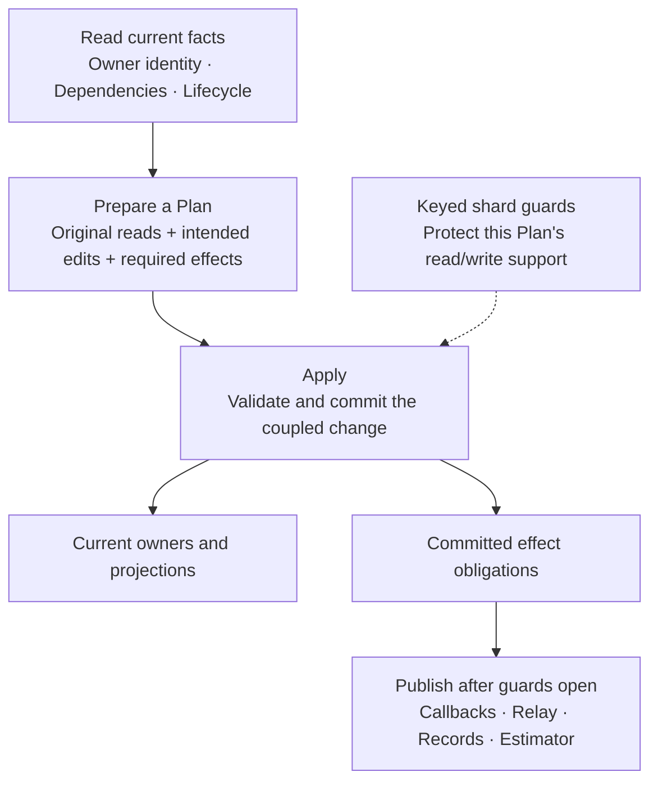
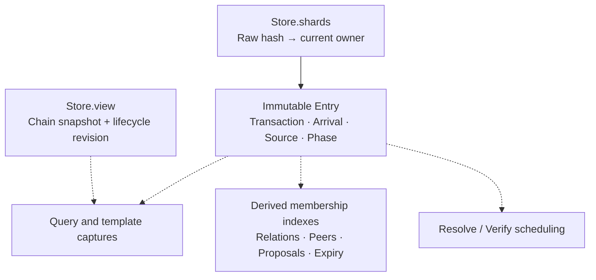

# Transaction-pool architecture

The pool is built around **original observations → Plan → Apply → publication**.
This gives admission, replacement and chain changes one rule: validate the facts
that justified a decision, then commit all coupled changes together. Shards make
compatible commits concurrent; the outbox retains effects that must follow them.

## The architectural core

| Concept | Responsibility |
|---|---|
| Read set | Retains the original premises of a decision, including absence and complete relation reads |
| Plan | Owns original reads throughout preparation and Apply; pairs owner changes with their effects and preserves premises when discarding a refused policy |
| Apply | Revalidates premises and reserves exact capacity before committing owners, indexes, queues, charges and obligations |
| Shards and gates | Protect conflicting facts during Apply; they are concurrency machinery, not independent policy authorities |
| Effect outbox | Preserves ordered obligations after commit until publication settles |

A transaction has one current immutable owner. Raw hash is its lookup key; the
`Arc<Entry>` instance distinguishes successive owners at that key. Witness hash
identifies VM payload. Expensive resolution, verification, graph decisions and
external calls stay outside owner guards.

A queued transaction crosses this boundary more than once: ingress installs its
first owner, resolution commits Verify or Waiting, and admission commits Accepted.
Queue selection and computation themselves do not change owner phase.

For replacement, the Plan includes both candidate and victims. If an observed
spender or dependency changed, Apply rejects the stale Plan; no partial victim
removal becomes visible. Two compatible Plans can hold their final commit guards
at the same time, including when their transactions only share a read-only cell-dep.
Publication is ordered, but is not performed inside those guards.

## Facts, owners and projections

The owner is the retained transaction fact; indexes locate and classify it.
Source records permissions/provenance, while phase records its current work or
accepted/recovery state. A phase change creates a new owner instance. The paired
view supplies chain context and invalidation. Public pending/gap/proposed position
is a projection against that view, distinct from the owner's admission phase.
Gap is the proposal-to-commit delay of the two-phase protocol. Missing dependencies
never assign Gap: Waiting owners count as orphans and have no accepted pool status.
[Entry and Source](../src/authority/model.rs) define these facts.

Decision modules prepare Plans; **Store alone writes live owners and their
membership projections**. Pool owns jobs, computation admission and request
coordination. Block verification takes priority over pool computation while
reconciliation and publication remain live. The builder owns startup and task
joins. Jobs, suspended VM state, active reservations and publisher endpoints have
their own lifetimes, explained in [execution](architecture/EXECUTION.md).
Consensus and VM truth remain in the canonical verification crates.

Membership policy reads through a graph borrowing its Plan. The graph's private
Store/cache boundary prevents policy from bypassing tracking or swapping out its
observations. Private Plan and Effect fields centralize outcome construction.
Business rules still own which premises and obligations are necessary; see
[original reads and intended writes](architecture/COMMIT.md#original-reads-and-intended-writes).

## Responsibilities in code

| Change or review target | Entry point |
|---|---|
| Request protocol and completion | [controller](../src/service/controller.rs), [message](../src/service/message.rs), [dispatch](../src/service/dispatch.rs) |
| Active jobs and direct requests | [Pool](../src/authority/service.rs), [execution](../src/authority/service/execution.rs), [submission](../src/authority/service/submission.rs) |
| Policy preparation | [ingress](../src/authority/ingress.rs), [membership](../src/authority/membership.rs), [chain](../src/authority/chain.rs) |
| Live reads and prepared decisions | [Store](../src/authority/store.rs), [Plan and read set](../src/authority/store/plan.rs) |
| Coupled mutation and resource ownership | [Apply](../src/authority/store/apply.rs), [budget](../src/authority/budget.rs) |
| Retained representation and runnable work | [model](../src/authority/model.rs), [residency](../src/authority/residency.rs), [queues](../src/authority/queue.rs), [waiting](../src/authority/waiting.rs) |
| Resolution and canonical checks | [jobs](../src/authority/jobs.rs), [verification](../src/verification.rs) |
| Committed effects and relay reconstruction | [notice](../src/authority/notice.rs), [relay](../src/authority/relay.rs) |
| Queries and mining output | [query](../src/authority/query.rs), [template](../src/authority/template.rs), [packing](../src/authority/packing.rs), [compiled causal graph](../src/authority/packing/graph.rs), [conditional ordering](../src/authority/packing/ordering.rs), [block assembler](../src/block_assembler/mod.rs) |
| Startup, shutdown and disk format | [builder](../src/service/builder.rs), [persistence](../src/persisted.rs) |

## Read the details

- [Commit and concurrency](architecture/COMMIT.md): read/write support, preflight,
  atomic mutation, lock order and dependency/replacement policy.
- [Execution and lifecycle](architecture/EXECUTION.md): owner phases, scheduling
  and block priority, resource lifetimes, publication, reorg, templates and shutdown.
- [Maintenance](MAINTENANCE.md): configuration, caller migration and diagnosis.
