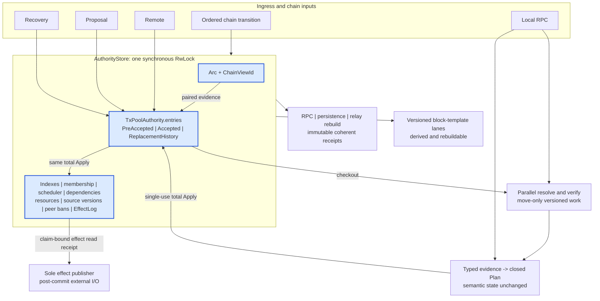
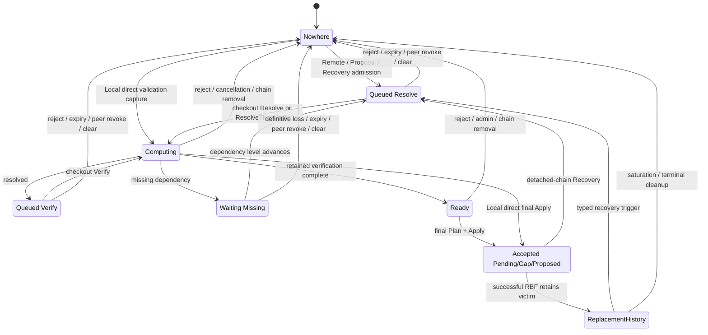
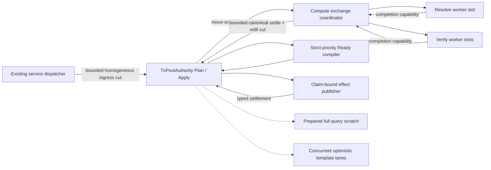
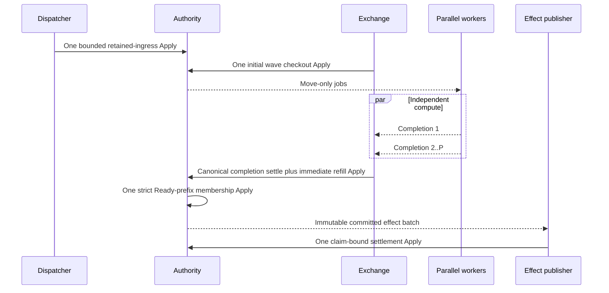

# Tx-Pool Architecture: Unified Authority Kernel

This document is the normative design of the current tx-pool. It describes
the surviving production model, not the migration history. Executable behavior
and attack regressions are indexed by [REVIEW_GUIDE.md](REVIEW_GUIDE.md);
machine-contract maintenance is documented by [VALIDATION.md](VALIDATION.md);
performance evidence and measurement rules live in
[PERFORMANCE.md](PERFORMANCE.md) and [BENCHMARK.md](BENCHMARK.md).

## 1. Decision

`TxPoolAuthority` is the only transaction-lifecycle authority. It lives with
the exact chain snapshot it validates against inside one `AuthorityStore`
protected by a synchronous `RwLock`. Its `entries` map owns every retained or
accepted transaction by raw transaction hash:

```text
Owner(h) = Nowhere
         | PreAccepted(phase, source, evidence, charge)
         | Accepted(status, proof, charge)
         | ReplacementHistory(observation, charge)
```

Indexes, membership relations, scheduling, dependency observations, resource
accounting, source versions, peer-ban state and committed effects are fields or
projections of that same authority. They change in the same total Apply as the
owner. None is a second decision authority.

Resolve, script verification and immutable planning are parallel work outside
the authority guard. `EntryVersion` plus a move-only checked-out work value
binds each compute result to the exact owner and chain view it can settle.
External I/O runs only after Apply and consumes effects committed by that
Apply.



The word pipeline refers to parallel computation around this kernel. It does
not mean a chain of owning queues. The pipeline may reorder expensive work;
only Apply decides ownership and membership.

## 2. Compatibility boundary

The refactor preserves these externally observable contracts:

- Local RPC submission bypasses retained queues, performs validation directly
  and returns its committed result synchronously. It shares only the
  count-based transient compute semaphore, so a running Remote computation can
  briefly delay capacity acquisition without gaining ordering authority over
  Local work.
- Remote, Proposal and Recovery inputs use retained asynchronous validation.
- RPC continues to expose only `Pending` and `Proposed`. Internal `Gap` maps to
  public `Pending` for compatibility, but internal proposal/template selection
  always consumes the exact `AcceptedStatus` and never the RPC projection.
- Replacement history is private recovery state. It is absent from live-pool
  RPC status, block templates and persistence.
- The `get_raw_tx_pool.conflicted` field remains wire-compatible but now lists
  only successfully displaced Accepted victims retained as charged
  `ReplacementHistory`. A rejected conflict/RBF candidate is terminal
  recent-reject evidence and is never retained merely to populate that list.
  This is an intentional semantic narrowing of `develop`'s uncharged conflict LRU:
  per-hash callers use `get_transaction` for the rejection, while removing the
  candidate's second residency closes the freeloader and implicit-retry
  surface. Rolling back to `develop` restores the broader legacy list together
  with that cache behavior.
- Verification-cache identity is the inline 32-byte witness hash together with
  the exact `ScriptVerificationRules` generation.
- Persistence remains best effort. Accepted transactions and Recovery-source
  entries are captured from one read cut; all replayed transactions re-enter
  ordinary validation.
- Full/reset block-template replacement remains serialized. Proposal,
  transaction and uncle component work remains optimistic and concurrent.
- Consensus validation is not replaced or weakened. Tx-pool-only evidence
  reuse is explicitly scoped in section 5.

Any change to wire, RPC, persistence, cache or template behavior requires a
separate compatibility decision; an internal simplification is not permission
to change it.

## 3. Why structural change from `develop` is necessary

The justification is concrete failure closure, not preference for new types.
The table also records the cost paid by the UAK and whether risk is eliminated,
bounded or merely transferred.

| Family | Verified `develop` structure and failure | Why a local patch is not a complete proof | UAK mechanism and cost | Disposition |
|---|---|---|---|---|
| F1 ownership and ABA | `VerifyQueue`, `OrphanPool`, unregistered active verifier work, conflict storage and accepted `PoolMap` independently retain or infer a transaction's location. A worker removes an item from `VerifyQueue` before verification; peer ban can then inspect only the queue, allowing that checked-out item to complete after the ban. | Locking one handoff still leaves every other producer, cancellation and administrative path to coordinate the same partition. A complete local fix would have to introduce a common owner/version protocol, which is the structural change. | One `entries` map; three owner variants; one non-reused entry version and move-only checked-out work. One authority write guard sequences short transitions. | **Single authority required.** Ownership ambiguity is eliminated. Lock contention is a measurable cost, not hidden. |
| F2 RBF and capacity atomicity | `process_rbf` removes victims and publishes rejection/conflict state before `_submit_entry` and `limit_size` have proved the replacement can remain accepted. | Moving one fee check earlier cannot make victim closure, descendant removal, accepted capacity, resource accounting, callbacks and failure recovery one transaction. Undo would add another fallible state machine. | Immutable membership/RBF compilation followed by one total Apply; optional victim history is installed by that Apply. Planning and closure work are bounded. | Partial replacement is eliminated. Bounded plan cost replaces rollback risk. |
| F3 observable effects | Accepted mutation occurs before direct external callbacks, relay settlement, recent rejection, cache work and template notification. A callback is invoked after pool insertion without a committed effect record and may unwind the worker after membership changed. | Adding retries to every endpoint cannot prove which state was committed and can duplicate or omit publication. The required logical effect must share the mutation's commit cut even though foreign I/O remains asynchronous. | `EffectLog` is part of the authority; a bounded effect delta commits with ownership. One move-only publisher consumes it after the guard opens. | **Single authority required for state plus logical effect.** In-process state/effect gaps are eliminated. Crash durability and exactly-once external delivery remain explicit residual risks. |
| F4 hostile resources | Accepted bytes, verify-queue bytes, orphan count, verification cycles, conflict retention and auxiliary graph/index memory have separate bounds; each local limit can pass while no equation represents total retained residency or metadata/active-work cost. The legacy structures are bounded, so this is fragmented accounting rather than a claim of unbounded memory. | Independent ceilings do not prove owner/charge conservation and allow transitions between structures to escape or double charge. A distributed linear-budget protocol is possible but would add capabilities across the same handoffs; one ledger under the owner is the smaller proof. | One `ResourceLedger` charges entries, bytes, edges, active work, compute envelopes, accepted cost, remote/per-peer state and replacement history; effect memory is separately bounded by the same construction inputs. | **Single accounting authority required for the selected conservation law.** Uncharged residency is eliminated; conservative overcharging is an accepted bounded availability trade-off. |
| F5 dependency progress | Missing resolution and orphan insertion are separate events. A child may observe a missing parent, the parent may then be accepted and scan the current orphan index, and only afterward may the child be inserted; the one edge-triggered wake has already passed. Accepted causal edges and conflict recovery add further wake tables. | Rechecking only orphan insertion fixes that schedule but leaves reorg, RBF, expiry, clear and peer revocation as independent loss/availability publications. Complete progress proof requires owner change and dependency level to cross one cut. | One canonical dependency set, `DependencyFrontier`, observation cut, reverse keys and bounded level-triggered maintenance. | **Single authority required for complete wake/loss closure.** Lost-wake timing dependence is eliminated; bounded maintenance latency remains. |
| F6 conflict recovery | RBF victims are removed, conflict history is recorded separately and recovery is spawned later into another queue. Ordering decides whether a loser is restored, replaced again or stranded. | Restore/abort ordering patches move the race and fee/accounting proof between structures. | Only an actually Accepted victim can become charged inert `ReplacementHistory` in the same successful replacement Apply. Recovery always re-enters validation. | Speculative victim ownership and nested undo are eliminated. Optional history may be dropped as a complete set under its hard sub-budget. |
| F7 chain and template convergence | Reorg processing updates blank template/candidate uncles, then pool status/recovery, then full template. `Gap` and RPC `Pending` are conflated externally, and detached-uncle proposals can suppress re-proposal. Separately spawned ordinary-message and reorg tasks also let a later clear Apply before delayed detached recovery, after which recovery can repopulate the cleared pool. | `Gap` demotion and uncle conflict filtering are sufficient local corrections for the original proposal-censorship symptoms. They do not order snapshot/recovery/clear ownership: that race requires one reliable chain-control order and one paired authority Apply. | One reliable capacity-one tip transition pairs snapshot and authority Apply; exact source versions drive versioned template receipts. Full/reset and optimistic component lanes retain their distinct concurrency. | **Mixed:** local correction suffices for Gap/uncle censorship; single authority and ordered control are required for chain/owner convergence. A derived template can retain its last valid value and temporarily underfill after a rebuild failure. |
| F8 identity and evidence | Raw hash, witness hash and proposal short ID are passed through APIs with overlapping primitive types; detached recovery historically queried a witness-keyed cache with the raw hash. | The exact bug is locally correctable by using the witness hash. Type separation plus the script-rule context prevents recurrence across every future cache caller, but this family alone does not justify the authority rewrite. | Newtypes for owner/proposal/version/view identities and a concrete cache key containing witness hash plus script rules. Short IDs are collision-aware indexes only. | **Local correction sufficient for the historical bug.** Typed identity is retained as strictly stronger hardening with negligible runtime cost. |

The concrete comparison anchor is `develop` at `91b97ab5f`. Reviewers can
reproduce the necessity trace without relying on this prose:

- `tx-pool/src/process.rs::submit_entry` calls `process_rbf` (which removes and
  publishes victims), then `_submit_entry`, then `limit_size`, and only later
  spawns victim recovery;
- `_update_tx_pool_for_reorg` moves `Gap -> Proposed` and
  `Pending -> Gap/Proposed`, but has no `Gap -> Pending` transition;
- `fetch_txs_verify_cache` keys the detached cache by witness hash while
  `readd_detached_tx` queries the returned map with raw transaction hash;
- `update_block_assembler_before_tx_pool_reorg` inserts every detached block
  into candidate uncles before pool reconciliation;
- `TxPool::package_proposals` excludes proposal IDs from all selected uncles,
  while `CandidateUncles::prepare_uncles` can retain the first detached block
  whose parent remains on the new main chain for the rest of the epoch;
- `PoolMap::pending_size` combines Pending and Gap, while `get_proposals`
  iterates only Pending, making the stranded state externally look healthy.
- a verify worker removes an item with `VerifyQueue::pop_front` before running
  `_process_tx`, while `ban_malformed` removes only same-peer items that remain
  visible in the queue;
- missing-parent handling publishes the parent request before `add_orphan`,
  while parent acceptance scans only children already present in the orphan
  index;
- ordinary controller messages are spawned independently from the reorg task,
  and detached recovery computes its retained set before later acquiring the
  same pool lock used by `clear_pool`.

The immutable source facts and their eight executable negative witnesses are
bound by `architecture-contract.json#develop_refinement` and checked with
`python3 tx-pool/scripts/check_develop_refinement.py`. The checker verifies the
full baseline commit and tree, extracts each named function from Git, enforces
the recorded call order and requires every counterexample in the review
evidence graph.

This evidence deliberately does **not** claim that every historical bug needs
the complete rewrite. The exact Gap/uncle symptoms and raw-versus-witness cache
lookup admit local corrections. The rewrite is necessary for the combined
closure that remains: checked-out ownership and administration, RBF/capacity,
logical effects, continuous charge, dependency progress and ordered
chain/clear reconciliation all require the same transaction facts to cross
one commit cut. Keeping the old queues after adding that common protocol would
retain duplicate lifecycle encoding without recovering useful concurrency.

### 3.1 Necessity and cost ledger

Every retained mechanism below pays for a named root family. This table is the
review boundary against risk transfer and accidental complexity.

| Mechanism | Required for | Concrete cost and bound | Risk disposition and removal rule |
|---|---|---|---|
| `OwnedTx` in one `entries` map | F1, F2, F4, F5, F6 | Three resident variants under the configured count/byte/edge budgets. `Nowhere` is absence, not a fourth stored state. | Eliminates inferred ownership. A new owner variant is forbidden without a new business/attack case and continuous charge proof. |
| One synchronous `AuthorityStore` `RwLock` and total Apply | F1, F2, F7 | One short write section for owner/projection/charge/effect changes; shared coherent reads; no await, VM, I/O, large destruction or template build under the guard. | Eliminates partial commits while concentrating contention. Sharding is admissible only with a proof of cross-shard RBF/chain atomicity and measured benefit. |
| `EntryVersion`, `ApplySequence`, `PoolGeneration`, `ChainViewId` | F1, F5, F7, F8 | One version per owner, two process clocks, and revision plus tip identity. Checked `u128`/`u64` advancement; no duplicate compute counter remains. | Eliminates ABA, same-tip refresh ambiguity and hand-authored publication cuts. A token with no unique invalidation/publication role must be removed. |
| Membership, dependency, scheduler, resource and source projections | F2, F4, F5, F7 | Derived indexes changed by the same Apply; no duplicate payload owner. Ordinary transitions are local/bounded; named cold scans are listed in section 14. | Eliminates repeated population inference. Any projection that becomes a decision authority or lacks a rebuild/validation rule is rejected. |
| Count-only compute semaphore and worker topology | Parallel validation plus F4 | Bounded permits and configured resolver/verifier tasks. The semaphore contains no transaction identity; checked-out work remains move-only and cancellation-owned. | Bounds transient hostile work without serializing validation. Remove or resize only from profiling and resource evidence. |
| Bounded `EffectLog` and sole publisher | F3 and peer/refetch security | Three capacity regions, one claimed publisher task, a lifetime-bound read receipt with tentative progress, and startup-proved indivisible batch limits. Endpoint I/O is outside the lock. | Eliminates in-process mutation/publication gaps. Crash durability and universal exactly-once delivery remain external risk, not hidden owner state. |
| `ReplacementHistory` | F2, F6 | Inert optional owner under a separate hard count/byte/edge sub-budget; never scheduled, persisted or exposed as live RPC state. | Eliminates speculative victim restore/undo. Saturation drops the complete optional set while preserving the winner; no partial history is legal. |
| Capacity-one ordered chain-control lane plus five template lanes | F7 | One reliable task orders chain reconciliation with generation-clearing controls; full/reset share a separate ordered replacement lane while proposal/transaction/uncle/notification work stays optimistic and derived. | Eliminates chain/authority and reorg/clear split ordering without serializing admission or template construction. Any topology change must preserve the established lane concurrency. |
| 100,000-entry committed-hash compatibility cache | Compact-block lookup compatibility | Bounded LRU from proposal short ID to raw hash, committed with the paired snapshot. Full raw-hash and short-ID checks occur before a transaction is returned. | Collision can only underfill a derived compact-block response; it cannot select an owner or wrong payload. Delete when the compatibility lookup no longer needs it. |

The UAK is justified only while each retained mechanism maps to one of these
families or another named compatibility/attack requirement. An implementation
artifact with no such owner is design debt and must be removed.

## 4. Authority algebra and invariants

### 4.1 Owner variants

`OwnedTx` is a closed enum:

- `PreAccepted`: retained admission with source, original basis, current phase
  and exact charge;
- `Accepted`: consensus-facing pool member with status, proof, provenance and
  accepted accounting;
- `ReplacementHistory`: an inert, charged former Accepted victim retained only
  for bounded recovery.

`Nowhere` is absence from `entries`; it is not a stored tombstone. Every owner
stores a `TxRecord` whose raw identity equals its map key.

### 4.2 PreAccepted phases

`PreAcceptedPhase` has five semantic locations:

```text
Queued(Resolve)
Queued(Verify(ResolvedFacts))
Computing(ActiveWork)
Waiting(ObservedDependencies)
Ready(VerifiedFacts)
```

Resolve and Verify queue states share a typed `QueuedWork` enum. Computing
contains the only active work record, exact chain view, work permit, resource grant,
attribution, payload policy and dependency cut. Waiting can represent only a
non-empty missing-dependency observation. Replacement conflict history cannot
be encoded as executable waiting work.

### 4.3 Accepted status

`AcceptedStatus` is `Pending`, `Gap` or `Proposed`. Status is authoritative
internal state. Public RPC compatibility mapping is a derived read operation
and cannot feed proposal or commit selection.

### 4.4 Stable proof obligations

| ID | Invariant |
|---|---|
| T1 OwnerPartition | For every raw hash, `entries` contains zero or one `OwnedTx`; no worker, queue, effect, cache or template owns lifecycle state. |
| T2 CapabilityAndABA | A compute completion mutates only the exact entry version and Computing phase it checked out; chain-bound proof is retained only under its exact chain view. The checked-out work value is move-only, and stale work is mutation-free. Other asynchronous receipts carry their own typed generation or source cut. |
| T3 ContinuousResources | An owner is charged if and only if it exists; ownership and every charge coordinate change in the same Apply. |
| T4 DependencyExactness | Canonical input/cell-dep/header/dep-group facts and reverse observations describe the same owner generation. Definitive loss cannot leave a surviving accepted consumer. |
| T5 SchedulerExactness | Every executable PreAccepted owner has exactly the scheduler membership implied by its phase; no inert/history owner is executable. |
| T6 TotalApply | A prepared transition contains all owner, projection, resource, clock and effect deltas. Consuming Apply has no ordinary failure result. |
| T7 CommittedEffects | Every required external outcome is in the same committed Apply; the publisher never reconstructs it by rereading authority state. |
| T8 BoundedHostility | Peer-controlled count, bytes, edges, fanout, closure, retries, active work and effect memory have explicit checked bounds. |
| T9 ChainSnapshotPairing | `Arc<Snapshot>` and `ChainViewId` move as one store fact; a T -> T' -> T sequence remains distinguishable by revision. |
| T10 LevelTriggeredProgress | Notifications are hints only. A consumer subscribes before checking its authoritative level and sleeps only when a named independent action can change that level. |
| T11 IdentityAndEvidence | Every proof is bound to the exact raw/witness identity, script rules, chain view and policy context it proves. |
| T12 CoherentPublicProjection | RPC, compact-block, persistence, relay rebuild and fee/template reads are captured from one authority read cut and finished outside the guard. |
| T13 TemplateConvergence | Template lanes publish only receipts whose chain/source cut remains current; full/reset priority and optimistic partial concurrency are preserved. |
| T14 StageCommutativity | A multi-owner Apply is observationally equal to one named canonical no-interleaving fold from the same authority cut, or every pair in it has an exact commuting proof. Transition families without that proof cannot share a batch. |
| T15 BoundedComputeExchange | Only the retained compute checkout/settlement boundary may exchange move-only work capabilities in batches, every assignment and completion slot is bounded by active-work capacity, and workers never mutate authority directly. |
| T16 SemanticBatchProgress | Immediately available compatible retained work fills immediately available worker slots without one write-side round trip per owner; compatible completions settle without a timer or a slow batch peer. |

These invariants are checked by construction first and by bounded validation as
defense in depth. A runtime check is not a substitute for a type that can
remove the invalid state.

### 4.5 Executable mathematical proof kernel

Prose is not the primary proof of this state machine. The model is one labeled
transition system with conservative modules, not several competing
authorities:

```text
M = (E, Sigma, Legal, Step, Inv, Obs, Equivalent, Live, Cost)

E = (consensus, static policy and limits, validation functions,
     process-monotonic and operational wall-clock semantics,
     external endpoint contracts)

A = (generation, snapshot_view_pair, owners, indexes, source_versions,
     resources, membership, scheduler, dependency, effects, peer_bans,
     clocks)

K = linear authority capabilities and their stale-retirement state
P = bounded controller request/response, relay, effect and derived handoffs
D = rebuildable derived projections and accelerators
L = task, cancellation, shutdown and restart lifecycle

Omega = (A, K)
U = NoAuthority | LiveAuthority(Omega)
Sigma = (U, P, D, L)
```

`E` states the trusted boundary; it is not silently folded into authority
state. `snapshot_view_pair` is the exact `Arc<Snapshot>` and `ChainViewId`
installed under one store guard. `Legal` distinguishes hostile but valid
commands from malformed trusted control input and programmer defects. `Step`
contains deterministic kernel commands plus explicitly nondeterministic
external acknowledgement, time and cancellation steps. `KernelStep_E` is the
atomic authority/capability sub-transition over `Omega`, legal only for a live
authority slot: checkout produces the unique capability in the same step that
changes `A`, and settlement consumes or replaces it in the same step.
Process `Instant` is monotonic, but the Unix clock is a distinct legal input
which may repeat or move backward. Public `accepted_at` remains exact; current
Remote/Accepted expiry is therefore conditionally live only when wall time
eventually reaches the recorded deadline. A wall-clock deadline is never used
as an unconditional monotonic-level proof.
`ProtocolStep_E` advances protocol/capability, derived or lifecycle state and
invokes a kernel step for authority settlement; it cannot retroactively decide
a commit. The tagged slot is required because bounded controller queues and
`service_started()` exist before a complete authority is assembled. Lifecycle
phases distinguish `Constructing(NoAuthority)`,
`Initializing(LiveAuthority)`, `Running`, `Draining` and offline outcomes.
Persistence replay and reliable ordered chain control may advance the complete
initializing authority before readiness; ordinary dispatcher requests remain
queued. Startup or initialization failure closes or drains every capability
before going offline and never exposes a partially live authority.

The production authority stores an immutable membership configuration, but
the abstraction maps it to the validated static policy in `E`; it is not a
mutable model fact. The store's committed short-ID cache belongs to `D`; every
hit is revalidated against the paired snapshot and a miss may only underfill a
compact-block response.

The production `OwnedTx` and phase enums checked by the architecture contract
are refinement facts, not axioms of the reference model. The model begins with
semantic residency, accepted membership, optional recoverable victim evidence
and move-only validation claims. A production phase, queue or version appears
in the model only when removing it loses an observation, conservation law,
progress theorem or cost bound; otherwise it is implementation topology to be
fused or deleted.

`Obs` is defined at named stable cuts. At an authority cut no private prepared
delta holds the guard; checked-out capabilities remain explicit state. At a
protocol cut channel contents, claims and acknowledgements are represented
rather than hidden inside a call. A crash cut exposes only the documented
durable projection. `Obs` includes per-command dispositions, public
readiness/controller handoff, owner/status and resource results,
query/template/persistence/relay projections, and the exact ordered committed-
effect stream. Endpoint execution after effect commitment is a separate
protocol trace. Opaque internal
identifiers may be alpha-renamed only after proving that they affect no
ordering, validity cut, deadline or public result. `ApplySequence`, source cuts
and committed-effect order remain exact.

The machine contract gives every discovered public operation or state variant
one semantic family, but one-family ownership does not erase cross-cutting
protocols. It also binds the complete discovered `Message` domain to ordinary
controller-request conservation and the complete `ChainControl` domain to the
ordered request protocol. These bindings name behavior evidence without
copying individual Rust variants, so a new message must satisfy both its
semantic family and every shared law for its domain.
The shared law partitions command-payload ownership into caller, queued,
handler-owned or terminal locations. Enqueue acknowledgement and optional
response sender/receiver state are orthogonal: a no-responder notification may
return accepted while the payload is still queued, whereas abandoning a result
receiver cannot change a later authority commit.

Derived observations retain their documented weaker equivalence rather than
pretending to be authority facts. Pending recent-reject records overlay the
external store exactly per hash until endpoint settlement; the TTL/sharded
store may later evict within its bound, its public total is approximate and
does not include pending log records, and disabled storage is exactly `None`.
Fee-estimator history and template/cache contents likewise converge from named
source cuts but cannot decide or invalidate a transaction transition.

For every valid system state and legal environment event, the full transition
is total and invariant-preserving:

```text
Step_E(Sigma, event)
  = NoAdvance(ordinary_observation)
  | Advance(Sigma', trace_delta, ordinary_observation)

Inv(Sigma) and event in Legal_E(Sigma)
  implies Inv(Sigma') or NoAdvance
```

An external request may span multiple system steps. Its linearization point is
the named authority Commit/read cut or an ordinary pre-authority disposition.
When the authority slot is absent, only bounded enqueue, readiness, cancellation
and closure protocol steps are legal; no kernel command can run. An initializing
live slot accepts only replay, ordered chain control and the capability/effect
work they create; the ordinary dispatcher opens only at the Running transition.

For one legal kernel command, the reference transition is total over every
valid authority/capability state:

```text
KernelStep_E(Omega, command)
  = NoAuthorityCommit((A, K'), ordinary_disposition)
  | AuthorityCommit((A', K'), committed_effects, ordinary_disposition)

Omega in InvKernel and command in LegalKernel
  implies the returned Omega' is in InvKernel
```

`NoAuthorityCommit` keeps `A` exact but may consume a stale/cancelled
capability or return an owner-free compute permit in `K`. It is not a claim
that all of `Omega` stayed unchanged.

An integrity stop is not a third legal-input disposition. It denotes an
already-invalid `A`, a violated trusted-boundary premise, or a programmer
defect proven unreachable from `Legal`. Planning may reserve physical
container capacity, but does not change `ObsKernel(Omega)`. Once a sealed prepared delta
has retained the exclusive authority borrow, Apply is infallible, total and
consumed exactly once. Lock-external evidence is revalidated while creating
that delta, not deferred to Apply.

Every current or future multi-owner optimization must define a canonical
single-item transition and mechanically establish the kernel theorem from the
same initial state with no intervening authoritative command:

```text
ObsKernel(CommitBatch_E(Omega, X))
  = ObsKernel(FoldNoInterleave(KernelStep_E, Omega, Canon_Omega(X)))
```

The fold's intermediate states are not observable; the atomic batch is one
legal linearization, not a claim that every concurrent interleaving has the
same result. Concurrent histories have a separate linearizability obligation:
each read or write must map to a legal sequential history that preserves
real-time precedence and exact public effect order.

The owner/resource law is exact, not merely a count equality. Let `O` be the
owner map and `C.rows` the per-owner resource rows:

```text
Dom(O) = Dom(C.rows)
for every h in Dom(O): C.rows[h] = charge_record(O[h])
C.aggregates = CheckedHierarchicalFold(C.rows)
effect_usage = CheckedFold(committed_effect_log)
```

The fold is a partial checked algebra over total, Remote, per-peer,
replacement-history, Accepted and effect partitions. Overflow or a configured
limit produces an ordinary pre-Apply outcome; it cannot become projection
corruption. Materialized membership, dependency, scheduler and index facts
each have an explicit reconstruction or transition invariant and remain part
of the same Apply.

Capability conservation is stated only at stable cuts and deliberately allows
stale work:

```text
O[h] = PreAccepted(Computing(v))  implies |Caps(h, v)| = 1
for every (h, v): |Caps(h, v)| <= 1
Stale(c, A) implies MutationRight(c, A) = empty

FreeComputePermits + |HeldComputePermits| = ConfiguredComputePermits
RetainedComputingOwners = |CurrentRetainedWorkCapabilities(A)|
                       = C.aggregates.active_work
```

Checkout atomically creates the current Computing state and releases its one
move-only capability when the guard opens. A chain/admin transition may retire
the owner while that capability is executing; the resulting stale capability
has no mutation right and must settle in bounded work. Effect publication and
ordered chain control have analogous single-claim laws. Owner-free
Local/TestAccept holds a bounded compute permit and request capability but no
owner row. An endpoint lease names the exact committed effect-log token; it
does not move the record out of authority before settlement.

Transaction composition is state-dependent. Cell reads/writes are necessary
but not sufficient: exact raw/witness identity, proposal short-id collision,
pool parent/reader edges, source and peer policy, deadlines, accepted capacity,
eviction and package order, fee/cycle/size metrics, time/`since`/DAO/maturity
context, resource partitions, effect capacity, chain/rule cuts and fairness
cursors are also footprint components. A cohort is classified as:

- `IndependentComposable`: its logical member transitions commute and one
  canonical compiler assigns exact tokens and effects;
- `CanonicalOrdered`: order is observable, but one Plan can simulate the
  complete named sequential fold before one Apply;
- `Coupled`: RBF, dependency, eviction, chain or indivisible-effect semantics
  require one joint component plan.

These are ephemeral proof results, not retained lifecycle flags or a second
DAG. Failure to construct one is an ordinary fallback to the exact coupled
planner.

Progress is local to an obligation, not one global rank for an indefinitely
running service. Under named executor fairness and external-environment
premises, each request, command or linear capability uses a finite rank while
its evidence epoch is stable, or waits on a monotonic level with a named
transition that can release it. A new view may create a new obligation, but
the superseded one retires in bounded work. Retry against the same authority
cut, evidence epoch and source level is forbidden. Allocator availability has
no such level, so repeated timer retry is not a progress proof.

The quantitative proof precedes timing measurement. For a batch with `B`
owners, `E` dependency/conflict edges and coupled components `G`:

```text
Cost(B, E, G)
  <= C_fixed + B * C_item + E * C_edge
     + sum(C_coupled(size(g)) for g in G)
```

The model must separately bound lock hold, allocation, resident bytes, edges,
wakeups, retries and wasted compute under adversarial graph shapes. A measured
speedup cannot repair an absent asymptotic or hostile-input bound.

The executable reference model, property/concurrency falsifiers and generated
trace gates are the evidence owners for these equations. This document records
their trusted boundary and rationale; a formula written only in Markdown does
not satisfy the gate. Consensus resolution and script execution remain outside
the tx-pool model behind the exact typed evidence described in section 5.
Model evolution is reviewed at every phase boundary: a counterexample accepted
by both model and production is a model gap; one rejected by the model but
accepted by production is a refinement bug; a failed trusted premise is a
boundary-contract bug. A model change made only to accommodate current code is
not admissible without a CKB semantic, compatibility or attack justification.

## 5. Identity and evidence

| Type | Role |
|---|---|
| `RawTxHash(Byte32)` | primary ownership and accepted membership |
| `WitnessTxHash(Byte32)` | transaction witness identity inside authority evidence |
| `TxVerificationCacheKey { [u8; 32], ScriptVerificationRules }` | copy-cheap, context-complete script cache identity |
| `ProposalId(ProposalShortId)` | collision-aware consensus proposal index only |
| `EntryVersion(u128)` | non-reused owner and active-compute identity; source-only transitions may deliberately preserve it |
| `CheckedOutWork` / `SettlementToken` | sole move-only active computation capability; it carries `EntryVersion` rather than a redundant second counter |
| `ApplySequence(u128)` | total committed authority/source/effect order |
| `PoolGeneration(u64)` | clear/generation boundary |
| `ChainViewId { ChainRevision, ChainTipHash }` | exact chain event and same-tip evidence scope |

Positive chain-cell evidence may be reused only when the current and resolved
tip hashes match and the individual `CellMeta.transaction_info` proves the cell
came from the chain. Pool-produced cells are always checked against the mutable
membership overlay. This is a tx-pool final-admission optimization only; it is
not available to block or consensus verification, removal-history reasoning or
another transaction's dependency proof.

`CellLocationReceipt` owns the exact `ChainViewId` captured with those roles;
`VerificationContextReceipt` consumes that receipt rather than accepting a
separately supplied view. Resolver, final-validation, direct and internal
construction therefore cannot express a location/view mismatch.

The `pre_resolve_tip`, cell metadata and script-rule generation must originate
from the same captured `Arc<Snapshot>`. No caller may infer provenance from an
ingress source or a nearby hash.

## 6. Lifecycle and sources



Sources are policy, not locations:

- Remote carries immutable ingress peer/residency and the declared-cycle
  policy for its exact witness payload. It is charged globally and per peer.
- Proposal is trusted. Same-witness promotion may preserve immutable ingress
  attribution while replacing peer-supplied verification policy.
- Recovery is trusted detached-chain/persistence input and must re-run normal
  resolve and verification.
- Local owns no retained phase. It performs computation directly and uses the
  same final membership compiler and effect rules.
- TestAccept evaluates validation policy but performs no authoritative Apply.

For Remote, Proposal and Recovery, `Computing -> Ready -> Accepted` is the
intentional successful path. Ready is not merely transition ceremony: settling
into it releases the compute permit and active-work charge, after which the
Ready driver can overlap final membership work with later resolve and verify
work and can amortize final membership across a bounded batch. A measured
single-Apply Remote experiment removed authority operations but regressed
throughput because it kept the compute stage live through final membership.
Local submission does not use the retained pipeline and therefore keeps its
direct `Computing -> Accepted` path.

Remote and Proposal ingress share one production batch compiler but keep their
different relay protocols explicit. The existing dispatcher drains only an
immediately available homogeneous prefix; Remote is same-peer, and
cross-message Proposal coalescing stops at the 100-owner authority Apply bound.
The carrier is also byte-bounded, has at most one stack-owned lookahead and
adds no queue, timer or actor. Non-contextual validation remains outside the
authority guard. One ordered Plan then compiles the longest complete
owner/resource/effect prefix and one total Apply commits it. A public single
submission is the same path with `B = 1`.

Remote relay marks requested hashes known before controller submission. Its
bounded requests are polled concurrently; each failed request immediately
releases its own mark, and dispatch acknowledges only the exact committed
authority prefix. Proposal uses no pre-authority known mark. Receiving a
requested Proposal response consumes its in-flight request exactly once;
replay is ignored, and only a committed Accepted effect marks the raw
transaction known. Controller failure and terminal no-owner Proposal outcomes
therefore require no rollback and leave the same raw transaction fetchable
from another peer.

A peer ban removes only not-yet-Accepted owners attributed to that peer. Its
committed cohort effect resets the relay projection. Because relay marks input
known before asynchronous controller delivery, every already-queued message
that reaches the live peer fence later commits an exact
`RemoteIngressReleased` effect of its own. Another peer can therefore supply
the same raw transaction in either ordering; Accepted owners remain accepted.
The fence registry retains at most `PEER_BAN_FENCE_CAPACITY = 1024` distinct
sessions. Exact retirement would require a second cross-layer lease protocol
covering relayer batches, controller queues and checked-out handlers. On
saturation the oldest fence is therefore retired: a later delayed submission
from that session re-enters complete per-peer/resource/verification policy,
while newer fences remain effective. Saturation never bypasses validation,
removes Accepted ownership or stops all Remote admission.

## 7. Validate, Plan, Apply and effects

### 7.1 Validation

Resolution and script verification consume immutable snapshot/overlay inputs
and produce concrete receipts. Workers carry no owner map and never decide
membership. Resource envelopes are reserved before attacker-shaped resolved
data can become retained state.

### 7.2 Plan

Plan runs under a coherent authority cut and changes no authoritative semantic
fact. It may reserve collection capacity so Apply cannot fail allocation, then
builds a private closed delta containing:

- exact before/after owners;
- index and source-version replacements;
- accepted membership/causal projection changes;
- scheduler and dependency-frontier changes;
- resource charge changes;
- clock values;
- the exact bounded effect mutation;
- retirement carriers and, only for specialized compute checkout plans, the
  exact move-only worker capability.

Clock fields are constructible only through the discardable
`ClockPlanReservation` and nonempty-Apply `ApplyClockReservation` capabilities;
they are never optional or defaulted in an authority planner. The closed
`TransitionControls` constructors are the sole owner of the legal dependency,
effect and replacement-retirement combinations. Their three fields remain an
atomic-commit mutation surface even though required clock-field deletion is
now compile-unrepresentable.

Ordinary outcomes such as rejection, backpressure, duplicate, stale evidence
and cancellation are decided before Apply and represented by closed enums. A
prepared plan borrows the authority mutably and is `must_use`; it cannot be
applied twice or against another authority.

Every move-only compute completion is classified by one total relation. The
active owner's baseline dependency proof is the common first premise for every
result variant; a post-checkout definitive loss therefore returns every result
to Resolve before chain, payload-policy or rejection-validity distinctions are
considered. Identity, view and dependency evidence remain sealed by the work
constructors rather than being reconstructed in Plan.

### 7.3 Apply

`PreparedApply::apply(self) -> CommittedDelta` is total. It captures the
allocation-free runnable projection before and after swapping all fields in one
short authority critical section, advances the clocks and returns one derived
wake transition plus outside-guard retirement. Large retired payloads and
generations are carried out of the guard before destruction. Apply performs no
external I/O and has no rollback path.

The wake transition has exactly six derived observations: compute, Ready,
dependency maintenance, effect publisher, effect capacity and template source.
Every `AuthorityDelta` arm lies between the same two projection reads. Runtime
maps the first four homogeneous levels to wake-one and the two heterogeneous
levels to wake-all; the booleans carry no routing or ownership decision.

Consuming `CommittedDelta` first destroys retirement storage and produces a
move-only post-commit receipt. One runtime router then publishes timing evidence
and lossy role hints. The hints contain no transaction identity or decision
state and are never consulted by Plan: scheduler, dependency, effect and source
levels remain the only truth. This order prevents notification while a large
retirement still extends the authority critical section.

Specialized `PreparedCheckout` contains its move-only compute capability beside
the generic plan by construction. Effect acquisition is deliberately not an
Apply: the sole publisher claim borrows the minimum immutable resident record,
and only exact settlement mutates its cursor or removes it. Generic plans and
`CommittedDelta` cannot manufacture either capability.

```mermaid
sequenceDiagram
    participant D as Dispatcher or worker
    participant S as AuthorityStore
    participant C as Parallel computation
    participant P as Effect publisher
    participant E as External endpoint

    D->>S: capture typed work + exact version/view
    S-->>D: move-only checked-out work and immutable evidence
    D->>C: resolve or verify without authority guard
    C-->>D: typed result
    D->>S: Plan under coherent cut
    Note over S: validate stale/budget/policy<br/>reserve capacity; build complete delta
    D->>S: consume total Apply
    S-->>D: typed capability + CommittedDelta retirement/wake receipt
    Note over D,S: guard opens, retirement drops, typed role hints publish
    P->>S: borrow minimum committed effect receipt
    P->>E: perform external I/O
    P->>S: settle exact effect progress
```

## 8. Membership, RBF and dependencies

### 8.1 Accepted membership

`MembershipProjection` is derived from Accepted owners and stores the causal
input/cell-dependency graph, spender relation, ancestor/descendant aggregates,
status counts and deterministic ordering required by admission and templates.
It is not a second payload owner. Membership preparation validates the complete
virtual final set before the authority owner map changes.

### 8.2 Independent and coupled work

Transactions whose inputs/dependencies are chain-backed and whose membership
plans commute may be validated concurrently and accepted through one bounded
`IndependentDelta`. Coupled transactions use the same authority and proof
rules but compile an exact cohort. This extracts CKB cell-model parallelism
without adding a sharded owner map or a second DAG authority.

### 8.3 RBF

RBF planning computes the complete conflict/victim/descendant closure, new
unconfirmed-input rule, ancestor/descendant overlap, dependency-on-victim rule,
candidate bound, absolute replacement fee and size-based fee-rate gate against
one coherent virtual membership. A rejected membership decision leaves every
Accepted owner unchanged; applying that decision terminalizes the candidate
with its rejection effect and never creates candidate `ReplacementHistory`.

A successful plan applies candidate insertion, all victim removals, descendant
updates, charge changes, dependency levels, source versions and effects once.
Only actually Accepted victims can become `ReplacementHistory`. If the history
partition cannot retain the complete optional set, the set is terminalized and
the winner is retried without history; partial history and winner failure are
not legal saturation outcomes.

Replacement and administrative removal share one projected-final-owner law for
released inputs. Their only distinct premise is the spender context: a
replacement suppresses candidate-consumed inputs and requires the current
spender to be in its removal cohort, while administration requires the exact
victim. Chain-backed provenance or a surviving non-removed Accepted parent with
an in-range output then decides availability once for both paths.

### 8.4 Dependency progress

Every owner carries one canonical `KnownDependencies` basis. Missing work owns
a non-empty `ObservedDependencies` with an exact `DependencyCut`. Reverse keys
are derived in `DependencyFrontier`. Availability and definitive loss advance
authority levels in the same Apply that changes the producer or spender.

Positive, owner-free, resolved and missing evidence all consume the same sparse
frontier relation. Key-specific definitive loss fences resident owners;
unindexed loss additionally fences owner-free or newly expanded evidence, and
unindexed change fences a newly observed missing dependency. Final and direct
admission receipts revalidate these cuts together with their exact chain view,
identity and owner/source version before Plan can commit them.

Positive cell evidence has two layers: an attached block may make an output
chain-live, but that output is not finally available while the post-Apply
Accepted membership still has a spender. Chain validation therefore carries
explicitly named chain-layer facts, and chain Plan filters them through the
already-compiled final membership projection before publishing a dependency
level. This same-cut composition prevents parent commitment from falsely
waking an RBF victim while its winner still owns the spend; it requires no
cache, second projection, repair scan or extra lock.

Workers subscribe to their role hint before checking the authoritative level.
The hint may be coalesced or lost because the level is the truth. Maintenance
operates in bounded slices and re-arms only when its dirty frontier activates
or the independent expiry timer fires. A timeout may diagnose failure but is
never the progress proof.

The production resolver must not expose a PreAccepted output as chain-backed
dependency evidence for an unrelated transaction. Accepted pool-produced
evidence is represented through the membership overlay and causal compiler.

## 9. Chain and administrative transitions

The chain layer owns one tip-installation boundary: install the new snapshot,
then send the exact fork delta on a reliable capacity-one ordered channel. RPC
readiness cannot suppress this transition. The ordered chain-control driver
packages detached/attached inputs outside the authority guard. Runtime then
retains one coherent upgradable read cut while selecting and validating the
bounded proposal/recovery subjects against the paired snapshot, upgrades that
same cut, and applies all owner, membership, status, recovery, dependency,
resource and effect changes with the new `Arc<Snapshot>` and `ChainViewId`.

Normal best-block and truncate paths use this same boundary. IBD and
candidate-uncle notifications remain readiness-gated derived signals and must
not be placed on the authoritative ordered channel.

`ClearPipeline` preserves Accepted owners; `ClearPool` creates a fresh empty
generation. Both share the chain-control lane so a clear issued after an
installed chain transition cannot be overtaken by that transition's detached
recovery. This ordering adds no lock or state token and does not serialize
ordinary admission. Peer revocation, local removal, remote expiry and accepted
expiry use a cause-complete owner-removal compiler that updates every projection
and required effect once. Reorg and clear use neither a recovery lock, nested
undo nor a detached-block payload owner.

## 10. Committed effects and external failure

`EffectLog` is a bounded field of `TxPoolAuthority`. It owns immutable committed
outcomes, not transaction lifecycle. Capacity is partitioned into Remote,
Trusted and Critical classes, each with an indivisible batch bound validated at
construction. Chain detail that every consumer can rebuild may collapse to one
constant-size `GenerationReset`; non-rebuildable security effects may not.

The effect enum includes accepted/rejected outcomes, chain-committed remote
settlement, peer-cohort revocation, remote expiry/release, parent requests and
generation reset. A pending-recent-reject index is a charged lookup into the
same resident batches.

One synchronously claimed publisher task is the sole consumer. A mutable borrow
of that claim consumes one log-owned `Receipt | Idle | ClosedAndDrained`
observation. Head ordering and terminal drain are decided from the same
coherent log cut; Apply wake projection reads only the non-cloning publication
level. A read-only receipt names the minimum sequence, and the resident record
never moves to an in-flight authority location. Endpoint progress is
tentative until one exact settlement Apply advances or removes that record. A
newer coalesced reset subsumes an older reset receipt without mutation, while a
queued FIFO head cannot be displaced by append, reset or close. The claim
borrow lives through cancellation and settlement, so safe Rust cannot publish
the same head concurrently. Endpoint failure cannot roll back or reinterpret
the committed owner transition. Relay publication uses a bounded nonblocking
mailbox; overflow converges through `GenerationReset` and bounded level rebuild.

Effect-index inconsistency is an authority projection fault. JSON encoding,
storage, callback, network and other endpoint failures are derived or external
outcomes and cannot construct authority-generation invalidity.

Effect delivery is not crash durable or universally exactly-once. This is an
explicit operational boundary, not hidden transaction state.

## 11. Reads, RPC, persistence and cache

All public/query projections borrow one `AuthorityReadView` from one coherent
store read cut. The target contract is that allocation-heavy sorting, parent
expansion and serialization occur after the guard opens; cursors carry exact
source cuts and restart if relevant state changes. The M0 audit found that the
current full-pool ID/info, detail-rank and fee-estimate paths do not yet satisfy
that cost boundary: they perform population scans, sorting or allocation while
holding the shared authority guard. This is an explicit model/refinement
blocker, not a property the current implementation may claim.

- RPC may show PreAccepted work as Pending and maps Accepted Gap to Pending for
  compatibility; internal detail and template code consume exact phases/status.
- Status and detailed transaction lookup are separate read products. Status
  never evaluates optional replacement-fee arithmetic. A detailed minimum
  replacement fee that cannot be represented is `None`, matching the legacy
  compatibility surface; it cannot invalidate a coherent authority generation.
- ReplacementHistory returns no live RPC status and falls through to the
  existing recent-reject/RBF-compatible surface.
- The legacy `get_raw_tx_pool.conflicted` projection contains only charged
  ReplacementHistory victims. It is not a list of every recent RBF rejection;
  those terminal candidates are available only through the per-hash reject
  surface and cannot consume hidden tx-pool residency.
- Compact-block lookup is collision-aware and may read every live owner that
  intentionally participates in that compatibility surface.
- Persistence captures Accepted owners and Recovery-source PreAccepted owners,
  orders them parent-first outside the guard and writes through one serialized
  atomic-file writer. It excludes Remote, Proposal and ReplacementHistory.
- Cache reads and writes use `TxVerificationCacheKey`; cache update is derived
  work and never gates committed ownership.

## 12. Concurrency, tasks and progress

### 12.1 Lock domains

The transaction authority has one synchronous `RwLock`. Production code may
not hold it across `.await`, blocking I/O, VM execution or external endpoint
work. `AuthorityRuntime` exposes concrete operations rather than a generic
mutation closure.

Every authority mutation remains directly visible in an `AuthorityRuntime`
method. After the write guard opens, that method consumes one top-level
post-commit receipt; no fallible or escaping control flow lies between Apply
and receipt consumption. A source validator rejects hidden Apply helpers,
conditional publication or an unpaired receipt.

The exhaustive Apply compiler, rather than each caller, derives changed
Resolve, small-Verify, any-Verify and Ready heads, dependency activation,
effect availability/capacity and template source versions. The three
role-compatible compute heads are one allocation-free observation cut, not
three routing decisions: the runtime emits one coalesced compute prompt and
the coordinator derives a complete bounded role probe from the authoritative
scheduler. A released active-work slot republishes that prompt when a stable
head may have become eligible. Effect capacity and changed template sources
retain bounded broadcast because their waiters have heterogeneous batch sizes
or independent optimistic source cuts. No hint is a scheduler, level mirror
or second authority.

Other locks protect derived outputs only: verification cache, relay mailbox,
candidate uncles, current block template and template convergence. They cannot
decide transaction ownership. Template publication acquires the current-
template guard, then performs a bounded synchronous authority source check;
production never waits on the template guard while holding the authority guard.

The count-only compute semaphore reserves transient capacity but contains no
transaction identity and has no independent lifecycle state.

### 12.2 Task ownership

`AuthorityTaskTopology` constructs every capability before spawning the first
task and owns:

- one bounded compute coordinator and its resolve/verify worker slots;
- Ready and bounded maintenance drivers;
- the sole effect publisher;
- the derived verification-cache updater;
- optional block-template lanes.

The service generation separately owns the ordered chain-control driver.
Cancellation closes producers first, joins authority workers, closes and
drains effects, then joins derived tasks. Every task exit is classified by what it owns;
template/cache degradation retains authoritative state, while loss of the sole
authority capability forbids persistence. Section 15 defines the backward
constructor and producer/caller reachability obligation for that boundary;
any unresolved route remains a release blocker rather than an assumed
impossibility. Persistence eligibility permits one best-effort external write;
an I/O or join failure is a terminal non-durable outcome, not authority
corruption and not false durable success.

### 12.3 Normative bounded semantic exchange

The M3.6 model comparison selects the **bounded semantic exchange** as the
normative execution topology. I1 one-stamp atomic batches, I2 retained ingress
batching and I3 compute exchange are implemented. The old per-worker
checkout/settlement protocol exists only as a test-only sequential refinement
oracle; it is not a second production path. The machine-readable component,
cost, falsifier and slice ownership is in `architecture-contract.json`.



There is still one transaction authority. The coordinator owns only bounded
transport slots and linear capabilities; it cannot decide lifecycle state.
Each retained worker has one assignment slot, and the completion transport has
capacity `P`, where `P` is retained active-work capacity. Thus transport holds
at most `2P` items and cannot become an uncharged waiting room. A finished
capability releases its execution permit before an immediate refill attempt;
it never waits behind Direct work. Only an idle coordinator may own one fair
permit wait, then fill additional slots using immediately available permits.



No fixed-width delay is introduced. A prompt single transaction still
progresses immediately. RBF, pool-produced dependencies, shared writes,
effect-control changes, stale evidence and resource exclusions stop the exact
commuting prefix and use the existing coupled compiler. This is a proof cut,
not a fast path that skips validation.

### 12.4 Wait-for proof

Every wait must name an independently running releaser:

| Wait | Held authority capability | Releaser |
|---|---|---|
| compute semaphore | none | completion/cancellation of another checked-out computation |
| compute assignment/completion transport | one exact bounded capability, never an authority guard | retained worker or exchange coordinator; every slot has one owner and shutdown retirement path |
| coalesced compute or Ready level hint | none | a changed committed scheduler head or active-work release; the coordinator or Ready driver rechecks its exact authoritative level |
| dependency-maintenance hint or expiry timer | none | dirty frontier activation or the independent wall-clock tick |
| effect publisher hint | none | committed effect availability or closed-and-drained transition |
| effect capacity | possibly the exact failed settlement capability, never a store guard | sole effect publisher settlement or cancellation; release broadcasts across heterogeneous batch shapes |
| verification cache channel | no owner or store guard | cache updater; cache failure is derived degradation |
| ordered chain-control channel | chain or clear request at producer boundary, no store guard | ordered chain-control driver |
| template source change | no authority guard | exact pool source-version advance or candidate-uncle source mutation |
| shutdown joins | topology owner only | cancellation-aware owned task or bounded operational timeout |

The reliable ordered channel bounds queued commands, not producer-owned
payloads suspended in `send`. The selected boundary preserves the sole trusted
reorg producer's lossless order and admits at most one move-only public clear
capability. Excess clear calls fail before retaining a payload. Adding another
queue or treating channel capacity as a sender bound is not an admissible fix.

The complete deadlock/livelock/lost-wake/starvation audit and constructive
saturation tests are release gates, not assumptions inferred from timeouts.

### 12.5 Production convergence boundary

The production crate has one mechanically closed Rust module graph rooted at
`tx-pool/src/lib.rs`. The production-contract checker follows conventional and
explicit `#[path]` modules, including conditional test and internal modules,
and rejects every Rust source file that is not reachable. This prevents an
uncompiled historical implementation from being mistaken for a live owner by
reviewers or source scanners.

Retained Proposal ingress exposes only the validated batch carrier and
`submit_proposal_batch`; the carrier deliberately has no `IntoIterator`
implementation. Both the normal dispatcher cut and its exhaustive fallback
therefore transfer the complete vector to the same bounded admission compiler.
Remote retains one explicit single-request adapter because a payload that
cannot form dispatcher scratch must still receive a typed bounded outcome. It
calls the same batch compiler with one member and is not a second admission
authority.

The other surviving single-item routes are semantic fallbacks, not duplicate
implementations. An exchange capability that cannot join a batch is settled by
the same `apply_settlement` transition, and a Ready head whose dependency, RBF
or refreshed-payload relation is coupled uses the same candidate disposition
planner. Point queries remain outside prepared full-query serialization.
These routes preserve correctness when the commutativity premise is false;
they do not add another owner, resource ledger, publication point or policy.

Ready, effect publication, retained verification-cache publication and block
template construction retain distinct task boundaries. In particular, Ready
does not publish external effects, retained compute never awaits the derived
cache writer, and full/reset serialization does not serialize proposal,
transaction or uncle construction. The static topology contract checks these
boundaries together with the sole post-commit publication rule.

## 13. Block-template convergence

The block assembler is a rebuildable derived projection. It owns no tx-pool
membership. `AuthorityTemplateReadReceipt` captures accepted payloads,
relations, exact proposal/transaction/chain source versions and the paired
snapshot under one read cut; construction happens after the guard opens.

Five tasks preserve the established performance model:

1. one ordered replacement lane serializes reset and full rebuild;
2. one optimistic proposal lane;
3. one optimistic transaction lane;
4. one optimistic uncle lane;
5. one coalesced external notification lane.

Each build publishes only if its chain/source receipt and expected template
revision/reset epoch still match. Full/reset has priority over partial work,
but partial and uncle construction is not serialized behind it. Optional
proposals and uncles share one byte budget; only proposal IDs actually
published in the candidate uncles are excluded. A rebuildable failure retains
the last valid template and waits for a source-level change rather than
spinning or mutating tx-pool state.
Candidate-uncle insertion is likewise a bounded derived observation: source
counter exhaustion rejects that cache mutation and records degradation, but it
cannot veto an already-committed chain Apply or forbid authority persistence.

## 14. Resource and complexity contract

`ResourceLedger` continuously charges each owner by raw hash. Coordinates are
entries, resident bytes, dependency edges, active work, reserved compute bytes
and edges, accepted count/size/cycles, global Remote usage, per-peer usage and
ReplacementHistory usage. Effect batches/bytes have a separate bounded ledger
inside the same authority.

Checked construction proves limit hierarchy and a complete per-lease compute
envelope. `ResourceLedger` is the sole compiler of the sealed `ComputeGrant`;
both worker checkout and settlement consume its total retained-residency and
edge units, including payload, entry metadata and edge metadata. Direct
owner-free computation keeps a separate transient payload bound because it
retains no authority entry. Transitions use checked arithmetic. Peer-controlled parent count,
dependency expansion, RBF candidates, causal closure, eviction cohort,
maintenance slice, relay mailbox and effect batch all have explicit bounds.

Population-sized work is forbidden in ordinary lock-held ingress/settlement.
The completed static complexity inventory is:

| Path class | Maximum work under the authority guard | Why it is admitted |
|---|---|---|
| Remote/trusted ingress and compute exchange | Transition-local index/projection deltas. For `P = verify_workers + 1`, one exchange owns at most `P` completion capabilities and `P` refill grants; a settle/refill cut may therefore carry and transition at most `2P` owners. Each partition is checked against the configured active-work ledger rather than the unrelated membership-component limit. Ready selects at most `MAX_READY_BATCH = 8`. | Hot path; no full owner scan or attacker-sized destruction. `P` is operator-configured and already paid for by worker tasks, channels and compute reservations. |
| RBF, eviction and accepted causal removal | Complete indexed conflict/descendant cohort capped by `MAX_POOL_MUTATION_CANDIDATES = 100`, with configured ancestor/descendant bounds. | Atomic membership requires the complete closure; over-bound input is rejected or the chain generation is rebuilt. |
| Dependency/expiry maintenance | One dependency edge/marker step, one accepted causal root closure, or at most `ADMIN_MAINTENANCE_SLICE = 32` due Remote owners per Apply. | Level-triggered bounded progress; repeated work yields between Apply cuts. |
| Ordered chain transition | Work proportional to the actual fork plus indexed affected closures. A detached chain may visit every validation-proven tip-context-sensitive Accepted owner; a script-rule change necessarily visits every Accepted owner. Recovery is selected parent-first: an individually resource-excluded new trusted root and its new trusted recovery descendants are omitted while unrelated fitting roots continue. An already-owned PreAccepted descendant remains charged and re-enters validation under its source policy. The same closed selection drives normal reconciliation and fresh-generation fallback. | Chain generation is trusted consensus work and must reconcile as one ordered cut. The context-sensitive index avoids a stable-owner scan on ordinary reorgs; a rules change invalidates every retained script proof by definition. Fork traversal and detached payload compaction occur before the authority cut. Bounded in-memory proposal/recovery validation retains an upgradable read guard; only capacity/projection preparation and total Apply remain after upgrade. |
| `ClearPipeline` / `ClearPool` | All live owners in an explicit administrative command. | Deliberate whole-generation operation, never ordinary ingress. Retired payload destruction happens after the guard opens. |
| RPC, persistence, relay rebuild and template capture | Persistence, relay rebuild and template paths use owned receipts or bounded pages. The exact public full-scan class is serialized by one derived FIFO gate. ID/info/fee captures copy into one reusable row scratch bounded by `preaccepted.entries + accepted.entries`; summary/detail retain only fixed output. Fallible growth, sorting, formatting and response allocation happen after the authority guard opens. | Whole-pool compatibility requires an O(pool) coherent scan, but at most one such scan can delay Apply at once. Point/status/live-cell queries, bounded proposal reads and all template lanes remain independent of the gate. |
| Template graph algorithms | Outside the authority lock; selected dependency occurrences and descendant-cache memberships are each capped at 200,000 and conditional-cycle shedding at 64 rounds. | Derived consensus packaging with deterministic underfill fallback. |
| Candidate uncles and committed-hash cache | Hard limits of 128 and 100,000 respectively, outside lifecycle authority decisions. | Bounded compatibility/template projections; exhaustion degrades or evicts derived data only. |
| Peer-ban fence | At most `PEER_BAN_FENCE_CAPACITY = 1024` session rows; expiry and oldest-live retirement are incremental. | Bounds session-churn memory without a second relayer/controller lease authority. Saturation may send one old delayed submission back through full bounded validation, never through a trust fast path. |

No other population scan is admitted as a closed design. The query and chain
transition rows are explicit bounded cases, not implicit exceptions. The
chain-transition population cases are bounded by charged Accepted ownership
and driven only by an ordered, consensus-validated chain command, not peer
transaction ingress. Adding or retaining a scan requires an explicit row,
attack bound and complexity regression before implementation.

## 15. Rust-native failure model

Valid transactions, hostile peers, stale work, duplicates, capacity pressure,
allocation pressure, cancellation and external failure are typed ordinary
outcomes. They must not panic, deadlock, livelock, leak charge or invalidate the
service generation.

Production authority code does not use `panic!`, `assert!`, `unwrap()`,
`expect()` or `catch_unwind` as validation or control flow. A structural
`AuthorityFault` denotes contradiction between the one owner and its derived
projections, not policy rejection. Rust is not treated as an Erlang-style
restart runtime: panic-and-catch and broad fail-stop are not repair mechanisms.

The service error algebra encodes this boundary rather than maintaining a
variant allowlist: operational failures are direct `AuthorityServiceError`
variants, while only `AuthorityServiceError::Integrity(AuthorityIntegrityFault)`
can construct `AuthorityGenerationInvalidity`. Exhaustive matching therefore
forces every new service outcome to choose its failure domain at compile time.
The ordered chain consumer is narrower still: `AuthorityChainUpdateError`
contains only cancellation and integrity. Allocation retains and retries the
exact request; a future operational service variant cannot silently terminate
the sole chain-control task.
Rebuildable candidate-uncle collection and response/config conversion remain
outside the integrity domain; a dedicated ingress-rejection commit proof keeps
unrelated successful dispositions unrepresentable at the Remote-pressure call
site.

The backward constructor contract classifies each integrity family as follows.
The table states the premise every production constructor must establish; it is
not by itself a claim that every producer/caller path has been proved. Release
requires the generated route frontier, closed operation results and exact
falsifiers to discharge these premises under the named sealed-producer,
configuration and single-guard boundaries:

| Integrity class | Only legal constructor premise | Why valid/hostile input cannot reach it |
|---|---|---|
| Counter exhaustion | Checked `EntryVersion`, arrival, Apply/source, pool-generation or chain-revision advancement fails, or arithmetic over an already allocated bounded owner/edge/effect collection overflows. | Clocks start fresh per process/generation and require an unsupported number of committed transitions to exhaust. Collection arithmetic is bounded by values already resident under configured limits; a transaction cannot materialize enough elements to overflow the host index width before allocation or resource admission fails ordinarily. |
| Invalid chain evidence | Canonical fork facts contain duplicate transaction/header identity, or proposal positions disagree with the exact installed snapshot. | The sole chain producer supplies a consensus-validated fork and its paired snapshot through one reliable ordered boundary. Peer transactions cannot construct this command. |
| Resource projection | An existing owner/charge row disagrees, checked subtraction underflows, or a sealed membership compiler returns a resource outcome it had already proved impossible. | Ordinary allocation and all configured total/Remote/peer/accepted/compute/history limits are typed backpressure or rejection before Apply. |
| Membership/index/scheduler/dependency projection | Same-cut owner-derived structures disagree, or a supposedly exact move-only capability names no matching owner/phase. | Lock-external stale evidence is an ordinary stale result. Under one guard, these structures are changed only by the same total Apply and validated by model/projection regressions. |
| Effect projection | A prevalidated indivisible batch no longer fits its configured region, effect index/progress disagrees, or a rebuildable chain delta leaks raw capacity pressure. | Full/allocation/closed endpoint outcomes remain operational; only contradiction with the startup-proved effect algebra reaches this class. |
| Effect lifecycle closed during ordered chain control | A state producer observes the effect log closed before producer cancellation/join. | Shutdown owns producers-before-effect-close ordering. No input closes effects; occurrence proves a topology/programmer defect and cannot be ignored without losing the paired chain transition or clear. |

This is not a panic-free or restart-based architecture. Structural faults
remain typed defense in depth for programmer defects; they are not validation,
policy control flow or a recovery mechanism. Any new constructor must extend
the generated frontier and prove its producer/caller premise, or be redesigned
as a local typed outcome.

The generated refinement gate starts from the semantic roots in
`architecture-contract.json`, derives every rooted enum constructor from source
and expanded production code, and derives an explicit construction witness for
every registered root struct, including task owners and move-only capabilities.
Its negative canary contains both an unbound semantic root and a deliberately
unconstructed capability. This prevents a hand-maintained fault or capability
inventory from silently promising a route that production cannot construct.

## 16. Performance model

The architecture preserves parallelism where CKB permits it:

- independent resolve and script verification run concurrently outside the
  authority lock;
- a worker may retain its transient permit across the exact computation it
  owns, but not across unrelated waiting;
- independent membership transitions may compile into bounded commuting
  batches;
- Local direct validation bypasses retained scheduling;
- authority read queries are shared;
- block-template component construction stays optimistic and parallel;
- external effects, cache writes and persistence I/O stay outside the guard.

Ordered chain reconciliation is the deliberate exception to ordinary short
write-side planning. It keeps one upgradable read cut through semantic
validation so a concurrent admission cannot create a newly affected consumer
that is absent from every captured owner version. Releasing that cut would
require a whole-authority OCC version, retry policy and starvation proof; it
would not be a free concurrency improvement. Fork payload preparation remains
outside the guard and Apply/destruction/publication retain their narrow scopes.

Resolve and Verify queues use committed per-owner round-robin fairness. Ready
admission deliberately does not: it is strict `Recovery > Proposal > Remote`,
then fee rate, absolute fee, earlier arrival and deterministic identity/version
ties, in bounded batches of eight. No aging state exists. Remote expiry bounds
hostile retention; trusted work has no per-entry latency guarantee. This is a
documented policy trade-off, not a claim that every Ready owner is fair.

The cost of safety is short authoritative checkout/settlement/Apply work,
version/evidence objects, exact derived projections and a bounded effect log.
These costs must be measured, but no optimization may create another owner,
weaken final validation, move expensive work under the guard or serialize the
template lanes.

For `N` homogeneous chain-backed independent retained owners, `A` immediately
available homogeneous ingress cuts and `R` non-empty Ready slices, the I2
implementation performs `A + 2N + 2R` authority Applies, where
`ceil(N / 8) <= R <= N`. Admission is now per bounded ingress cut; checkout
and compute completion remain per owner; membership and effect settlement are
per immutable Ready/effect batch. This is a source-checked description of the
I2 intermediate topology, not a semantic lower bound.

For the same fixed semantic trace, let `A` be the number of bounded ingress
cuts and `W` the number of retained compute waves. The selected bounded
semantic exchange target is:

```text
i2_applies(A, N, R) = A + 2N + 2R
i3_applies(A, W, R) = A + (W + 1) + 2R
```

The `W + 1` term is one initial checkout plus one completion exchange per wave;
an exchange may refill the next wave in the same Apply. Under the executable
eight-slot examples, I2 has already reduced one eight-owner wave from the
frozen pre-I2 count of 26 to 19 Applies and 64 owners from 208 to 145; I3's
selected target is 5 and 26 respectively. One prompt owner remains 5, so
batching never buys throughput by delaying latency-sensitive work. These are
operation-count theorems, not throughput claims; profiling and fixed-binary
A/B remain later acceptance gates.

Static review precedes profiling. Profiling attributes cost and selects
optimization candidates; fixed-binary A/B decides measured value. Neither is a
correctness-discovery substitute.

## 17. Minimality and rejected alternatives

### Harden the `develop` queues

Rejected. Closing all owner handoffs, RBF rollback, resource transfer and
publication gaps would require a shared authority/version/effect protocol
across the queues. Retaining the queues after adding that protocol would keep
duplicate state without preserving useful concurrency.

### Separate pre-pool and accepted authorities

Rejected by the current implementation review. The cross-owner handoff and
coherent read problem were accidental complexity. Accepted and preaccepted
payloads now occupy variants in one map and one Apply; read concurrency comes
from the store `RwLock`, not a second owner.

### Universal async actor

Rejected. Serializing validation, read capture, template work and Local direct
submission through one mailbox would weaken independent-transaction and
read/template concurrency. The kernel serializes only ownership transitions.

### Nested undo or rollback

Rejected. All fallible policy, capacity, closure and effect checks finish
before total Apply. Undo would add persistent intermediate states and another
failure path without a business requirement.

### Separate DAG or sharded lifecycle owners

Rejected as a default. CKB dependency information is valuable for bounded
frontier scheduling and commuting batches, but a second DAG/shard authority
would duplicate membership, RBF and resource facts. The current dependency and
membership projections extract graph parallelism under one owner. A future
shard design must prove conflict/RBF/chain atomicity and lower measured cost
before adding state.

### Self-fused authority workers

Rejected. A worker that computes and then settles its own result retains the
per-owner authority round trip. The executable one-available-wave witness gives
the frozen pre-I2 topology and self-fused topology 26 Applies for eight owners,
while the I2 checkpoint costs 19 and the implemented I3 exchange gives 5. It
also makes fair permit ordering harder
because a finished worker is both a completion holder and a permit acquirer.

### Dedicated ingress actor

Rejected. The existing dispatcher already owns bounded message order and can
opportunistically drain an immediately available homogeneous prefix. A new
actor adds a task, queue, cancellation edge and failure domain without a new
semantic owner or lower Apply count.

### Resident full-query projection

Rejected. It duplicates the complete owner view and needs its own publication
and rebuild protocol. One fallible reusable scratch, grown outside the read
cut and admitted through a full-query-only gate, preserves coherent reads
without serializing point queries, template reads or authority mutations.

### No pipeline

Rejected. Removing retained parallel computation would simplify scheduling but
discard the main scalable property: chain-backed independent transactions can
resolve and verify concurrently. The correct simplification is one owning
kernel with typed borrowed work, not serialized computation.

The UAK is the constructively safe kernel and the bounded semantic exchange is
the selected execution topology. The selection is frozen by exact model roles,
cost ledgers, falsifier tests and ordered implementation slices in
`architecture-contract.json`. It may be reopened only by a new model that
preserves T1-T16 and falsifies the selected topology on correctness,
availability or measured cost; local implementation convenience is not a
reason to stitch in another authority, queue or retry protocol.

"Smallest" here means semantic state and proof surface, not minimum source
lines. The explicit transition algebra is substantially larger than
`develop`, but it replaces implicit cross-queue protocols rather than adding a
second feature model. In particular, mechanically splitting the private
`plan.rs` algebra would currently require wider cross-module visibility without
removing a state or transition; that is navigation cleanup, not architectural
simplification. It should be attempted only as a zero-behavior mechanical
change after the production gates, with no new public constructors or traits.

Post-Apply values are part of that audit. They may carry a linear capability,
an outside-lock retirement carrier, a committed external effect or an
operational observation that a production consumer actually uses. They must
not duplicate owner hashes, causes, views, sequences or transition variants
solely to let tests reconstruct the mutation. Tests inspect a sealed Plan
before Apply and the authority/effect state after Apply; otherwise the test
receipt becomes a second hand-maintained projection of the transition graph.

Non-authoritative contract observations follow the same rule. A successful
fallible reservation exposes capacity at least equal to its request; Remote
expiry removes only the effect-journal prefix it can publish; operational
metrics copy the resource ledger plus the cumulative effect regions
(`Remote` is charged to remote, ordinary and total); and private scheduler
`PartialOrd` implementations equal `Some(Ord::cmp)` for real producer keys.
These observations never participate in policy or Apply. Mutation outcomes
retain their raw tool classification. A missed perturbation is accepted as
observationally equivalent only when its structured current candidate resolves
to one architecture-owned proof ID and executable producer/transition
evidence. Timeout, an absent proof or an ambiguous selector remains a blocker;
an impossible authority fixture is not evidence.

### Forward-upgrade compatibility policy

CKB does not support node downgrade. The tx-pool therefore has no reverse
persistence migration, rollback writer or old-format decision authority.
Forward upgrades remain compatible with legacy tx-pool configuration files:
missing new fields receive validated compatibility defaults, the legacy
verify-queue budget is translated without shrinking its former aggregate
pipeline capacity, and an explicitly configured current pipeline budget takes
precedence. Persistence accepts legacy v1 as a migration input, revalidates
every transaction and writes only v2. These are separate compatibility cuts:
unsupported node downgrade cannot be used to remove old-configuration parsing
from a supported forward upgrade.

`architecture-contract.json#release_surface.compatibility_policy` owns this
boundary. Its checker verifies the exact policy and consumer-facing release
anchors; the registered `ckb-app-config` Nextest evidence proves legacy
translation and defaults. Adding a configuration field without a legacy
default or explicit migration decision reopens the release surface before
production use.

### Historical finding convergence

Historical reports are evidence inputs, not parallel design documents. Their
current-code dispositions are retained here by root family so a future review
cannot silently reopen or forget them.

| Finding family | Current disposition | Surviving proof owner |
|---|---|---|
| Reorg-recovered `Gap` work and detached-uncle proposal suppression | `confirmed-closed` | Reliable paired chain Apply demotes status from the new proposal window; only actually published uncle proposal IDs suppress packaging; normal-mining reorg integration evidence is registered. |
| Ghost/double ownership, budget-exempt waiting/RaceLost, non-atomic victim removal | `superseded-by-proven-model` | One charged `OwnedTx` location and total membership/RBF Apply make the old cross-queue states unrepresentable. |
| Definitive parent death, dep-to-in-flight producer ambiguity, chain/overlay availability drift and lost dependency wake | `confirmed-closed` | Canonical dependency evidence, exact reverse frontier, same-Apply final membership projection, loss levels and bounded level-triggered maintenance. |
| Failed-RBF retry loop, missing rejection publication, public conflict-history status and partial history saturation | `confirmed-closed` | Deterministic terminal effect, private charged `ReplacementHistory`, complete-set saturation and full-validation recovery. |
| Manual cause/effect drift, including wrong `LocalRemoval` relay release and peer-ban refetch blockage | `confirmed-closed` | Cause-complete owner removal and exhaustive committed effect compilation; ban removes only attributed not-yet-Accepted owners and releases relay-known state. |
| Legal input/resource/external/template/cache outcomes promoted to fail-stop | `confirmed-closed` | Closed ordinary outcome enums, derived degradation and the backward fault table in section 15. The ordered chain task now exposes only cancellation or structural integrity. |
| Raw/witness/short-ID and script-rule identity substitution | `confirmed-closed` | Typed raw/witness identities, `TxVerificationCacheKey`, paired chain evidence and full-hash validation of short-ID compatibility reads. |
| `C-freeloader-rbf` under-fee restore-before-recover claim | `suppressed-with-current-counterevidence` | The alleged held under-fee candidate cannot pass the prerequisite size-based higher-fee gate; UAK no longer has the reported RaceLost restore ordering. |
| Strict/permissive marker allegedly required for same-tip cell reuse | `suppressed-with-current-counterevidence` | Chain-dead inputs cannot produce resolved evidence; per-input chain provenance plus exact snapshot/view is sufficient, and pool-produced cells always use the overlay. |
| Constructorless `Waiting(Conflict)` | `superseded-by-proven-model` | The variant was removed; only successful displacement of an Accepted victim constructs inert `ReplacementHistory`. |
| Phantom compute/proposal tokens and constructorless publisher collision | `confirmed-closed` | `EntryVersion` plus move-only work is the sole compute identity; the publisher is synchronously claimed before spawn. |
| Zero-match test anchors, partial integration selection, stale machine contracts and missing cross-crate CI triggers | `confirmed-closed` | One-way evidence discovery fails dangling symbols/test arms and derives CI roots from registered evidence. P9.8 passed the generated complete 150-spec universe at `8d5c27559`. |
| Performance/noise claims from pre-UAK checkpoints | `superseded-as-release-evidence` | Historical profiles may select mechanisms, but only P10 fixed-current-binary A/B can accept the current architecture. |

## 18. Implementation map

| Concern | Primary implementation owner |
|---|---|
| owner algebra and typed evidence | `authority/state.rs`, `authority/chain.rs` |
| total Plan/Apply and clocks | `authority/plan.rs`, `authority/plan/` |
| accepted membership and RBF | `authority/plan/membership.rs`, `authority/plan/membership/` |
| resources | `authority/resources.rs` |
| scheduling | `authority/scheduler.rs` |
| dependency observations and wake | `authority/dependency.rs` |
| source-version compiler | `authority/source.rs` |
| committed effects | `authority/effect.rs`, `authority/publisher.rs` |
| runtime lock and capabilities | `authority/runtime.rs` |
| retained ingress batch and relay handoff | `authority/plan/ingress.rs`, `authority/service.rs`, `service/builder.rs`, `service/dispatch.rs`, `sync/src/relayer/` |
| workers and task ownership | `authority/worker.rs`, `authority/topology.rs` |
| service compatibility boundary | `authority/service.rs` |
| chain packaging and ordered boundary | `authority/chain_boundary.rs`, `chain/src/verify.rs` |
| coherent reads and persistence receipts | `authority/read.rs`, `authority/query.rs` |
| template receipts and publication lanes | `authority/template.rs`, `authority/template_driver.rs` |
| bounded relay projection | `authority/relay.rs` |

Production tests belong under dedicated `tests/` modules. Any irreducible
`cfg(test)` field or observation hook must be a named seam in
`test-layout-manifest.json`; an entire production directory may never be
excluded from static safety review.

## 19. Change rules

Before adding a state, lock, task, queue, cache, version, effect or fallback:

1. name the business/compatibility/attack case;
2. identify the one authoritative owner and legal transitions;
3. prove why an existing type or derived projection cannot represent it;
4. define identity, validity, rebuild and resource bounds;
5. derive the wait-for and shutdown edges;
6. account for lock work, allocations, clones and concurrency;
7. add exact unit, integration, hostile and complexity evidence;
8. update the architecture contract, behavior registry and review guide in the
   same change.

Manual producer-to-consumer maps are suspect. Prefer one exhaustive compiler
from before/after owner state to source versions, effects and wake levels. A
variant with consumers but no producer, or a publication point with no
consumer/rebuild rule, fails review.

## 20. Residual risks and release evidence

The following stable boundaries are owned by
`architecture-contract.json`. They are not dynamic release status:

| ID | Residual risk |
|---|---|
| R2 | External effects are not crash durable or universally exactly-once. |
| R3 | Persistence is best effort and every replayed transaction re-enters validation. |
| R4 | Process OOM abort, FFI failure and memory corruption are outside the tx-pool model. |
| R5 | Derived template failure can retain the last valid template and underfill until a source change. |
| R6 | Optional replacement history can be discarded as a complete set under its bounded sub-budget. |
| R7 | Legacy v1 persistence remains an accepted compatibility input. |
| R8 | Peer-ban fence saturation evicts the oldest fence; a delayed submission from that session must re-enter full bounded validation. |

Before release, the architecture-adjudication matrix recorded in sections 3,
3.1, 14, 15 and 17 must:

1. prove the exact `develop` race/non-atomic call graphs that require each UAK
   mechanism;
2. account for every new state, lock, log, task, bound and failure domain and
   distinguish risk elimination from bounding or transfer;
3. establish the smallest constructively safe semantic and execution model
   among the evaluated alternatives, and close a backward proof that valid or
   hostile input cannot satisfy an invariant-fault constructor premise;
4. close every statically derivable correctness, security, liveness,
   publication, identity and complexity issue;
5. re-adjudicate every historical report against current code as
   `confirmed-closed`, `superseded-by-proven-model`,
   `suppressed-with-current-counterevidence` or `open-blocker`;
6. make documentation, machine contracts, isolated tests, full related
   integration coverage and CI selectors agree exactly.

Current release disposition has one authority:
`security-regression-manifest.json`. P9.8 complete related test acceptance
passed at `8d5c27559`; a later semantic change reopens its affected evidence.
The M0-M4 mathematical/refinement/minimality program and the later controlled
profiling/fixed-binary A/B are separate manifest blockers. Neither may be
inferred from the other or from legacy green tests.
