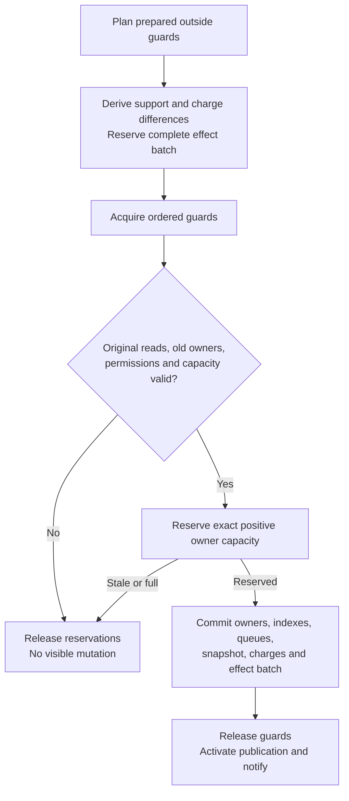
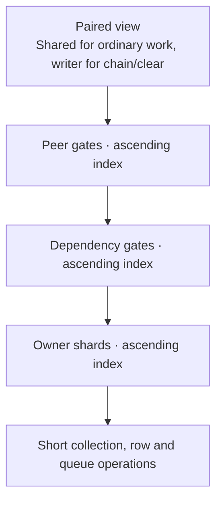

# Commit and concurrency

[Architecture overview](../ARCHITECTURE.md) introduces the core. This page explains
how [Apply](../../src/authority/store/apply.rs) validates a prepared
[Plan](../../src/authority/store/plan.rs) and protects its coupled mutation.
[Execution](EXECUTION.md) owns the surrounding job and effect lifetimes.

## Original reads and intended writes

Preparation records the facts it actually used. Apply must validate those original
facts, not substitute newer observations that happen to support the same outcome.
This applies to a rejection as well as an acceptance.

| Observation | Why it is needed |
|---|---|
| Positive owner identity | The same transaction hash can leave and reenter; an old worker must not act on its successor |
| Absence | A missing producer/spender can appear before commit |
| Point spender value | RBF must validate the specific input conflict used in its decision |
| Complete relation or peer set | A new descendant, reader or cohort member must not escape a prepared coupled change |
| Paired lifecycle and snapshot | Reorg or same-tip clear invalidates work even when a tip identifier alone looks unchanged |

Positive reads use `Weak<Entry>` identity. They do not pin retired transaction
payloads; retained weak control blocks prevent pointer-reuse ABA. Complete relation
and peer observations also use identity markers. Different repeated observations
make a read set stale. Absence is a current predicate: absent → present → absent
history alone does not falsify it.

A Plan owns the decision from preparation through Apply. Construction seeds the
original resolution or capture reads; later tracked reads extend that same private
set. The [membership graph](../../src/authority/membership/graph.rs) borrows the
Plan and hides its Store and owner cache from membership policy. It preserves the
first owner observation, including absence, and records complete input/dep reader
and child relations even when they are empty. Capacity planning can extend the
same decision with a full accepted capture. Only full captures allocate the
optional shard-revision arrays; ordinary reads stay sparse.

`Plan::edit` adds a unique before/after owner change and its optional effect
together, after checking the old identity and duplicate/hash constraints.
Metadata-only changes explicitly pass no effect. Notice-only outcomes use
`Plan::notify` and still validate the decision's premises. Effect fields are
private: constructors define accepted, rejected, waiting, projection, ban, reset
and block obligations. Peer bans and their generation-reset notices share one
Plan operation; attached-block notices and committed-hash records also share
their source. Write support, relation changes, queues and charges derive from
the owner edits, without a second mutable membership ledger.

A policy rejection consumes the existing Plan, discards its speculative edits
and effects, and constructs only its required rejection outcome. Original reads,
peer eligibility and dry-run mode survive. This keeps a late policy failure from
leaking victims, acceptance notices or lifecycle changes.

Read tracking does not infer which facts the business rule ought to use. Review
that closure against transaction semantics and independently perturb its premises:

| Decision | Required premises and outcome | Behavioral check |
|---|---|---|
| Admit a producer after its readers | Complete output readers include both inputs and cell-deps; every surviving reader gains the parent | `late_input_and_cell_dep_readers_invalidate_admission_and_become_parents_on_retry` |
| Replace a spender | Exact input conflict, original victim owners, full descendant closure and backing; child-before-parent rejection notices precede admission | `replacement_retries_the_complete_descendant_set_with_exact_ordered_effects` |
| Refuse a prepared policy | Retain original positive/negative reads and peer eligibility; publish only the rejection | `refused_plan_retains_its_original_reads_and_discards_speculative_changes_and_effects`; `rereading_peer_eligibility_cannot_replace_a_refused_plans_original_premise` |
| Preview a result | Validate original reads and capacity without committing or reserving notices | `rejected_preview_validates_reads_without_consuming_notice_capacity_or_retiring_its_owner` |

The first two checks in [membership tests](../../src/authority/tests/membership.rs)
derive expected parents from fixture transaction bodies, independently of Graph
and stored parent metadata. The latter checks are in
[ingress contracts](../../src/authority/tests/ingress_contracts.rs). These contracts
and counterexamples complement the restricted interfaces; they are not a proof
that arbitrary future policy code has a complete read or effect set.

### Example: replacing an input spender

Suppose candidate B spends the same input as accepted A, and C depends on A.
Membership reads the current A/C owners, the input's spender and the complete
relations used to discover victims and validate backing. The Plan describes B's
admission, A/C retirement or optional history, and the required notices.

If another transaction adds a dependent reader before Apply, the original relation
observation is stale: nothing is removed. If the premises still hold and exact
capacity is available, candidate, victims, indexes, charges and notice obligations
change together. Sharding determines which guards protect those facts; it does
not choose the replacement policy.

## Preflight and commit

A disjoint commit can consume scalar capacity after earlier planning. Final owner
reservation can still refuse: sparse accepted-capacity pressure becomes Stale so
fee policy can be replanned, while other refusals retain their classified outcome.
The exact validated victims fund replacement credit. Speculative credit cannot
escape a refused commit. Dry-run shares membership policy and final capacity
validation, then stops without reserving notices or installing owners or effects. Capacity trimming
can enlarge the RBF victim set, so complete backing is rechecked for that final set.

Replacement history is optional. If only its pipeline/history capacity is lost,
`apply_admission` removes the proposed history owners and retries the same Plan
once synchronously, retaining its exact effect reservation. Every original read
and final owner charge is checked again. The reservation never escapes into an
asynchronous wait; later replanning carries the decision to omit history.

All fallible policy, arithmetic and capacity checks precede mutation.
`commit_infallibly` takes a unit-returning closure, so an accidental `?` in that
tail does not compile. This narrow guard does not prove preflight completeness,
prevent panics or promise rollback after a committed integrity fault. Allocation
uses Rust's abort-on-OOM behavior. A generation fault prevents continued normal
use and makes persistence ineligible.

Within that commit, `Shard::apply_edit` updates the owner and every shard-local
projection, including queue membership and retirement. Its exhaustive field
destructuring forces a new Shard field to be considered at this boundary; it does
not prove the update is correct. Clear replaces complete shards, while a snapshot
change refreshes the proposed count against the new view.

Retired payloads and replaced collections drop outside the guarded cut. The
outbox batch is appended with the mutation and becomes ready after guards open.
This preserves the obligation even when a caller stops waiting; delivery to an
external endpoint has its own failure boundary.

## Semantic conflicts and physical guards

A semantic conflict exists when one operation changes a fact another relies on.
Physical routing conservatively groups facts for synchronization.

| Pair of operations | Required relationship |
|---|---|
| Spend the same input | Conflict; validate the original spender and membership policy |
| Add a reader while replacing its backing producer | Conflict with the complete backing/reader premise |
| Read the same cell-dep without changing it | Compatible |
| Admit remote work while banning that peer | Peer permission check and commit must be protected together |
| Ordinary mutation during chain/clear replacement | Conflict with lifecycle replacement |

The current Store uses randomized keyed routing over 256 owner shards and separate
peer/dependency gate families. Owner routing incorporates proposal ID so a short-ID
collision shares its owning cut. Within a physical shard, writer mode dominates
reader mode. Complete relation reads take their gate exclusively; point reader
additions share it and update the short row under its mutex.

Collection mutexes precede their row mutexes. Budget, outbox and dirty-key
bookkeeping must not acquire an earlier layer while held. Queue selection releases
its lane before owner lookup; maintenance releases its dirty-key mutex before
relation lookup. No authority guard spans await, storage I/O or a foreign call.

Ordinary work shares the lifecycle view and visits only its support. There is no
global membership writer around independent transactions. Physical collisions
can still serialize them, and short quota/row/FIFO operations remain. Full capture
and clear visit all owner shards. The guard bound is per family: Apply can retain
up to 768 peer, dependency and owner guards plus its lifecycle guard.

Remote admission holds the peer gate shared across its final ban check and commit;
a ban holds it exclusively. A ban winning first makes prepared work recheck. The
marker alone does not retroactively remove work committed first. Ban-marker expiry
and bounded table eviction are separate policies.

## Dependency and replacement decisions

[Jobs](../../src/authority/jobs.rs) resolve against the chain snapshot and accepted
overlay while recording producer/spender premises. A pool spend does not make
chain backing dead; [membership](../../src/authority/membership.rs) decides RBF.
Only producers create causal ancestry. Conditional reader-before-spender order
belongs to [packing](../../src/authority/packing.rs), not the ancestor budget.

RBF counts shared descendants once, checks full input/dependency backing, and
commits candidate plus victims atomically. Complete relation observations prevent
an interposed reader from escaping the plan. Self-eviction does not evict incumbents
for a rejected candidate. Wide fee totals preserve exact descendant accounting;
optional fee overflow must not poison unrelated admission or query paths.

## Current optimizations

| Mechanism | Work or retention reduced | Prerequisite and cost |
|---|---|---|
| Sparse original observations | Ordinary Plans avoid full shard-revision arrays | Full captures still retain and validate every required revision |
| Weak owner/relation identities | Stale work does not pin retired payloads or need finite marker-version reservations | Weak control blocks remain while observations exist |
| Prepared shard support | Ordinary Apply visits affected shards | Fixed routing can create conservative collisions; full operations still visit all shards |
| Fixed bitsets for lock support | Avoids per-Plan ordered maps for three guard families | Writer bits dominate reader bits; ascending traversal preserves lock order |
| Owner edits routed and sorted once | Preflight/mutation avoid scanning all edits per shard | Preparation vector and sorting add scratch; a stale Plan discards that work |
| Flat per-relation owner changes | Merges repeated roles of each ordered owner without nested maps | The Plan's unique hash order is required; preflight checks every original role before mutation |
| Direct spender projection | Point conflict reads avoid scanning dependency readers | Only Apply changes the spender; full relation reads still include it and preserve their version premise |
| One temporary account aggregation | Combines old/new charges without two trees; each owner's at-most-three account routes stay on the stack | Checked gross totals precede netting; the tree is consumed into ordered positive/negative lists before guards are acquired |
| Original graph reads reused within a decision | Avoids rereading already observed owners and absences | A retired weak owner makes the decision stale; Apply still validates the original identities |

Membership calculation remains transient. Complete aggregate queries reuse
ordinal marks and one traversal scratch area across roots, enforcing the same
ancestor, cycle and arithmetic checks as a point walk. Removal notices calculate
totals for their actual victims; capacity trimming combines each removed closure's
contribution before updating surviving ranks. Shared descendants count once,
and no subsequent victim is chosen before those rank updates finish. These
calculations add bounded scratch, not persistent transitive membership.

These choices reduce particular kinds of work; they do not imply zero contention
or universal speedup. [Representative checks](../REVIEW_GUIDE.md#representative-checks)
include original-read refusal, failed multi-owner atomicity and observable overlap
inside final production commit cuts.
