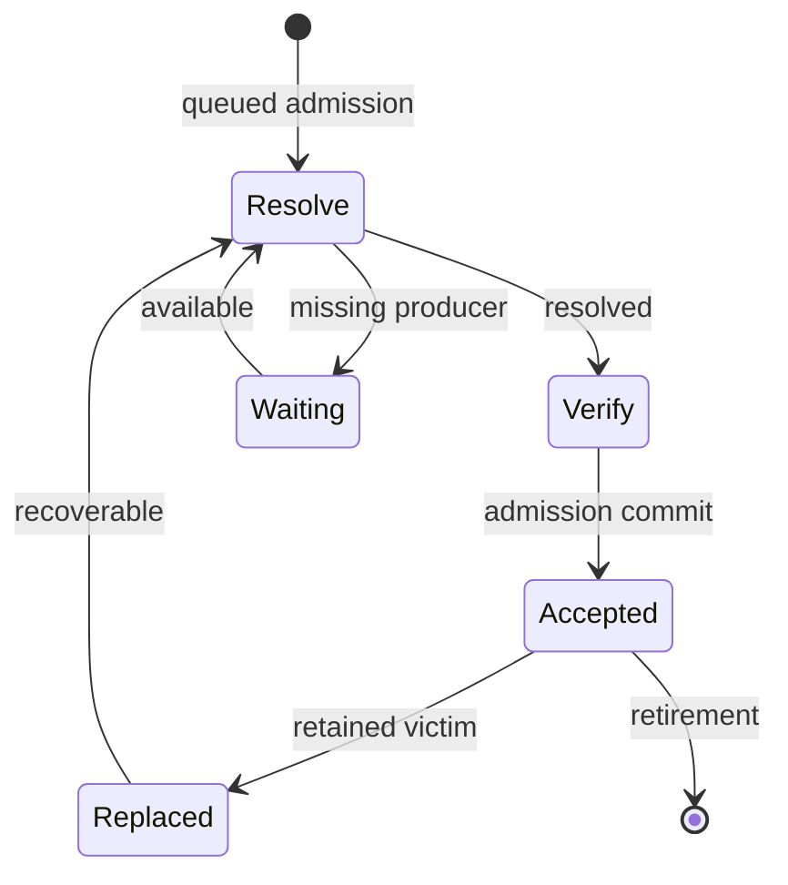
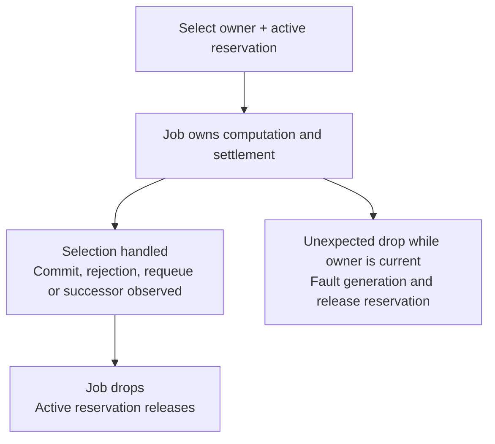
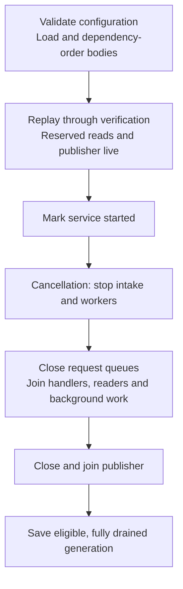

# Execution and lifecycle

[Architecture overview](../ARCHITECTURE.md) describes the core;
[commit and concurrency](COMMIT.md) explains its atomic boundary. This page follows
who owns work and resources before, during and after that boundary.

## Owner phases and jobs

The diagram shows queued progress; rejection, clear and chain changes can retire
owners across phases. Every owner-state arrow is prepared as a Plan and installed
through Apply; selecting a queue item or running a Job adds no owner phase.
A Replaced owner is optional recovery history, not accepted
membership. Local submit/dry-run resolve and verify directly; only successful
local admission installs an Accepted owner, and dry-run installs none.

| Phase | Retained fact |
|---|---|
| Resolve | Raw payload awaiting or undergoing canonical resolution |
| Verify | Compact resolved cells, fee and original observations |
| Waiting | Current missing cell keys; no VM capability |
| Accepted | Verified cycles/fee, retained input cells, compact dependency identities and direct producer ancestry |
| Replaced | Optional transaction body and all/any blocker predicates |

[Queue](../../src/authority/queue.rs) selection transfers an immutable owner and
active reservation to one non-Clone Job. It does not add a Working phase. A fixed
worker retains its completed result while awaiting settlement, so no Ready owner
or completed-result exchange is needed. A successor owner invalidates old jobs.
Unexpected drop of a current Job faults the generation; orderly cancellation
settles/requeues it or observes a successor.

## Scheduling and block priority

Resolve and Verify use separate queues because fee ordering requires resolved
fees. Both derive lanes from the same source/declared-cycle threshold and preserve
the configured selection order: `fee_rate` by default, or `arrival_time`. Completion can occur
in a different order. Block priority applies to every lane and to direct local
requests, independently of declared cycles.

[Pool](../../src/authority/service.rs) admits resolution, direct input checks and
VM execution through shared compute permits. It checks the current pause after
acquiring a permit, before selecting a queued job or reserving active memory.
A suspended waiter returns the permit and waits for the control signal; dry-run
declines without waiting. A multi-thread runtime with one worker hands off its
core for synchronous compute; larger runtimes retain capacity for control and I/O.

The sole [block consumer](../../../chain/src/verify.rs) owns a scoped pause while
processing ready blocks and truncations. When that backlog empties, it resumes
pool computation before waiting for more work. Scope exit and unwind also resume
the pool. There is no delayed restart or intermediate resume between queued blocks.

Pausing changes execution permission without retiring a transaction or its Job.
A running VM cooperatively suspends with its scheduler state, consumed cycles,
compute permit and memory reservation retained; Resume continues that execution.
Already admitted synchronous work can finish, so a pause request does not establish
VM quiescence. Ingress can still queue bounded work. Reconciliation and publication
have their own progress requirements, described below, and remain outside this gate.

## Settlement and failure

The [worker](../../src/authority/service/execution.rs) owns its Job through
settlement. `Job::complete()` marks the selection handled; the active reservation
is released only when the Job drops. Owner residency and effect-batch capacity
have separate lifetimes and are not released by that marker.

| Outcome | Who continues and what is retained |
|---|---|
| Stale admission, verification reads still valid | Worker replans admission while retaining its verified result |
| Stale verification premises | Worker requeues Resolve, or observes that a successor already owns progress |
| Outbox/chain pressure | Pool waits on state/capacity notifications and retries; owned work stays charged |
| Ordinary resource or verification rejection | Worker prepares a rejection Plan; stale rejection observations also require requeue |
| Structural fault | Generation stops normal use and becomes ineligible for persistence |
| Orderly cancellation | Worker settles/requeues work or observes its successor before leaving |

## Resource and lifetime bounds

[ResidencyLimits](../../src/constants.rs) derives byte ceilings from serialized
capacity, shared by admission, reorg payload and persistence-read bounds.
[Limits](../../src/authority/budget.rs) divides those ceilings into envelopes once;
[residency](../../src/authority/residency.rs) defines retained charges.
[Maintenance](../MAINTENANCE.md#configuration-and-capacity) owns defaults and tuning.

| Population | Ownership and bound |
|---|---|
| Accepted | Separate serialized bytes, conservative retained bytes and item count |
| Pipeline | Raw, resolved, waiting and recovery owners; charged bytes, items and edges |
| Active jobs | For `W = max(workers, 1)`: `W+2` global slots, `W+1` remote, `ceil((W+1)/4)` per peer; envelopes reserved from pipeline capacity |
| Remote/per-peer retention | Subquotas preserve trusted room under remote pressure |
| Replacement history | Charged to pipeline and smaller optional-history quotas |
| Effects | Complete batches reserved before commit, with remote limits and trusted/critical headroom |
| Scratch/concurrency | Bounded captures and graphs, fixed workers, bounded channels/read handlers and paged maintenance/relay work |

Accepted owners retain input cells, but reduce cell-dep and dep-group cells to
identity/provenance fields. A selected Verify job keeps its full resolved owner
charge until replacement. Detached
cell backing must remain shared through the resolver; a final owner check cannot
bound an earlier duplicate allocation. Include source/destination overlap,
container capacity and concurrent producers when reviewing a bound.

Full graph/query/template scratch, database caches, allocator overhead and VM
internals remain separate costs. Pool budgets are not a process-RSS cap. VM initial
load and cumulative active VM time have independent local limits; queueing and
suspension do not consume VM time. These refusals do not establish consensus
invalidity or justify peer banning.

## Waiting, chain and recovery

Waiting records current missing cell keys. Invalid headers are rejected by canonical
resolution, not registered as waiters. Only `Remote { cycles: Some(_) }` may wait for an unknown producer. Other queued
sources, including remote work without declared cycles, require a known preaccepted
producer that can supply the exact output. Maintenance rotates pages of at most 32 waiters and gives due
expiration opportunities. This bounds a step, not elapsed time under arbitrary
arrivals, repeated conflicts or stalled providers.

Reorg uses a reliable bounded lane. The block consumer waits for reconciliation
and its required publication, so that lane, the publisher and reserved reads must
remain live while pool computation is paused. `Pool::reconcile` holds ChainPause
through preparation, coupled snapshot/owner commit and publication. ChainPause
coordinates owner commits; the computation pause controls worker admission and
VM execution. Paired snapshots supply proposal facts; `ProposalView` and
`TwoPhaseCommitVerifier` remain the canonical reference. Detailed capacity refusal
selects bounded parent-first recovery. An oversized command replaces the generation
against the exact successor snapshot.

Optional replacement history may be omitted under pressure and can occupy quota
until relevant availability or clear. It has no ordinary remote TTL or accepted
timestamp. Recovery returns its body to verification; replay restores neither
accepted proof nor old blocker predicates. GenerationReset clears sync's known
and pending relay state; RelayDrain reconstructs current waiting-parent notices
in bounded pages after the mailbox drains, not all accepted transaction results.

## Ordered publication and projections

[Outbox](../../src/authority/notice.rs) appends a batch with its owner commit and
activates it after guards open. A later ready batch cannot overtake an earlier
unready one. Each batch settles, returns capacity and releases publisher/FIFO
references before the next. Callback-owned clones have their own lifetimes.

Callback panic disables all callback kinds for that publisher; other endpoints
can continue. Relay disconnection disables relay publication. Recent-reject write
failure suppresses new writes for one second before another effect retries;
omitted records are not retained for replay. Publisher cancellation faults the
generation and preserves owned obligations. Synchronous endpoints must return for
publication and shutdown to progress; async abort cannot stop them.

Reserved bounded reads let callbacks query while their invoking admission waits
for publication. Direct callback mutation is rejected. A callback must not join
a helper thread that synchronously reenters mutation: its thread-local marker does
not follow that helper. [Maintenance](../MAINTENANCE.md#diagnose-shutdown-or-publication-progress)
explains diagnosis and endpoint boundaries.

Application transaction notifications are best effort. The
[notification service](../../../notify/src/lib.rs) uses bounded ingress and
subscriber channels. A full or closed channel immediately omits that delivery
and releases the notification's ownership; there are no deferred transaction
send tasks. Other subscribers can still use their channel space. The legacy
`notify_tx_timeout` configuration remains readable but is unused. These delivery
limits do not change ordered fee-estimator updates or pool commits. RPC subscribers
and the optional indexer's pending overlay receive a best-effort event stream.
The overlay has no loss-triggered resynchronization: a missing removal can leave
a stale consumed-cell filter even after delivery resumes. It does not establish
a complete current membership snapshot.

[Queries](../../src/authority/query.rs) derive views from owners. Preaccepted
payloads expose pending status without accepted proof; history stays separate
from live membership. The sole [template driver](../../src/authority/template.rs)
captures accepted owners, builds outside Store guards and validates selected-owner,
lifecycle and uncle sources before publication to BlockAssembler. Unrelated
additions need not invalidate output; selected-owner replacement and same-tip clear
do. Mandatory base bytes are checked before optional fitting. A refresh wait has
one 30-second deadline; it does not bound synchronous work or stop the shared driver.

## Startup and shutdown

[Builder](../../src/service/builder.rs) owns both drain phases. Each has a 30-second
grace period; expiry faults the generation, aborts and joins tasks, and skips save.
Synchronous providers must still return, so these are not total shutdown bounds.
`stop()` signals cancellation and wakes suspended work; it remains terminal for
that service generation, including if the block consumer later requests Resume.
`service_started() == false` precedes complete joins.

[Persistence](../../src/persisted.rs) loads v1/v2 bodies and writes v2 accepted/recovery
partitions through a synced temporary file and rename. A corrupt v2 does not fall
back to v1: loading, merging and dependency ordering finish before workers start;
preparation failure is logged and startup uses an empty replay set. Every prepared
body still passes normal admission. A faulted
generation preserves the prior file. The writer does not fsync the parent directory;
file sync/rename alone does not promise universal crash durability.

## Current optimizations

| Mechanism | Work or retention reduced | Prerequisite and cost |
|---|---|---|
| Worker-owned job and result | Avoids separate Working/Ready owners and result transport | The worker retains the bounded result through settlement/backpressure |
| One canonical resolution per attempt | Avoids preliminary spender scan and strict/permissive retry | Original producer/spender reads and complete RBF backing checks remain necessary |
| Shared detached cell backing | Avoids repeated input/dependency materialization copies | Sharing and reservation must compose through the actual resolver |
| Compact accepted owners | Discards resolved dependency payload after admission | Canonical verification metadata must be complete before discard |
| State-relevant notifications | Queue/capacity subscriptions end when a job is selected; unrelated commits do not repoll its active VM | Dependency, capacity and lifecycle changes must still wake the responsible work |
| Bounded ready-prefix publication | Amortizes endpoint handoffs across ready batches | FIFO order and per-batch settlement/release remain intact |
| Validated template captures | Keeps graph/packing work outside owner guards | Selected-source invalidation can require a rebuild |

These mechanisms preserve the common commit contract. Their throughput, CPU and
memory tradeoffs need [measurement](../BENCHMARK.md), while resource release and
ordering need [observable regression evidence](../REVIEW_GUIDE.md#representative-checks).
