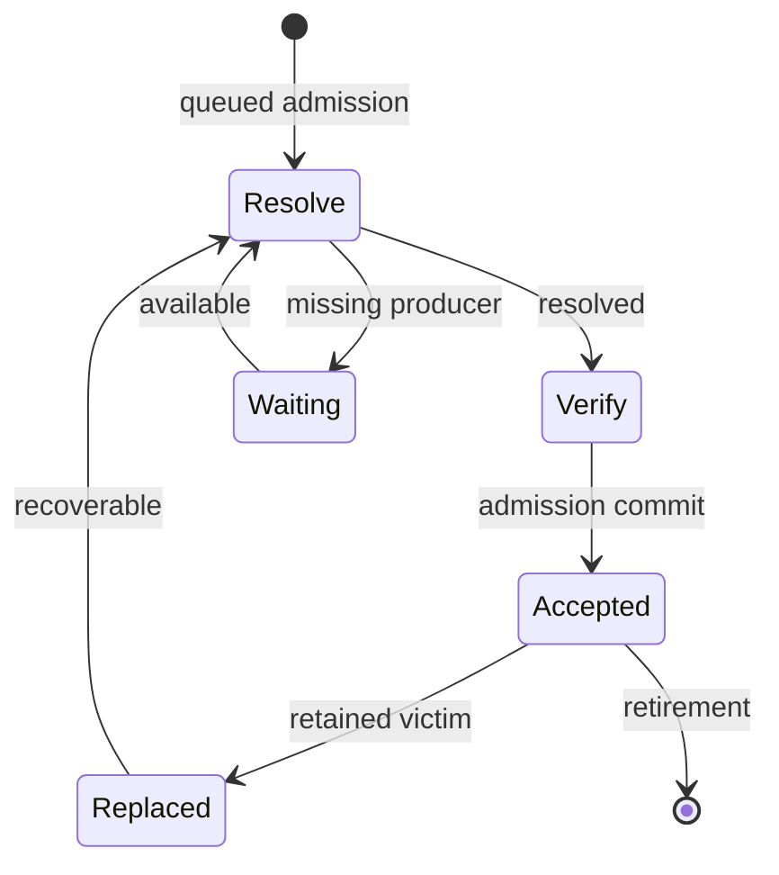
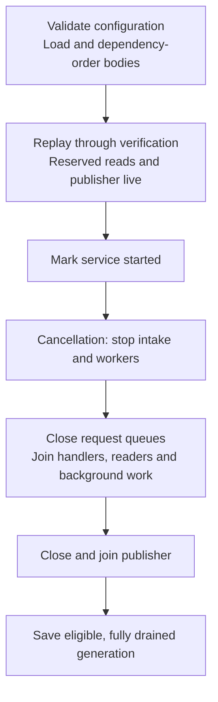

# Execution and lifecycle

[Architecture overview](../ARCHITECTURE.md) describes the core;
[commit and concurrency](COMMIT.md) explains its atomic boundary. This page follows
who owns work and resources before, during and after that boundary.

## Owner phases and jobs

The diagram shows queued progress; rejection, clear and chain changes can retire
owners across phases. Every owner-state arrow is prepared as a Plan and installed
through Apply; selecting a queue item or running a Job adds no owner phase.
A Replaced owner is optional recovery history, not accepted
membership. Local submit/dry-run resolve and verify directly; only successful
local admission installs an Accepted owner, and dry-run installs none.
The integration-test submission RPC also resolves locally, but acknowledges a
Verify owner before background script verification. All RPC entry points reject
missing or spent dependencies instead of creating Waiting owners.

| Phase | Retained fact |
|---|---|
| Resolve | Raw payload awaiting or undergoing canonical resolution |
| Verify | Compact resolved cells, fee and original observations |
| Waiting | Current missing cell keys; no VM capability |
| Accepted | Verified cycles/fee, retained input cells, compact dependency identities and direct producer ancestry |
| Replaced | Optional transaction body and all/any blocker predicates |

[Queue](../../src/authority/queue.rs) selection transfers an immutable owner and
its non-Clone `ActivePermit` together to one non-Clone Job. It does not add a Working phase. A fixed
worker retains its completed result while awaiting settlement, so no Ready owner
or completed-result exchange is needed. A successor owner invalidates old jobs.
Unexpected drop of a current Job faults the generation; orderly cancellation
settles/requeues it or observes a successor.

## Scheduling and block priority

Resolve and Verify use separate queues because fee ordering requires resolved
fees. Both derive lanes from the same source/declared-cycle threshold and preserve
the configured selection order: `fee_rate` by default, or `arrival_time`. Completion can occur
in a different order. Block priority applies to every lane and to direct local
requests, independently of declared cycles.

[Pool](../../src/authority/service.rs) admits resolution, direct input checks and
VM execution through shared compute permits. It checks the current pause after
acquiring a permit, before selecting a queued job or reserving active memory.
A suspended waiter returns the permit and waits for the control signal; dry-run
declines without waiting. A multi-thread runtime with one worker hands off its
core for synchronous compute; larger runtimes retain capacity for control and I/O.

The sole [block consumer](../../../chain/src/verify.rs) owns a scoped pause while
processing ready blocks and truncations. When that backlog empties, it resumes
pool computation before waiting for more work. Scope exit and unwind also resume
the pool. There is no delayed restart or intermediate resume between queued blocks.

Reconciliation, IBD updates and generation clears share the ordered chain-control
driver. None consumes an ordinary transaction handler: those handlers may all be
waiting for the block consumer to resume verification. An IBD update completes
after earlier chain publication and before its caller releases the pause.

Pausing changes execution permission without retiring a transaction or its Job.
A running network VM cooperatively suspends with its scheduler state, consumed cycles,
compute permit and memory reservation retained; Resume continues that execution.
Already admitted synchronous work can finish, so a pause request does not establish
VM quiescence. Ingress can still queue bounded work. Reconciliation and publication
have their own progress requirements, described below, and remain outside this gate.

## Verification budgets and proof reuse

The transaction source selects an active-time budget only for network relay and
proposal verification. Local RPC submission, test submission, dry-run and recovery
have no time limit and use synchronous canonical verification through the existing
blocking adapter. They pass the computation gate before starting and retain their
work until verification returns. Network verification uses the controlled VM child
with pause/stop/join. Proposal promotion preserves local and recovery sources.

Before accepting work, the pool calibrates the node's VM backend once per process.
A fixed arithmetic/load/store loop runs to five million cycles after loading a
64 KiB program image and stack. Each supported VM version runs three samples;
the median suppresses an isolated scheduling disturbance and the slowest version
sets the execution rate. Loading uses fixed metadata, without ELF parsing or
provider I/O. The [budget adapter](../../src/verification/calibration.rs) leaves
16 times the measured time for workload differences and sets the minimum to one
whole loading/execution quantum with that margin. Both values scale with the
machine; neither is a configuration setting or learned from peer transactions.
The result is a conservative estimate, not a bound on every script's running time.
It is reused until restart, so it does not track later load or CPU frequency changes.

Declared network cycles select `max(ceil(cycles / rate), minimum)`, capped at
one minimum target block interval (`MIN_BLOCK_INTERVAL`, currently 8 seconds).
Network work without a declaration and failed calibration both use this internal
cap. It is not a user setting. Native integration builds enable the `test` Cargo
feature to override `max_tx_verify_time_ms`; the field and its parser do not
exist in production builds.

Shared script proofs bind witness content, VM rules and resolved input/cell-dep
origins observable through header dependencies. Confirmation and reorg can change
the latter without changing the transaction hash. The canonical verifier derives
and checks this key as well as the pool/block cache callers.
Header/extension syscalls and cache identity share
[`header_visible_origin`](../../../script/src/syscalls/mod.rs). Changes to this
rule must preserve the independent syscall visibility and cache identity tests.
Expanded dep-group members have cell-dep indexes; group containers do not.

The [pool executor](../../src/verification/execution.rs) shares one remaining
budget across ordinary VM groups. Each task owns a scheduler slice and returns
that ownership with its result and measured execution time. Joining the slice
both acknowledges suspension and debits its active time before any resume;
there is no separate pause acknowledgment protocol. A slice's timer starts when
its task runs and requests a cooperative interrupt. Its returned elapsed time
decides exhaustion, including when completion wins the timer race. The timer and
interrupt belong to that slice and cannot affect its successor. Dropping the
caller interrupts and cancels its owned slice.

Queueing, suspension and parent polling delay spend no budget. Root and dynamic
program loading run inside the charged scheduler slice, through the ordinary
loader. Synchronous loading and providers must return before the VM can
acknowledge a pause, so this is not a hard wall-clock deadline. Type ID, cycle
accounting and script error attribution remain in the canonical script verifier;
the pool supplies only its scheduler execution policy.

## Settlement and failure

The [worker](../../src/authority/service/execution.rs) owns its Job through
settlement. Acceptance, rejection and requeue borrow the Job without acknowledging
it; only the worker calls `Job::mark_handled()` after successful settlement, including
its orderly-stop path. The active reservation is released only when the Job drops,
after its computation results. Owner residency and effect-batch capacity
have separate lifetimes and are not released by that marker.

[Ingress](../../src/authority/ingress.rs) converts the exhaustive resolution
result into one Plan: Ready keeps its original reads and installs Verify; Waiting
installs its keys and derives any remote parent request from that same owner;
Rejected retains its reads and prepares the rejection. The worker commits or
retries this outcome, without assembling separate phase/read/effect values.

| Outcome | Who continues and what is retained |
|---|---|
| Stale admission, verification reads still valid | Worker replans admission while retaining its verified result |
| Stale verification premises | Worker requeues Resolve, or observes that a successor already owns progress |
| Outbox/chain pressure | Pool waits on state/capacity notifications and retries; owned work stays charged |
| Ordinary resource or verification rejection | Worker prepares a rejection Plan; stale rejection observations also require requeue |
| Structural fault | Generation stops normal use and becomes ineligible for persistence |
| Orderly cancellation | Worker settles/requeues work or observes its successor before leaving |

`Pool::commit_attempt` returns the successful attempt's result. Local admission
pairs its rejection outcome with the committed batch; reconciliation pairs the
batch with whether bounded recovery was used. Failed retries leave no separate
completion result for the caller to reconcile with the returned batch.

Fault detection belongs to its boundary. Outbox accounting or publisher failure
sets the shared fault flag and wakes outbox waiters; the service supervisor
observes publisher termination and calls `Pool::fault()` to stop and wake the
whole generation. Publisher failures have their own metric. `TypedFault` counts
the first transition made by `Store::fault()`, not every cause of a closed pool.

## Resource and lifetime bounds

[ResidencyLimits](../../src/constants.rs) derives byte ceilings from serialized
capacity, shared by admission, reorg payload and persistence-read bounds.
[Limits](../../src/authority/budget.rs) divides those ceilings into envelopes once;
[residency](../../src/authority/residency.rs) defines retained charges.
[Maintenance](../MAINTENANCE.md#configuration-and-capacity) owns defaults and tuning.

| Population | Ownership and bound |
|---|---|
| Accepted | Separate serialized bytes, conservative retained bytes and item count |
| Pipeline | Raw, resolved, waiting and recovery owners; charged bytes, items and edges |
| Active jobs | For `W = max_tx_verify_workers` (including zero): `W+2` global slots, `W+1` remote, `ceil((W+1)/4)` per peer; envelopes reserved from pipeline capacity |
| Remote/per-peer retention | Subquotas preserve trusted room under remote pressure |
| Replacement history | Charged to pipeline and smaller optional-history quotas |
| Effects | Complete batches reserved before commit, with remote limits and trusted/critical headroom |
| Scratch/concurrency | Bounded captures and graphs, fixed workers, bounded channels/read handlers and paged maintenance/relay work |
| Packing graph cache | At most one graph in the template loop, with numeric edges/aggregates and weak owner identities; invalidation releases it before replacement construction |

Each active permit reserves the same immutable per-job byte/edge envelope, so
active capacity is represented by total, remote and per-peer job counts. Those
counts have a separate mutex from owner charges. Selection obtains its permit
before removing queue work; refusal changes neither counters nor selection.
The permit retains its original peer until drop, even if a later owner promotion
changes the transaction's source.

Direct local requests retain their verified data and active envelope while waiting
for their committed publication response. Background jobs can return their worker
and active permit after commit because the outbox owns the remaining obligations.
A blocked callback can therefore leave committed local work occupying every active
slot; queued verification then resumes when a caller settles. Reconciliation and
publication do not acquire these compute slots.

Accepted owners retain input cells, but reduce cell-dep and dep-group cells to
identity/provenance fields. A selected Verify job keeps its full resolved owner
charge until replacement. Detached cell backing must remain shared through the
resolver; a final owner check cannot bound an earlier duplicate allocation.
Bounds include source/destination overlap, container capacity and concurrent producers.

Full graph/query/template scratch, database caches, allocator overhead and VM
internals remain separate costs. Pool budgets are not a process-RSS cap. The local
VM-time budget does not establish consensus invalidity or justify peer banning;
an exhausted attempt may be retried.

## Waiting, chain and recovery

Waiting records current missing cell keys. Invalid headers are rejected by canonical
resolution, not registered as waiters. Network sources may wait for an unknown
producer, including proposal work and remote work without declared cycles. Local
recovery requires a known preaccepted producer that can supply the exact output.
Maintenance rotates pages of at most 32 waiters and gives due
expiration opportunities. This bounds a step, not elapsed time under arbitrary
arrivals, repeated conflicts or stalled providers.

Reorg uses a reliable bounded lane. The block consumer waits for reconciliation
and its required publication, so that lane, the publisher and reserved reads must
remain live while pool computation is paused. `Pool::reconcile` holds ChainPause
through preparation, coupled snapshot/owner commit and publication. ChainPause
coordinates owner commits; the computation pause controls worker admission and
VM execution. Paired snapshots supply proposal facts; `ProposalView` and
`TwoPhaseCommitVerifier` remain the canonical reference. Detailed capacity refusal
selects bounded parent-first recovery. Success logs the refusal and does not imply
every candidate was retained. An oversized command replaces the generation against
the exact successor snapshot.

Reorg invalidates cell backing by the producer hashes in detached blocks,
excluding transactions reattached on the new chain. A cell first resolved from
the pool has no block-location metadata even after its producer commits. Its
outpoint still identifies that producer, so its readers and their descendants
leave accepted membership in the reorg commit, before recovery workers run.

Optional replacement history may be omitted under pressure and can occupy quota
until relevant availability or clear. It has no ordinary remote TTL or accepted
timestamp. Recovery returns its body to verification; replay restores neither
accepted proof nor old blocker predicates. GenerationReset clears sync's known
and pending relay state; RelayDrain reconstructs current waiting-parent notices
in bounded pages after the mailbox drains, not all accepted transaction results.
The [relay module](../../src/authority/relay.rs) owns both the mailbox and this
reconstruction cursor. It holds Store weakly; the public receiver cannot prolong
the service generation. Batched drains reserve a bounded prefix before removal
and preserve reset order and ownership on allocation refusal.

## Ordered publication and projections

[Effect constructors](../../src/authority/notice.rs) select the required endpoints
and bound diagnostics before Apply. Plan pairs effects with their owner edits or
explicit notice-only outcomes. A refused Plan keeps no speculative obligations;
Apply reserves its complete final batch before mutation.

[Outbox](../../src/authority/notice.rs) appends that batch with its owner commit and
activates it after guards open. A later ready batch cannot overtake an earlier
unready one. Each batch settles, returns capacity and releases publisher/FIFO
references before the next. Callback-owned clones have their own lifetimes.

One bounded rejection record supplies metrics, optional recent status and
diagnostics. Transient resource/time refusals keep their cause through publication
without entering the recent-reject index or database. Refused candidates attach
a bounded source/phase/peer context; Full additionally observes the five relevant
budget accounts. This snapshot is taken during rejection preparation after the
refusing operation returns, so concurrent usage may have changed. It does not
claim the exact reservation-time state.

The publisher emits these records at Debug under `ckb_tx_pool::rejection`, after
commit and guard release. An abandoned, stale or unactivated outcome emits none.
Expected RBF victim removal callbacks are excluded from candidate diagnostics;
their metrics, recent status, callback and relay obligations remain intact.
Context storage and bounded dynamic reasons are included in outbox byte charges.
The logger is a synchronous endpoint and must return for publication to progress.

Callback panic disables all callback kinds for that publisher; other endpoints
can continue. Relay disconnection disables relay publication. Recent-reject write
failure suppresses new writes for one second before another effect retries;
omitted records are not retained for replay. Publisher cancellation faults the
generation and preserves owned obligations. Synchronous endpoints must return for
publication and shutdown to progress; async abort cannot stop them.

Reserved bounded reads let callbacks query while their invoking admission waits
for publication. Direct callback mutation is rejected. A callback must not join
a helper thread that synchronously reenters mutation: its thread-local marker does
not follow that helper.

Application transaction notifications are best effort. The
[notification service](../../../notify/src/lib.rs) uses bounded ingress and
subscriber channels. A full or closed channel immediately omits that delivery
and releases the notification's ownership; there are no deferred transaction
send tasks. Other subscribers can still use their channel space. The legacy
`notify_tx_timeout` configuration remains readable but is unused. These delivery
limits do not change ordered fee-estimator updates or pool commits. RPC subscribers
receive a best-effort event stream.

The optional indexer pool overlay is rebuilt from an authoritative input snapshot
after block synchronization, including startup and the existing poll interval
(2 seconds by default). It does not depend on transaction notifications. Unchanged
accepted revisions reuse the compact snapshot. Replacement requires matching pool
and indexer tips; while the indexer is behind, the previous inputs continue to hide
their cells until its database has indexed the spends. This is an eventually
consistent view, not a synchronous read of pool membership. When no next block is
available, synchronization checks the indexed tip itself so truncation and
equal-height reorgs can recover without waiting for another block.

## Queries and templates

[Queries](../../src/authority/query.rs) expose transaction status only for accepted
owners and adapt missing-dependency Waiting to the RPC orphan count. Proposal-window
Gap and retained history stay separate from Waiting.
Summary reads use derived counts and accepted charges; replacement-fee reads
capture only the target's descendants. Both hold the paired view and all owner
read guards for a coherent cut, avoiding unrelated owner copies and graph work.
Optional fee overflow leaves transaction status visible.

The sole [template driver](../../src/authority/template.rs)
captures accepted owners, builds outside Store guards and validates selected-owner,
lifecycle and uncle sources before publication to BlockAssembler. Unrelated
additions need not invalidate output; selected-owner replacement and same-tip clear
do. Mandatory base bytes are checked before optional fitting. Each template request
carries one 30-second deadline from controller entry through queueing and refresh.
The caller's wait ends at that deadline even before dispatch; the driver does not
renew it. This does not interrupt synchronous work or stop the shared driver.

Each prepared template carries the matching uncle receipt and pruning authority
into publication. Uncle delivery uses an independent lock: a changed receipt
requires recapture even if the chain and selected owners still match. A selected
transaction outside its own captured candidates is instead an internal fault.

On a rebuild, the driver reuses cellbase and extension payloads within the same
lifecycle view. It computes DAO for the final selection and assigns each attempt
a fresh work ID and time. An unpublished stale attempt therefore leaves a gap
in the monotonically increasing work IDs. DAO cell-liveness memoization is a
separate, block-size-bounded LRU keyed by compact outpoints; a tip change clears
it, and unknown results are cached too. Hits refresh recency. This preserves hot
entries through same-tip churn but adds LRU maintenance to full scans.

[Packing](../../src/authority/packing.rs) borrows the immutable accepted owners
from that capture. One [compiled causal graph](../../src/authority/packing/graph.rs)
supplies numeric parents, children, a topological order and exact ancestor totals.
Construction validates endpoints, cycles, ancestor limits and arithmetic for all
captured entries, including Gap and Pending. Merged ancestors are deduplicated
with reusable traversal scratch rather than a retained closure per entry.

Candidate phases come from the current `ProposalView`, with Proposed taking
precedence over Gap. A temporary sorted lookup is used only when it has no more
entries than the declared query count, and is released after capture. Selection
orders a heap by exact ancestor fee rate and weight, then arrival, hash and local
index. Proposals and fee estimates consume only the needed prefix.

Each call owns its budgets and candidate states, copying ancestor totals on the
first adjustment. The initial heap and modified-score set each hold at most the
captured population. Selected packages leave the queue together; score changes
reach remaining descendants through selected intermediates. Retirement visits
each child use once, but this does not bound all score-update work linearly.
After the first successful package, remaining bytes below the smallest initially
queued transaction's own size stop selection; using own size keeps residual
children eligible. Near integer limits this shortcut is disabled to preserve overflow
checks. The consecutive-failure bound also starts after the first selection, so
unfitting spend packages cannot prevent fitting readers from making progress.

[Packing precedence](../../src/authority/packing/ordering.rs) includes every
accepted reader of a spent cell, including expanded dependency groups. Admission
closes that reader set when the spender enters the pool. Proposal eligibility and
package selection require these earlier readers, so block capacity can defer the
spender while readers commit over several blocks. Causal ancestry and its fee
aggregates remain separate from this block prerequisite graph.

One preference-ordered topological pass supplies package order. Traversal stops
at selected members or when a package exceeds remaining bytes/cycles; it can
still inspect a wide reader fanout. Conditional cycles use complete causal
package drops and a bounded fallback, reusing the causal graph for eviction totals.

The sole template loop can reuse one compiled graph when the ordered accepted-owner
identities and ancestor limit match exactly. Weak identities prevent allocation
reuse from masquerading as a hit. They retain retired `Arc<Entry>` allocations,
but keep no transaction or resolved payload alive. Proposal phases come from the
new snapshot on every call, and publication still validates original selected
owners, lifecycle and uncle sources. A mismatch drops the old graph and identities
before construction; an empty capture clears the old contents. Stop/fault releases
the loop's cache. One-time queries build only the numeric graph and retain no weak
source identities. Admission maintains no packing cache and takes no additional lock.

For `N` captured owners and `E` direct causal edges, retained graph/cache storage
is `O(N + E)`; accepted item, byte and ancestry limits bound its producers. A cache
miss temporarily overlaps the previous cache with fresh borrowed-candidate metadata,
including the temporary proposal lookup, then replaces it. Selection scratch,
output ownership and separately bounded read
handlers add to that cost. The driver already serves valid complete templates from
BlockAssembler, so repeated RPC reads do not establish graph-cache hit traffic.

## Startup and shutdown

[Builder](../../src/service/builder.rs) owns both drain phases. Each has a 30-second
grace period; expiry faults the generation, aborts and joins service tasks, and
skips save. Dropping a worker interrupts its VM slice, but a slice already inside
synchronous provider work may outlive these joins and retains its own resources
until it returns. Runtime shutdown still waits for that work, so the grace periods
are not total shutdown bounds.
`stop()` signals cancellation and wakes suspended work; it remains terminal for
that service generation, including if the block consumer later requests Resume.
`service_started() == false` precedes complete joins.

Chain updates remain reliable during normal startup, before public readiness.
Offline import and replay consume [SharedPackage](../../../shared/src/shared_builder.rs)
through `into_chain_services_builder()` to release unused pool receivers before
processing blocks. Replay owns a [ChainServiceScope](../../../chain/src/init.rs)
that joins chain threads before deleting the temporary database.

Loading and dependency ordering finish before workers start; preparation failure
is logged and startup uses an empty replay set. Saving uses the captured accepted
graph to order resolved parents and readers before spenders, across all proposal
phases. Conditional cycles retain the remaining bodies in causal order. Loading
preserves that accepted prefix; raw bodies cannot reconstruct every expanded
dependency. Recovery bodies and v1 migration use
[dependency ordering](../../src/dependency_sort.rs), preferring earlier input
among ready entries and preserving original order for a cyclic cohort. Every
body passes normal admission. A faulted
generation preserves the prior file; [maintenance](../MAINTENANCE.md#integrating-callers-and-stored-data)
describes file compatibility and durability limits.
