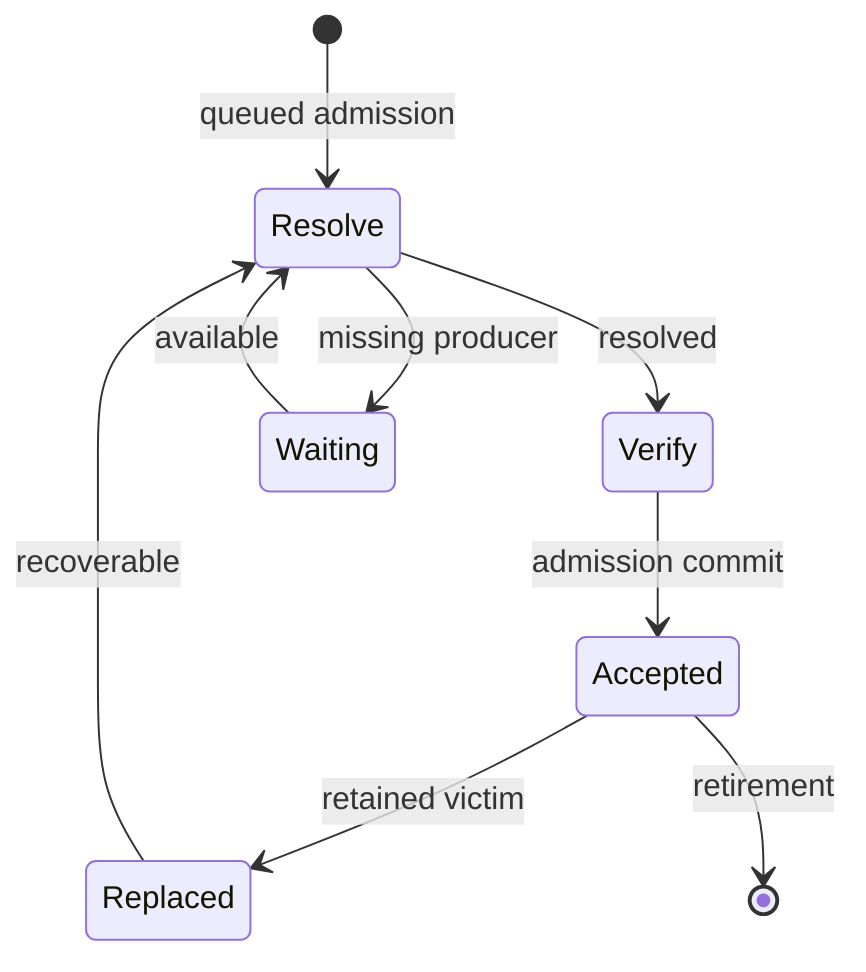
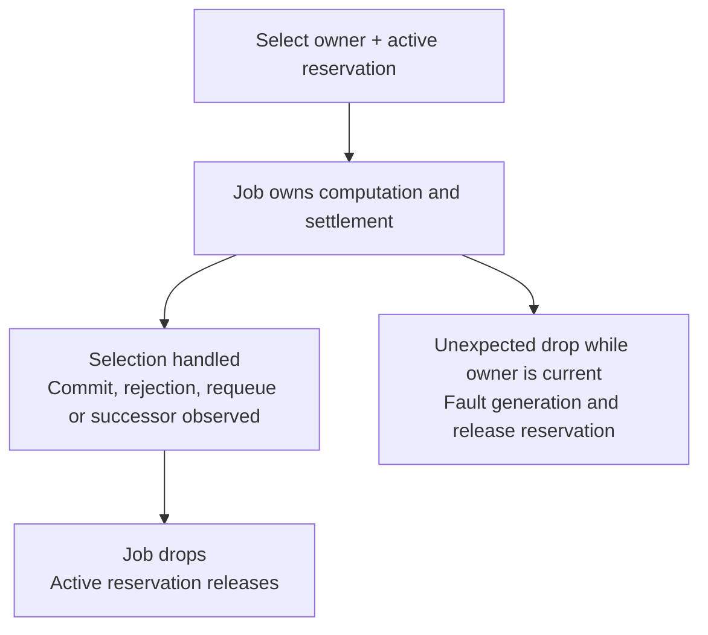
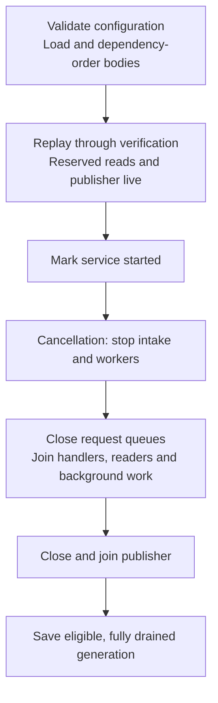

# Execution and lifecycle

[Architecture overview](../ARCHITECTURE.md) describes the core;
[commit and concurrency](COMMIT.md) explains its atomic boundary. This page follows
who owns work and resources before, during and after that boundary.

## Owner phases and jobs

The diagram shows queued progress; rejection, clear and chain changes can retire
owners across phases. Every owner-state arrow is prepared as a Plan and installed
through Apply; selecting a queue item or running a Job adds no owner phase.
A Replaced owner is optional recovery history, not accepted
membership. Local submit/dry-run resolve and verify directly; only successful
local admission installs an Accepted owner, and dry-run installs none.

| Phase | Retained fact |
|---|---|
| Resolve | Raw payload awaiting or undergoing canonical resolution |
| Verify | Compact resolved cells, fee and original observations |
| Waiting | Current missing cell keys; no VM capability |
| Accepted | Verified cycles/fee, retained input cells, compact dependency identities and direct producer ancestry |
| Replaced | Optional transaction body and all/any blocker predicates |

[Queue](../../src/authority/queue.rs) selection transfers an immutable owner and
its non-Clone `ActivePermit` together to one non-Clone Job. It does not add a Working phase. A fixed
worker retains its completed result while awaiting settlement, so no Ready owner
or completed-result exchange is needed. A successor owner invalidates old jobs.
Unexpected drop of a current Job faults the generation; orderly cancellation
settles/requeues it or observes a successor.

## Scheduling and block priority

Resolve and Verify use separate queues because fee ordering requires resolved
fees. Both derive lanes from the same source/declared-cycle threshold and preserve
the configured selection order: `fee_rate` by default, or `arrival_time`. Completion can occur
in a different order. Block priority applies to every lane and to direct local
requests, independently of declared cycles.

[Pool](../../src/authority/service.rs) admits resolution, direct input checks and
VM execution through shared compute permits. It checks the current pause after
acquiring a permit, before selecting a queued job or reserving active memory.
A suspended waiter returns the permit and waits for the control signal; dry-run
declines without waiting. A multi-thread runtime with one worker hands off its
core for synchronous compute; larger runtimes retain capacity for control and I/O.

The sole [block consumer](../../../chain/src/verify.rs) owns a scoped pause while
processing ready blocks and truncations. When that backlog empties, it resumes
pool computation before waiting for more work. Scope exit and unwind also resume
the pool. There is no delayed restart or intermediate resume between queued blocks.

Pausing changes execution permission without retiring a transaction or its Job.
A running VM cooperatively suspends with its scheduler state, consumed cycles,
compute permit and memory reservation retained; Resume continues that execution.
Already admitted synchronous work can finish, so a pause request does not establish
VM quiescence. Ingress can still queue bounded work. Reconciliation and publication
have their own progress requirements, described below, and remain outside this gate.

## Settlement and failure

The [worker](../../src/authority/service/execution.rs) owns its Job through
settlement. `Job::complete()` marks the selection handled; the active reservation
is released only when the Job drops. Owner residency and effect-batch capacity
have separate lifetimes and are not released by that marker.

[Ingress](../../src/authority/ingress.rs) converts the exhaustive resolution
result into one Plan: Ready keeps its original reads and installs Verify; Waiting
installs its keys and derives any remote parent request from that same owner;
Rejected retains its reads and prepares the rejection. The worker commits or
retries this outcome, without assembling separate phase/read/effect values.

| Outcome | Who continues and what is retained |
|---|---|
| Stale admission, verification reads still valid | Worker replans admission while retaining its verified result |
| Stale verification premises | Worker requeues Resolve, or observes that a successor already owns progress |
| Outbox/chain pressure | Pool waits on state/capacity notifications and retries; owned work stays charged |
| Ordinary resource or verification rejection | Worker prepares a rejection Plan; stale rejection observations also require requeue |
| Structural fault | Generation stops normal use and becomes ineligible for persistence |
| Orderly cancellation | Worker settles/requeues work or observes its successor before leaving |

`Pool::commit_attempt` returns the successful attempt's result. Local admission
pairs its rejection outcome with the committed batch; reconciliation pairs the
batch with whether bounded recovery was used. Failed retries leave no separate
completion result for the caller to reconcile with the returned batch.

## Resource and lifetime bounds

[ResidencyLimits](../../src/constants.rs) derives byte ceilings from serialized
capacity, shared by admission, reorg payload and persistence-read bounds.
[Limits](../../src/authority/budget.rs) divides those ceilings into envelopes once;
[residency](../../src/authority/residency.rs) defines retained charges.
[Maintenance](../MAINTENANCE.md#configuration-and-capacity) owns defaults and tuning.

| Population | Ownership and bound |
|---|---|
| Accepted | Separate serialized bytes, conservative retained bytes and item count |
| Pipeline | Raw, resolved, waiting and recovery owners; charged bytes, items and edges |
| Active jobs | For `W = max(workers, 1)`: `W+2` global slots, `W+1` remote, `ceil((W+1)/4)` per peer; envelopes reserved from pipeline capacity |
| Remote/per-peer retention | Subquotas preserve trusted room under remote pressure |
| Replacement history | Charged to pipeline and smaller optional-history quotas |
| Effects | Complete batches reserved before commit, with remote limits and trusted/critical headroom |
| Scratch/concurrency | Bounded captures and graphs, fixed workers, bounded channels/read handlers and paged maintenance/relay work |
| Packing graph cache | At most one graph in the template loop, with numeric edges/aggregates and weak owner identities; invalidation releases it before replacement construction |

Each active permit reserves the same immutable per-job byte/edge envelope, so
active capacity is represented by total, remote and per-peer job counts. Those
counts have a separate mutex from owner charges. Selection obtains its permit
before removing queue work; refusal changes neither counters nor selection.
The permit retains its original peer until drop, even if a later owner promotion
changes the transaction's source.

Accepted owners retain input cells, but reduce cell-dep and dep-group cells to
identity/provenance fields. A selected Verify job keeps its full resolved owner
charge until replacement. Detached
cell backing must remain shared through the resolver; a final owner check cannot
bound an earlier duplicate allocation. Include source/destination overlap,
container capacity and concurrent producers when reviewing a bound.

Full graph/query/template scratch, database caches, allocator overhead and VM
internals remain separate costs. Pool budgets are not a process-RSS cap. VM initial
load and cumulative active VM time have independent local limits; queueing and
suspension do not consume VM time. These refusals do not establish consensus
invalidity or justify peer banning.

## Waiting, chain and recovery

Waiting records current missing cell keys. Invalid headers are rejected by canonical
resolution, not registered as waiters. Only `Remote { cycles: Some(_) }` may wait for an unknown producer. Other queued
sources, including remote work without declared cycles, require a known preaccepted
producer that can supply the exact output. Maintenance rotates pages of at most 32 waiters and gives due
expiration opportunities. This bounds a step, not elapsed time under arbitrary
arrivals, repeated conflicts or stalled providers.

Reorg uses a reliable bounded lane. The block consumer waits for reconciliation
and its required publication, so that lane, the publisher and reserved reads must
remain live while pool computation is paused. `Pool::reconcile` holds ChainPause
through preparation, coupled snapshot/owner commit and publication. ChainPause
coordinates owner commits; the computation pause controls worker admission and
VM execution. Paired snapshots supply proposal facts; `ProposalView` and
`TwoPhaseCommitVerifier` remain the canonical reference. Detailed capacity refusal
selects bounded parent-first recovery. An oversized command replaces the generation
against the exact successor snapshot.

Optional replacement history may be omitted under pressure and can occupy quota
until relevant availability or clear. It has no ordinary remote TTL or accepted
timestamp. Recovery returns its body to verification; replay restores neither
accepted proof nor old blocker predicates. GenerationReset clears sync's known
and pending relay state; RelayDrain reconstructs current waiting-parent notices
in bounded pages after the mailbox drains, not all accepted transaction results.
The [relay module](../../src/authority/relay.rs) owns both the mailbox and this
reconstruction cursor. It holds Store weakly; the public receiver cannot prolong
the service generation. Batched drains reserve a bounded prefix before removal
and preserve reset order and ownership on allocation refusal.

## Ordered publication and projections

[Effect constructors](../../src/authority/notice.rs) select the required endpoints
and bound diagnostics before Apply. Plan pairs effects with their owner edits or
explicit notice-only outcomes. A refused Plan keeps no speculative obligations;
Apply reserves its complete final batch before mutation.

[Outbox](../../src/authority/notice.rs) appends that batch with its owner commit and
activates it after guards open. A later ready batch cannot overtake an earlier
unready one. Each batch settles, returns capacity and releases publisher/FIFO
references before the next. Callback-owned clones have their own lifetimes.

Callback panic disables all callback kinds for that publisher; other endpoints
can continue. Relay disconnection disables relay publication. Recent-reject write
failure suppresses new writes for one second before another effect retries;
omitted records are not retained for replay. Publisher cancellation faults the
generation and preserves owned obligations. Synchronous endpoints must return for
publication and shutdown to progress; async abort cannot stop them.

Reserved bounded reads let callbacks query while their invoking admission waits
for publication. Direct callback mutation is rejected. A callback must not join
a helper thread that synchronously reenters mutation: its thread-local marker does
not follow that helper. [Maintenance](../MAINTENANCE.md#diagnose-shutdown-or-publication-progress)
explains diagnosis and endpoint boundaries.

Application transaction notifications are best effort. The
[notification service](../../../notify/src/lib.rs) uses bounded ingress and
subscriber channels. A full or closed channel immediately omits that delivery
and releases the notification's ownership; there are no deferred transaction
send tasks. Other subscribers can still use their channel space. The legacy
`notify_tx_timeout` configuration remains readable but is unused. These delivery
limits do not change ordered fee-estimator updates or pool commits. RPC subscribers
and the optional indexer's pending overlay receive a best-effort event stream.
The overlay has no loss-triggered resynchronization: a missing removal can leave
a stale consumed-cell filter even after delivery resumes. It does not establish
a complete current membership snapshot.

[Queries](../../src/authority/query.rs) derive views from owners. Preaccepted
payloads expose pending status without accepted proof; history stays separate
from live membership. The sole [template driver](../../src/authority/template.rs)
captures accepted owners, builds outside Store guards and validates selected-owner,
lifecycle and uncle sources before publication to BlockAssembler. Unrelated
additions need not invalidate output; selected-owner replacement and same-tip clear
do. Mandatory base bytes are checked before optional fitting. A refresh wait has
one 30-second deadline; it does not bound synchronous work or stop the shared driver.

On a rebuild, the driver reuses cellbase and extension payloads within the same
lifecycle view. It computes DAO for the final selection and assigns each attempt a fresh
work ID and time. DAO cell-liveness memoization is a separate, block-size-bounded
LRU keyed by compact outpoints; a tip change clears it, and unknown results are
cached too. Hits refresh recency. This preserves hot entries through same-tip
churn but adds LRU maintenance to full scans.

[Packing](../../src/authority/packing.rs) borrows the immutable accepted owners
from that capture. One [compiled causal graph](../../src/authority/packing/graph.rs)
supplies numeric parents, children, a topological order and exact ancestor totals.
Zero/one-parent totals need no closure walk; merges deduplicate their bounded
ancestor closures. Graph evaluation finishes a ready branch first and reuses one
exact marked closure when its root is a direct parent of the next merge. This
avoids repeated shared-ancestor walks without storing a closure per entry. It
preserves eager source, cycle, ancestor-limit and arithmetic validation, including
entries currently in Gap or Pending. The default production ancestor limit is 1000;
dense bounded closures may still contain many edges.

Candidates borrow their owners' cached transaction hashes and proposal short ids;
only the proposal output prefix materializes independent owned ids. Candidate
phases come from the current `ProposalView`. For a capture with at least
as many owners as retained proposal keys, its temporary lookup copies sorted
inline keys and phases once; smaller reads query the original tree directly.
Both paths preserve Proposed precedence over Gap. The temporary copy contains at
most the declared query count and is released after capture. Candidate priority
uses a standard heap. Proposal selection and fee estimation consume the prefix
they need instead of sorting every result. The shared ancestor-score comparator
retains exact fee-rate cross-products and ancestor-weight ties, followed by
arrival, hash and local index.

Each packing call owns its changing budgets and candidate states. Ancestor totals
are copied only on the first score adjustment. The initial heap and the set of
modified scores each hold at most the captured population. Once a package is
chosen, its members leave the queue together; descendant adjustments pass through
selected intermediates while skipping branches with no remaining consumer. Each
retiring child use propagates towards parents only once. This bounds retirement
work, not all score-update work by a linear function.
After a successful package, selection stops if the remaining byte budget cannot
hold the smallest initially queued transaction's own bytes. Using own bytes
keeps small residual children eligible after their parents are selected. Near
integer limits, the shortcut is disabled where it could hide a projected-add
overflow. The existing consecutive-failure policy remains in effect otherwise.

When the unselected remainder forms a chain, its only parent-first order can be
emitted directly, stopping at selected ancestors. Any residual fork uses a local
priority Kahn traversal over the complete ancestor closure, including already
selected ancestors; only output omits those ancestors. This preserves the global
deterministic preference order without sorting the whole pool.
[Conditional ordering](../../src/authority/packing/ordering.rs) checks actual
selected inputs and read-before-spend edges. An already valid order returns
directly. Input keys borrow the canonical transaction bytes; dependency lookups
borrow resolved out points, including expanded dependency groups. The join still
rejects duplicate inputs before returning an already ordered result. Otherwise,
one selected graph supports induced subgraphs, complete causal
package drops and bounded cycle fallback. Only an actual conditional cycle needs
descendant eviction totals; those reuse the compiled parents and wide fee arithmetic.

The sole template loop can reuse one compiled graph when the ordered accepted-owner
identities and ancestor limit match exactly. Weak identities prevent allocation
reuse from masquerading as a hit. They retain retired `Arc<Entry>` allocations,
but keep no transaction or resolved payload alive. Proposal phases come from the
new snapshot on every call, and publication still validates original selected
owners, lifecycle and uncle sources. A mismatch drops the old graph and identities
before construction; an empty capture clears the old contents. Stop/fault releases
the loop's cache. One-time queries build only the numeric graph and retain no weak
source identities. Admission maintains no packing cache and takes no additional lock.

For `N` captured owners and `E` direct causal edges, retained graph/cache storage
is `O(N + E)`; accepted item, byte and ancestry limits bound its producers. A cache
miss temporarily overlaps the previous cache with fresh borrowed-candidate metadata,
including the temporary proposal lookup, then replaces it. Selection scratch,
output ownership and separately bounded read
handlers add to that cost. The driver already serves valid complete templates from
BlockAssembler, so repeated RPC reads do not establish graph-cache hit traffic.

## Startup and shutdown

[Builder](../../src/service/builder.rs) owns both drain phases. Each has a 30-second
grace period; expiry faults the generation, aborts and joins tasks, and skips save.
Synchronous providers must still return, so these are not total shutdown bounds.
`stop()` signals cancellation and wakes suspended work; it remains terminal for
that service generation, including if the block consumer later requests Resume.
`service_started() == false` precedes complete joins.

[Persistence](../../src/persisted.rs) loads v1/v2 bodies and writes v2 accepted/recovery
partitions through a synced temporary file and rename. A corrupt v2 does not fall
back to v1: loading, merging and dependency ordering finish before workers start;
preparation failure is logged and startup uses an empty replay set. Every prepared
body still passes normal admission. A faulted
generation preserves the prior file. The writer does not fsync the parent directory;
file sync/rename alone does not promise universal crash durability.

## Current optimizations

| Mechanism | Work or retention reduced | Prerequisite and cost |
|---|---|---|
| Worker-owned job and result | Avoids separate Working/Ready owners and result transport | The worker retains the bounded result through settlement/backpressure |
| One canonical resolution per attempt | Avoids preliminary spender scan and strict/permissive retry | Original producer/spender reads and complete RBF backing checks remain necessary |
| Shared detached cell backing | Avoids repeated input/dependency materialization copies | Sharing and reservation must compose through the actual resolver |
| Compact accepted owners | Discards resolved dependency payload after admission | Canonical verification metadata must be complete before discard |
| Counted active envelopes | Avoids constructing owner-account deltas for fixed-size active permits | Per-job byte/edge limits are immutable; owner and active capacity remain distinct |
| State-relevant notifications | Queue/capacity subscriptions end when a job is selected; unrelated commits do not repoll its active VM | Dependency, capacity and lifecycle changes must still wake the responsible work |
| Cooperative remote batches and paged wake reuse | Avoids unconditional yields and repeated readiness reads for one page's trigger | Long batches consume Tokio's cooperative budget; every used readiness fact stays in the Plan's original reads |
| Bounded ready-prefix publication | Amortizes endpoint handoffs across ready batches | FIFO order and per-batch settlement/release remain intact |
| Summary and targeted fee reads | Summary uses derived phase/queue counts and accepted charges; replacement-fee reads capture only the target's descendants | Counts change with their owner/queue projection; complete descendant reads are validated, and optional fee overflow preserves transaction visibility |
| Validated template captures | Keeps graph/packing work outside owner guards | Selected-source invalidation can require a rebuild |
| Buffered persistence | Combines small writes to the existing v2 temporary file | Flush must succeed before file sync and rename; file-format and crash-durability limits are unchanged |

Summary and descendant captures hold the paired view and all owner read guards
for a coherent cut. Their savings come from avoiding full owner copies and
unrelated graph calculations; the guarded shard population remains complete.

The shared script crate also avoids repeated immutable work.
[Root-program metadata](../../../script/src/program_cache.rs) caches one parsed
ELF per thread, keyed by actual program data hash and VM version. Only metadata
with at most 64 allocated action slots is retained; the cache owns no program
bytes, transaction, snapshot or VM state. Root loading still computes each
attempt's mapping receipt and charges its own active time. A miss, unavailable
slot or oversized parse uses the canonical parser. CKB-VM itself is unchanged.

These mechanisms preserve the common commit contract. Their throughput, CPU and
memory tradeoffs need [measurement](../BENCHMARK.md), while resource release and
ordering need [observable regression evidence](../REVIEW_GUIDE.md#representative-checks).
